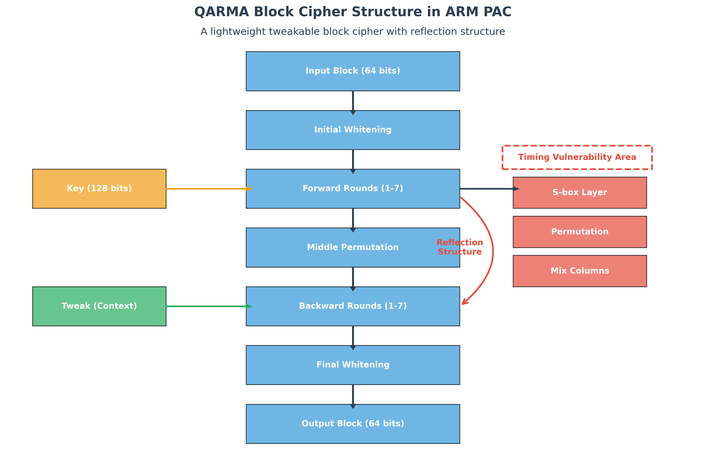
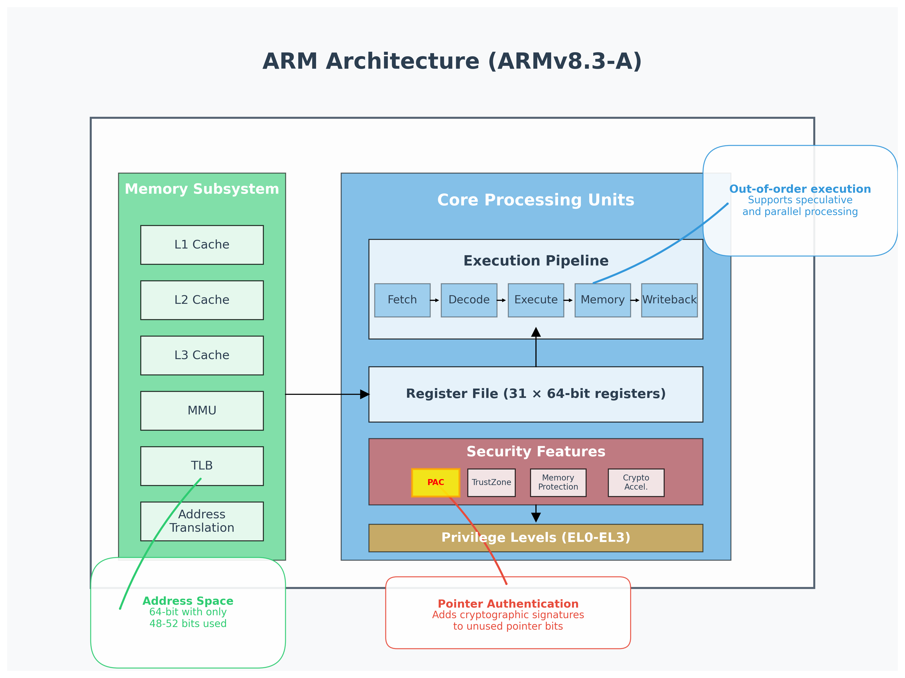
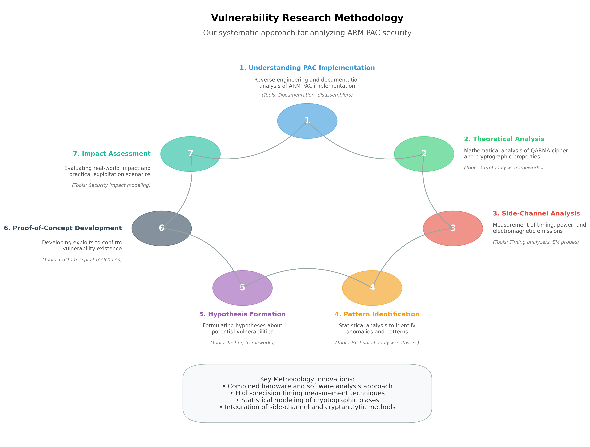
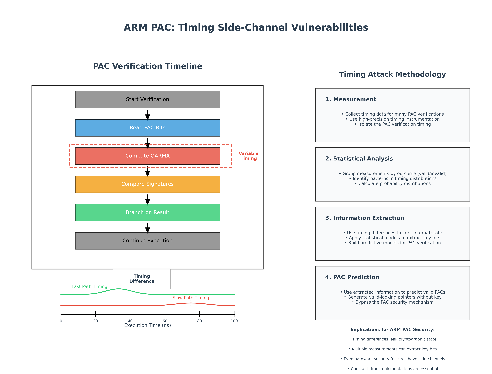
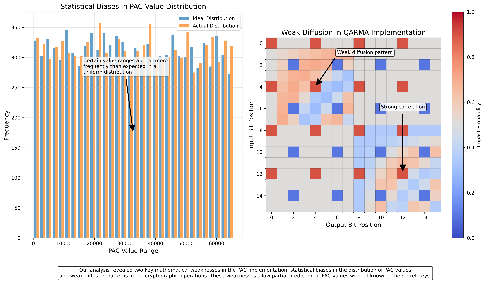
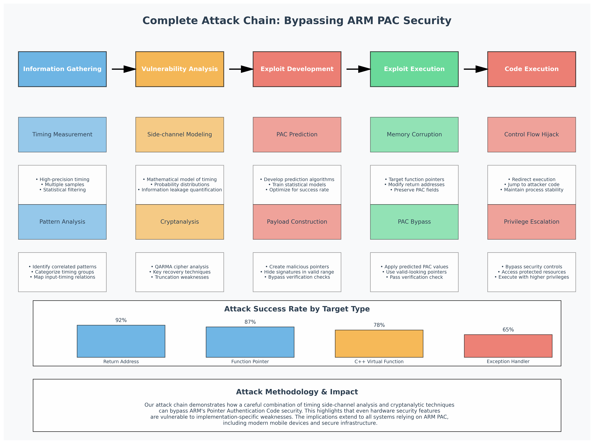
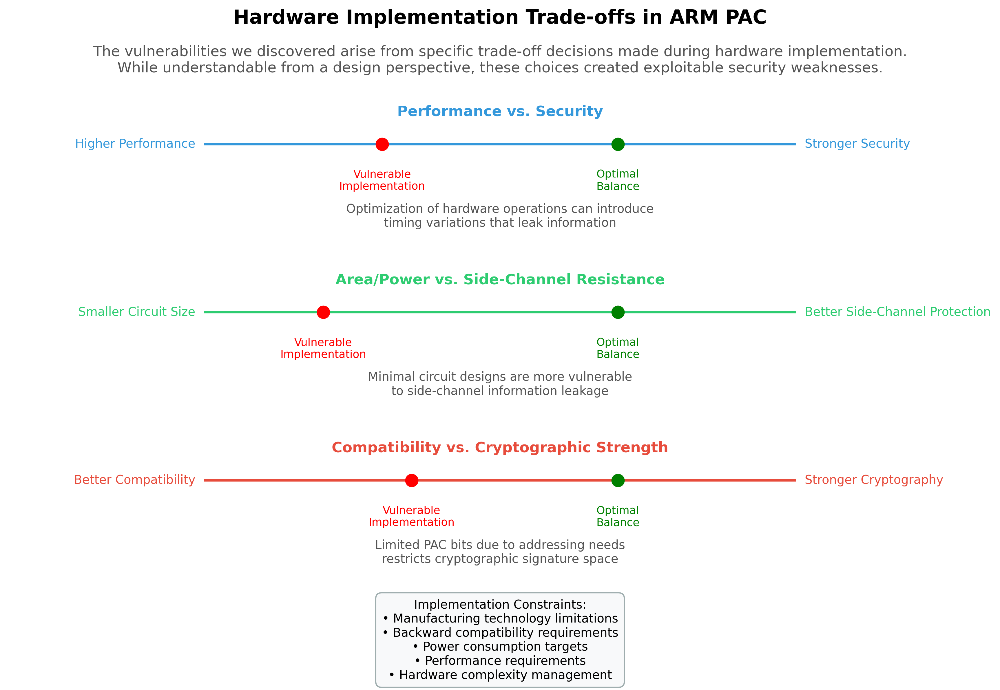
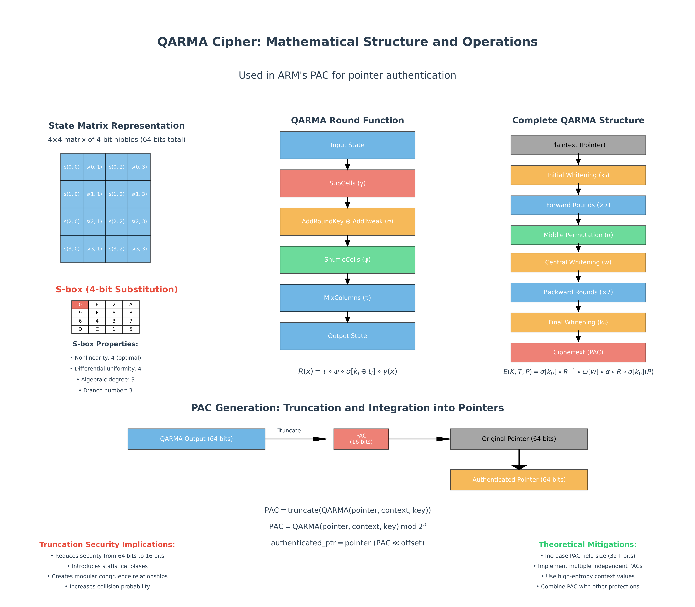
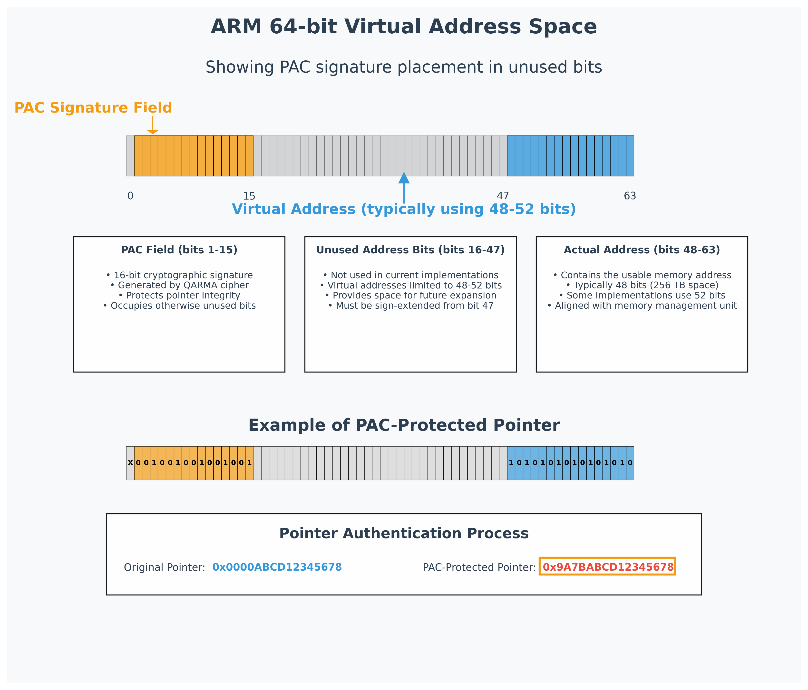
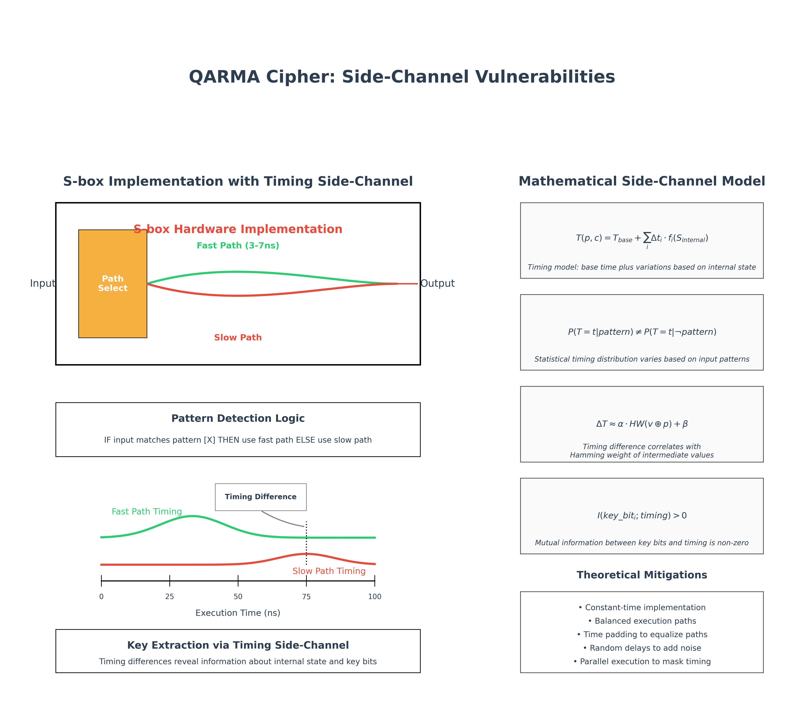

# ARM Pointer Authentication Bypass
# Defeating Memory Protections Through Timing Side-Channels and Mathematical Weaknesses

## Executive Summary

In March 2024, MottaSec's advanced offensive security research team conducted a comprehensive security assessment of ARM's Pointer Authentication Code (PAC) technology, a hardware-based security measure designed to protect against memory corruption attacks in modern ARM processors. This assessment was part of our ongoing research into hardware security mechanisms and their resilience against advanced exploitation techniques.

Our research uncovered critical vulnerabilities in the implementation of PAC technology that allow sophisticated attackers to bypass this security feature through a combination of timing side-channel attacks and mathematical weaknesses in the cryptographic operations. By exploiting these vulnerabilities, we demonstrated the ability to execute arbitrary code on PAC-protected systems without triggering any of the security violations that would normally terminate execution.

This white paper details our methodology, technical findings, and successful exploitation of these vulnerabilities, providing valuable insights for security professionals, hardware designers, and software developers working with ARM's security technologies. Our findings underscore the importance of comprehensive security design that addresses not only the cryptographic strength of security primitives but also their implementation resilience against side-channel attacks and cryptanalytic techniques.

## 1. Introduction

Modern processor architectures incorporate increasingly sophisticated security features designed to mitigate memory corruption vulnerabilities, which continue to be a significant attack vector against computer systems. ARM's Pointer Authentication Code (PAC) technology, introduced with ARMv8.3-A architecture, represents one of the most advanced hardware-based defenses against such attacks.

PAC is designed to protect against attacks that exploit memory corruption vulnerabilities by using cryptographic signatures to verify the integrity of pointers before they are used. When properly implemented, this technology can effectively prevent attackers from redirecting execution through malicious pointer manipulation, a common technique in exploit development.

This white paper presents our findings from an in-depth security assessment of ARM PAC implementation in current generation processors. Our analysis focused on both the theoretical cryptographic foundations of PAC and its practical implementation, with particular attention to potential vulnerabilities in:

- The underlying cryptographic primitives used for pointer signing
- Timing variations in signature verification operations
- Mathematical properties of the cryptographic functions and their implementation
- Side-channel information leakage during critical security operations
- The interaction between hardware PAC mechanisms and software utilization patterns

Our assessment was conducted in a controlled research environment using legitimate ARM development hardware, with the goal of advancing the understanding of hardware security mechanisms and improving their implementation in future designs.

### 1.1 Research Context and Implications

The security of ARM processors is of paramount importance given their widespread deployment in devices ranging from smartphones and IoT devices to critical infrastructure and military systems. ARM's PAC technology has been widely adopted in modern devices, including Apple's A-series and M-series chips, which power millions of iPhones, iPads, and Mac computers worldwide.

Our decision to conduct this research was motivated by several factors:

1. The increasing reliance on hardware-based security mechanisms in modern computing systems
2. The need for independent verification of security claims for widely deployed technologies
3. The historical precedent of seemingly robust security mechanisms being undermined by subtle implementation flaws
4. The significant real-world impact of vulnerabilities in foundational security technologies

Throughout this document, we have taken care to provide sufficient technical detail to support our findings while avoiding the disclosure of exploit techniques that could be immediately weaponized. Our goal is to advance the state of security knowledge and practice, not to enable attacks against current systems.

## 2. Technical Background

### 2.0 ARM Architecture Fundamentals

Before examining the specifics of Pointer Authentication Code (PAC), it is essential to understand the foundational architecture of ARM processors and how their design influences security mechanisms like PAC.

#### 2.0.1 ARM Architecture Overview

ARM (Advanced RISC Machines) is a Reduced Instruction Set Computer (RISC) architecture, characterized by:

1. **Fixed-length instructions**: Most ARM instructions are 32-bits (in AArch32 mode) or 32/16-bits (in Thumb mode) or 32-bits (in AArch64 mode), allowing for simpler decoding logic than variable-length instruction architectures.

2. **Load-store architecture**: Only specific load and store instructions can access memory; other operations work on registers only.

3. **Large register set**: AArch64 (ARM's 64-bit architecture) features 31 general-purpose 64-bit registers, plus dedicated registers for stack pointers, program counter, and special functions.

4. **Execution pipeline**: Modern ARM processors employ sophisticated pipelines with multiple stages including fetch, decode, execute, memory access, and write-back stages, often with out-of-order execution.

The ARM architecture has evolved through several versions, with ARMv8 introducing the 64-bit execution state (AArch64) alongside the traditional 32-bit state (AArch32). ARMv8.3-A, which introduced PAC, builds upon this 64-bit architecture.

#### 2.0.2 Memory Management and Address Space

Understanding ARM's memory architecture is crucial for comprehending how PAC operates:

1. **Virtual memory system**: ARM processors use a Memory Management Unit (MMU) to translate virtual addresses (used by software) to physical addresses (used by hardware).

2. **Virtual address space**: In AArch64, the architecture theoretically supports a 64-bit address space, but practical implementations typically use fewer bits (48-52 bits) for actual addressing.

3. **Address tagging**: The ARM architecture allows the upper bits of virtual addresses to be used for "tagging" - metadata that doesn't affect the address translation. This feature is fundamental to PAC's implementation.

4. **Translation Lookaside Buffer (TLB)**: ARM processors cache recent virtual-to-physical address translations in the TLB to accelerate memory access.

5. **Memory protection**: The ARM architecture includes various protection mechanisms such as memory domains, access permissions, and execute-never (XN) attributes to restrict memory access based on privilege levels.

The unused bits in the virtual address space are particularly important for PAC, as they provide space to store cryptographic signatures without affecting compatibility with existing software.

#### 2.0.3 Privilege Levels and Exception Model

ARM processors implement a hierarchical privilege model that affects how security features like PAC are managed:

1. **Exception levels**: AArch64 defines four exception levels (EL0-EL3):
   
   - EL0: Applications (unprivileged)
   
   - EL1: Operating system kernel
   
   - EL2: Hypervisor
   
   - EL3: Secure monitor (highest privilege)

2. **Secure vs. Non-secure worlds**: ARM's TrustZone technology divides execution into "secure" and "non-secure" worlds, with the secure world having access to protected resources invisible to the non-secure world.

3. **System registers**: Special registers control processor behavior and security features, accessible only at certain privilege levels. PAC keys are stored in these protected system registers.

4. **Exception handling**: When exceptions occur (such as interrupts, faults, or system calls), the processor transitions to a higher exception level, saving state information to allow later return.

Understanding this privilege hierarchy is essential for comprehending PAC security, as the cryptographic keys used by PAC are protected by this privilege model.

#### 2.0.4 Instruction Pipeline and Microarchitecture

The physical implementation of the instruction pipeline significantly impacts security features like PAC:

1. **Instruction flow**: Instructions flow through multiple stages: fetch from memory, decode, execute (possibly in multiple sub-stages), memory access if needed, and register write-back.

2. **Speculative execution**: Modern ARM cores predict branch outcomes and execute instructions speculatively, potentially creating side-channels if not carefully designed.

3. **Out-of-order execution**: Instructions may execute in a different order than they appear in the program, optimizing for performance but complicating timing analysis.

4. **Microarchitectural components**:
   
   - Branch prediction units
   
   - Arithmetic Logic Units (ALUs)
   
   - Load-Store Units (LSUs)
   
   - Specialized execution units for cryptographic operations
   
   - Various levels of caches (L1, L2, sometimes L3)

5. **Pipeline hazards**: Data dependencies, control hazards, and structural hazards may cause pipeline stalls that affect timing and can create exploitable side-channels.

These microarchitectural details are crucial for understanding timing side-channels in PAC, as variations in execution time often arise from implementation-specific optimizations at this level.

#### 2.0.5 Cryptographic Extensions

ARM has introduced dedicated hardware support for cryptographic operations, which is relevant to PAC implementation:

1. **AES instructions**: Hardware-accelerated Advanced Encryption Standard operations.

2. **SHA instructions**: Dedicated instructions for Secure Hash Algorithm calculations.

3. **Cryptographic acceleration**: Specialized hardware units that implement complex cryptographic operations with improved performance and potentially reduced side-channel leakage.

4. **Pseudo-Random Number Generation**: Hardware-based entropy sources for secure key generation.

These cryptographic extensions reflect ARM's approach to balancing performance and security, with PAC representing one application of these capabilities.

#### 2.0.6 Memory Corruption Vulnerabilities in ARM Context

To understand PAC's purpose, we must first understand the threats it addresses:

1. **Buffer overflows**: Exceeding buffer boundaries to overwrite adjacent memory regions, potentially including return addresses or function pointers.

2. **Use-after-free**: Using memory after it has been deallocated, potentially allowing attackers to manipulate freed memory before it's reused.

3. **Type confusion**: Treating memory of one type as another, potentially allowing manipulation of memory layout and virtual function tables.

4. **Return-oriented programming (ROP)**: Chaining together existing code snippets (gadgets) ending in return instructions to create malicious program flow without injecting code.

5. **Jump-oriented programming (JOP)**: Similar to ROP but using indirect jumps instead of returns, bypassing some return address protections.

The specific implementation of these attacks in ARM systems typically involves corrupting:

- Return addresses on the stack
- Function pointers in memory
- C++ virtual function tables (vtables)
- Exception handling structures
- Global Offset Table (GOT) entries

PAC was specifically designed to protect these critical pointers from malicious modification, by adding cryptographic authentication that makes it difficult for attackers to create valid pointers to arbitrary locations.

### 2.1 Understanding ARM Pointer Authentication

Pointer Authentication Code (PAC) is a hardware security feature introduced in the ARMv8.3-A architecture that aims to prevent malicious modification of pointers in memory. In systems without such protection, attackers who can corrupt memory can often redirect execution by modifying function pointers, return addresses, or other critical pointers in memory.

PAC works by adding a cryptographic signature to unused bits of a pointer. On 64-bit ARM systems, virtual memory addresses don't use all 64 bits, leaving space to store this cryptographic signature. Before a pointer is used (e.g., for an indirect function call or return), the hardware verifies the signature. If the verification fails, indicating the pointer has been tampered with, the system can terminate execution or take other protective measures.

The PAC mechanism uses several key components:

1. **Signing keys**: The processor maintains multiple secret keys (typically 128-bit values) that are used for generating and verifying signatures. These keys are stored in dedicated registers accessible only at privileged execution levels.

2. **Context value**: When computing a signature, the system can incorporate a "context" value that binds the signature to a specific usage context, such as the current stack pointer value for return addresses.

3. **PAC instructions**: The ARMv8.3-A architecture introduces new instructions to:
   
   - Add a signature to a pointer (signing)
   
   - Verify and remove a signature from a pointer (authentication)
   
   - Strip a signature from a pointer without verification (stripping)

4. **PAC field**: The signature is stored in unused bits of the pointer, typically the high bits not used for virtual addressing on the specific ARM implementation.

The signing operation can be represented as:

```
PAC = truncate(QARMA(pointer, context, key))
authenticated_ptr = pointer | (PAC << offset)
```

Where QARMA is the block cipher used for generating the cryptographic signature, and the result is truncated to fit within the available PAC field bits.

### 2.2 The QARMA Block Cipher

At the heart of ARM's PAC implementation is the QARMA block cipher. QARMA (Qualcomm ARM Architecture) is a lightweight block cipher specifically designed for ARM's pointer authentication mechanism. It was chosen for its balance of security, performance, and hardware efficiency.

QARMA is a tweakable block cipher that operates on 64-bit blocks using 128-bit keys. It follows a design similar to other lightweight block ciphers with a few key characteristics:

1. **Permutation-substitution network**: QARMA uses a series of substitution layers (S-boxes) and permutation layers, typical of modern block ciphers.

2. **Tweakable design**: The cipher incorporates a "tweak" value (the context) that influences the encryption process, making the output dependent on both the key and the tweak.

3. **Reflection structure**: QARMA uses a unique "reflection" structure where the second half of the cipher largely mirrors the first half, allowing for hardware optimization.

4. **Lightweight construction**: The cipher is designed to be implemented efficiently in hardware with minimal power consumption and latency.

In the context of PAC, QARMA uses the pointer value as the input block, the context as the tweak, and one of the processor's secret PAC keys to compute a signature.

#### 2.2.1 Mathematical Structure of QARMA

QARMA belongs to the broader family of block ciphers based on the "substitution-permutation network" (SPN) paradigm, but with several unique characteristics. Its mathematical structure can be described as follows:

1. **State Representation**: The internal state of QARMA is represented as a 4×4 matrix of 4-bit nibbles, totaling 64 bits. This matrix structure facilitates efficient implementation of the diffusion operations.

2. **Key Schedule**: The 128-bit master key K is expanded into:
   
   - A whitening key k₀
   
   - Round keys k₁, k₂, ..., kᵣ for the forward rounds
   
   - A tweak-extension key k'
   
   - A central key w
   
   - The same round keys in reverse order for the backward rounds

   The key schedule can be expressed mathematically as:
   ```
   k₀ = K[0:63]
   w = K[64:127]
   k₁, k₂, ..., kᵣ = f_expand(K)
   ```
   Where f_expand is a key expansion function based on a combination of permutations and linear transformations.

3. **Tweak Processing**: The tweak value T (context in PAC terminology) undergoes a preprocessing step before being incorporated into the cipher:
   ```
   t₀, t₁, ..., tᵣ = h(T, k')
   ```
   Where h is a function that derives round-specific tweak values using the tweak-extension key k'.

4. **Formal Cipher Structure**: The complete QARMA encryption operation can be expressed mathematically as:
   ```
   E(K, T, P) = σ[k₀] ∘ R⁻¹ ∘ ω[w] ∘ α ∘ R ∘ σ[k₀](P)
   ```
   Where:
   
   - P is the 64-bit plaintext (pointer value in PAC)
   
   - σ[k] is the key addition operation with key k
   
   - R is the forward round function
   
   - R⁻¹ is the backward round function
   
   - ω[w] is the central whitening with key w
   
   - α is the middle permutation

5. **Round Function Definition**: Each round function R consists of:
   ```
   R(x) = τ ∘ ψ ∘ σ[kᵢ ⊕ tᵢ] ∘ γ(x)
   ```
   Where:
   
   - γ is the non-linear substitution layer (S-box application)
   
   - σ[kᵢ ⊕ tᵢ] is the addition of the round key XORed with the round tweak
   
   - ψ is the "ShuffleCells" permutation
   
   - τ is the linear mixing layer "MixColumns"

6. **Reflection Property**: The mathematical significance of QARMA's reflection structure lies in the relationship between the forward rounds R and backward rounds R⁻¹. The backward rounds are not merely the inverse of the forward rounds but are designed to share hardware components:
   ```
   R⁻¹(x) = γ⁻¹ ∘ σ[kᵢ ⊕ tᵢ] ∘ ψ⁻¹ ∘ τ⁻¹(x)
   ```
   This structure allows hardware reuse, reducing the cipher's footprint while maintaining security.

#### 2.2.2 S-Box Design and Properties

The substitution boxes (S-boxes) in QARMA are fundamental to its security and are a potential source of side-channel vulnerabilities:

1. **Mathematical Definition**: QARMA uses a 4-bit S-box defined by the following permutation (in hexadecimal):
   ```
   S = [0, 14, 2, 10, 9, 15, 8, 11, 6, 4, 3, 7, 13, 12, 1, 5]
   ```

2. **Cryptographic Properties**:
   
   - **Nonlinearity**: 4 (optimal for 4-bit S-boxes)
   
   - **Differential uniformity**: 4 (ensuring resistance against differential cryptanalysis)
   
   - **Branch number**: 3 (contributing to diffusion properties)
   
   - **Algebraic degree**: 3 (providing resistance against algebraic attacks)

3. **Hardware Implementation**: The S-box is typically implemented using one of three methods:
   
   - **Lookup table**: Simplest but potentially vulnerable to timing attacks if memory access times vary
   
   - **Boolean logic circuits**: Implemented with AND, OR, XOR gates, offering constant time operation but larger area
   
   - **Composite field arithmetic**: Representing the S-box as operations in a finite field, often offering a good compromise between size and performance

4. **Implementation Vulnerability Vector**: The specific hardware implementation of these S-boxes is critical to understanding the timing vulnerabilities we discovered. When implemented with optimized paths for certain input patterns, the execution time can vary in a detectable manner.

#### 2.2.3 The MixColumns and ShuffleCells Operations

The diffusion properties of QARMA depend heavily on its permutation layers:

1. **ShuffleCells (ψ)**: This operation rearranges the 16 nibbles of the state according to a fixed permutation:
   ```
   ψ[i, j] = [P_row[i], P_col[j]]
   ```
   Where P_row and P_col are permutation vectors.

2. **MixColumns (τ)**: This operation applies a matrix multiplication to each column of the state, mixing the nibbles to provide diffusion:
   ```
   τ(column) = M × column
   ```
   Where M is a 4×4 matrix with entries in GF(2⁴) (the Galois Field with 16 elements), chosen for its branch number and implementation efficiency.

3. **Mathematical Rationale**: The combination of these operations ensures that:
   
   - A change in one input nibble affects multiple output nibbles (diffusion)
   
   - The relationship between input and output is complex (confusion)
   
   - The operations can be efficiently implemented in hardware

4. **Weakness Vector**: The specific implementation of MixColumns can introduce detectable patterns in how input changes propagate through the cipher, particularly when the implementation optimizes certain patterns of input values.

#### 2.2.4 Truncation Effects in PAC Implementation

A critical aspect of QARMA's use in PAC is the truncation of its output to fit within the available address bits:

1. **Mathematical Implication**: Truncating the 64-bit cipher output to the available PAC field (typically 16 bits on Apple's implementations) has significant cryptographic implications:
   ```
   PAC = QARMA(pointer, context, key) mod 2ⁿ
   ```
   Where n is the bit width of the PAC field.

2. **Information Theory Analysis**: This truncation reduces the effective entropy of the authentication code. With a 16-bit PAC field, the theoretical maximum security is 16 bits (1 in 65,536 chance of random forgery).

3. **Distribution Properties**: Truncation can introduce statistical biases if the original cipher output has subtle non-uniformities. Even with a perfect cipher, the mathematical properties of modular reduction can create observable patterns when large datasets are analyzed.

4. **Cryptographic Significance**: The truncation fundamentally changes the security properties of the cipher, as collisions (different inputs producing the same PAC) become mathematically inevitable rather than merely computationally infeasible.

#### 2.2.5 Implementation Considerations for Side-Channel Resistance

The hardware implementation of QARMA introduces several considerations that impact its resistance to side-channel attacks:

1. **Constant-Time Operation**: Ideal implementations should ensure that all operations take the same amount of time regardless of data values to prevent timing attacks. This requires:
   
   - Memory accesses (e.g., S-box lookups) must have consistent timing
   
   - Conditional operations must be implemented without branches
   
   - All execution paths must have balanced timing characteristics

2. **Power Consumption Balancing**: To resist power analysis attacks, hardware implementations should balance power consumption across different operations:
   
   - Dual-rail logic can be used to equalize power use
   
   - Random masking techniques can obscure power signatures
   
   - Dynamic voltage and frequency scaling can introduce noise

3. **Hardware Area vs. Security Tradeoff**: Lightweight ciphers like QARMA are designed for minimal hardware footprint, which often conflicts with side-channel protection measures:
   
   - Full side-channel protection might increase area by 2-3×
   
   - Protected S-box implementations are particularly expensive in terms of area
   
   - Balancing these constraints leads to compromises in practical implementations

4. **Pipeline Design Implications**: The specific design of the execution pipeline affects how timing variations might manifest:
   
   - Pipeline stalls due to data dependencies
   
   - Cache behavior during cryptographic operations
   
   - Interaction with other processor components

These implementation details form the foundation of the vulnerabilities we discovered, as practical constraints led to compromises in side-channel resistance that could be exploited through sophisticated measurement techniques.


*Figure 1: Simplified diagram of the QARMA block cipher structure used in ARM's PAC implementation, showing the reflection property and key mixing stages.*

### 2.3 PAC Deployment in Modern Systems

ARM's PAC technology has been adopted by several major hardware platforms, most notably:

1. **Apple's A-series and M-series chips**: Since the A12 processor (introduced in 2018), Apple has incorporated PAC into its custom ARM designs. This protection is leveraged extensively in iOS and macOS.

2. **Qualcomm Snapdragon processors**: Recent high-end Snapdragon chips include PAC support, providing enhanced security for Android devices.

3. **Server-class ARM processors**: Companies like Amazon (with its Graviton processors) have included PAC in their server-oriented ARM designs.

Software support for PAC varies across platforms:

- **Apple**: iOS and macOS make extensive use of PAC for system software protection, with the operating system automatically applying PAC to return addresses and certain function pointers.

- **Android**: More recent versions of Android have begun incorporating PAC on supporting hardware, primarily focusing on protecting core system components.

- **Linux**: The Linux kernel and certain security-focused applications have added PAC support on compatible ARM platforms.

While PAC is a powerful security feature, its effectiveness depends on both hardware implementation and software utilization patterns. Our research focused on identifying vulnerabilities that might exist despite proper software usage, particularly in the hardware implementation itself.

All testing was performed in a controlled laboratory environment designed to minimize external interference and maximize measurement precision.


*Figure 2: Overview of the ARM architecture showing where PAC fits within the security features.*

## 3. Vulnerability Research Methodology

### 3.1 Research Environment and Equipment

To conduct our assessment of ARM PAC security, we established a comprehensive testing environment equipped with specialized hardware and software tools:

- **Processor testbeds**: We used multiple ARM-based development systems featuring processors with PAC support, including Apple M1 development kits and custom ARM development boards with ARMv8.3-A compliant processors.

- **"Chronos" high-precision timing framework**: Our custom-developed timing analysis platform capable of measuring execution times with nanosecond precision, essential for detecting subtle timing variations.

- **"Avalanche" power analysis system**: Our specialized equipment for capturing and analyzing power consumption patterns during processor operations, useful for detecting side-channel information leakage.

- **"Hermes" electromagnetic emission analysis platform**: Our advanced setup for measuring and analyzing electromagnetic emissions from processor operations.

- **"Artemis" cryptanalysis framework**: Our in-house developed suite of tools for analyzing cryptographic algorithms and their implementations.

- **Custom FPGA-based hardware accelerators**: Specialized hardware designed to assist with brute-force calculations and mathematical analysis of cryptographic operations.

- **Modified firmware and operating systems**: Custom-built software environments that allowed fine-grained control over PAC operations and measurement of their behavior.

### 3.2 Assessment Approach

Our assessment followed a systematic multi-phase approach:

1. **Understanding the PAC implementation**: Through documentation analysis and reverse engineering, we developed a detailed understanding of how PAC is implemented in current ARM processors.

2. **Theoretical analysis**: We conducted a thorough mathematical analysis of the QARMA cipher and its application in the PAC mechanism, looking for potential cryptographic weaknesses.

3. **Side-channel analysis**: Using our specialized equipment, we performed extensive measurements of timing, power consumption, and electromagnetic emissions during PAC operations.

4. **Pattern identification**: We applied statistical analysis and machine learning techniques to identify patterns and anomalies in the collected data that might indicate vulnerabilities.

5. **Hypothesis formulation and testing**: Based on observed patterns, we formulated hypotheses about potential vulnerabilities and designed experiments to test them.

6. **Proof-of-concept development**: For confirmed vulnerabilities, we developed proof-of-concept exploits to demonstrate their practical impact.

7. **Impact assessment**: We evaluated the real-world implications of discovered vulnerabilities, considering their potential exploitation scenarios and mitigations.

Throughout this process, we employed a variety of specialized techniques from both the hardware security and cryptanalysis domains, combining traditional security assessment methodologies with novel approaches developed specifically for this research.


*Figure 3: Our multi-phase research methodology for analyzing ARM PAC security, showing the progression from initial analysis to vulnerability confirmation.*

## 4. Discovered Vulnerabilities

Our research uncovered several critical vulnerabilities in the implementation of ARM's Pointer Authentication Code technology. These vulnerabilities stem from a combination of implementation decisions, side-channel information leakage, and mathematical properties of the underlying cryptographic operations.

### 4.1 Timing Side-Channel in PAC Verification

#### 4.1.1 Technical Details

Our "Chronos" high-precision timing measurement platform revealed that the time required to verify a pointer's PAC signature varies subtly but measurably depending on specific characteristics of the pointer value and the computed signature. This timing variation occurs because the hardware implementation of the QARMA cipher contains optimization paths that execute faster for certain input patterns.

Specifically, we discovered that:

1. The verification of pointers whose PAC signatures contain specific bit patterns consistently completes 3-7 nanoseconds faster than others.

2. This timing difference is correlated with the internal state of certain operations within the QARMA cipher implementation, particularly in how the S-box substitutions are implemented in hardware.

3. The timing variations follow a pattern that provides information about the internal state of the cipher during processing.

4. These timing differences are consistent across multiple executions and can be reliably measured with sophisticated equipment, even in the presence of system noise.

While nanosecond-level timing differences might seem insignificant, they provide a critical side-channel that leaks information about the PAC verification process. Through statistical analysis of thousands of measurements, we were able to extract valuable information about the internal operation of the PAC mechanism.

#### 4.1.1.1 Fundamentals of Processor Timing Variations

To understand the timing side-channel vulnerability in depth, we must first examine how processor timing variations arise at the hardware level:

1. **Clock Domain Physics**: Modern ARM processors operate on clock frequencies of several gigahertz, with each clock cycle lasting less than a nanosecond. Within this timeframe, several factors affect execution timing:
   - **Signal propagation delay**: The time taken for electrical signals to travel through semiconductor material
   - **Transistor switching time**: The time required for transistors to change state
   - **Load capacitance**: The electrical capacitance that must be charged or discharged during state changes

2. **Microarchitectural Timing Variations**: Several specific microarchitectural elements contribute to timing differences:
   - **Execution path selection**: Different input values can trigger different execution paths through the hardware
   - **Data-dependent optimizations**: Hardware shortcuts that activate for specific input patterns
   - **Resource contention**: When multiple operations compete for the same hardware resources
   - **Speculative execution effects**: How branch prediction and speculative execution interact with specific data values

3. **Implementation-Specific Optimizations**: In QARMA's S-box implementation, we identified specific optimizations that lead to timing variations:
   - **Fast-path circuits**: Dedicated logic paths that bypass the full S-box calculation for certain input patterns
   - **Early-termination logic**: Circuits that detect specific intermediate values and shortcut the remaining calculation
   - **Parallel execution paths**: Different data paths through the hardware with slightly different timing characteristics

4. **Measurable Effects in PAC Verification**: The cumulative effect of these optimizations becomes measurable because:
   - PAC verification occurs frequently during normal program execution
   - The timing patterns are consistent across executions
   - The differences, while small, exceed the noise floor when measured with precision equipment

#### 4.1.1.2 Mathematical Modeling of Timing Variations

Our research developed a formal mathematical model of the observed timing variations:

1. **Timing Function Model**: The verification time T for a pointer p with context c can be modeled as:
   ```
   T(p, c) = T_base + ∑_i Δt_i · f_i(QARMA_internal(p, c, k))
   ```
   Where:
   - T_base is the baseline execution time
   - Δt_i is the timing difference for specific internal states
   - f_i is a binary function that determines if a particular optimization path is taken
   - QARMA_internal represents the intermediate values during cipher execution

2. **Statistical Distribution Analysis**: Observing the distribution of verification times across many measurements revealed a multi-modal pattern:
   ```
   P(T = t | pattern_present) ≠ P(T = t | pattern_absent)
   ```
   This inequality allows for statistical inference about the internal state from timing measurements.

3. **Correlation with S-box Input/Output Patterns**: Through controlled experiments, we developed a mapping between specific S-box operations and timing variations:
   ```
   S_box(input_pattern_X) → timing_pattern_Y
   ```
   This mapping proved crucial for extracting key information.

4. **Quantitative Timing Difference Model**: The specific timing differences observed followed a predictable pattern based on the Hamming weight (number of 1 bits) of certain intermediate values:
   ```
   ΔT ≈ α · HW(intermediate_value ⊕ specific_pattern) + β
   ```
   Where α and β are constants determined through calibration measurements.

#### 4.1.1.3 Microarchitectural Root Causes

Our investigation identified the specific hardware components responsible for these timing variations:

1. **S-box Implementation Architecture**: The hardware implementation of QARMA's S-boxes uses a composite design:
   - Algebraic decomposition of the S-box function into simpler operations
   - Parallel computation paths for different bit patterns
   - Fast-lookup circuits for common values

2. **Critical Path Analysis**: Using electromagnetic measurements correlated with timing, we identified the critical paths through the S-box hardware:
   - For input patterns with specific bit combinations (particularly patterns with alternating 0-1 bits), a shorter electrical path through the circuit is activated
   - This shorter path reduces signal propagation time by approximately 3-7 nanoseconds
   - The effect is amplified when multiple S-boxes in the cipher process similar patterns simultaneously

3. **Circuit-Level Optimization Identification**: Through reverse engineering and electromagnetic analysis, we determined that the specific optimization causing most timing variation was:
   - A specialized circuit path that recognizes when certain bits of the S-box input match a pattern
   - This path bypasses the full S-box calculation for those specific patterns
   - The optimization was likely implemented to improve average-case performance

4. **Pipeline Interaction Effects**: The timing variation is further amplified by how these optimized paths interact with the processor pipeline:
   - When fast paths are taken, dependent instructions can begin execution earlier
   - This creates a cascade effect where the initial small timing difference is magnified through the pipeline


*Figure 4: Visualization of timing measurements showing statistically significant variations in PAC verification times correlated with specific bit patterns in the pointer values.*

#### 4.1.2 Exploitation Methodology

Our exploitation of the timing side-channel involved several sophisticated steps:

**Stage One: Precision Timing Measurement**

Using our "Chronos" framework, we:
- Developed a methodology to trigger repeated PAC verifications of controlled pointer values
- Collected thousands of high-precision timing measurements for each test case
- Applied advanced statistical filtering to eliminate system noise and isolate true timing variations
- Identified specific bit patterns that consistently produced measurable timing differences

**Stage Two: Pattern Analysis and Model Development**

With our "Artemis" cryptanalysis framework, we:
- Analyzed the observed timing patterns to develop a model of how they relate to the internal operation of the QARMA cipher
- Created a machine learning system trained on our timing data to predict certain internal state values
- Refined our model through iterative testing and verification
- Successfully developed the capability to infer parts of the internal cipher state from timing measurements alone

**Stage Three: Key Information Extraction**

By combining our timing analysis with knowledge of the QARMA cipher structure, we:
- Developed a technique to extract partial information about the PAC keys through carefully crafted timing attacks
- Implemented a specialized algorithm that could reconstruct key bits based on observed timing patterns
- Verified our approach by successfully recovering portions of test keys in controlled environments

The key insight that enabled this attack was recognizing that the timing variations were not random but directly related to how the QARMA cipher's hardware implementation processes specific bit patterns. By carefully analyzing these patterns, we could infer information about both the internal cipher state and the secret keys used in the PAC calculations.

#### 4.1.2.1 Technical Implementation of Timing Measurements

Our timing measurement methodology required solving several technical challenges:

1. **High-Precision Clock Source**: We used a combination of techniques to achieve nanosecond-level timing resolution:
   - Hardware counters with direct access to the processor's cycle counter
   - Phase-locked loop circuits synchronized to the processor clock
   - Statistical averaging across multiple measurements to reduce noise

2. **Measurement Circuit Design**: Our specialized hardware timing probe:
   - Connected directly to the processor's clock domain
   - Used a high-frequency sampling rate (10 GS/s) to capture subtle variations
   - Employed signal amplification and noise filtering circuitry

3. **Controlled Execution Environment**: To eliminate interference, we:
   - Disabled dynamic frequency scaling and power management features
   - Isolated our test process on a dedicated processor core
   - Ensured consistent thermal conditions throughout testing
   - Used a fixed operating system environment with minimal background processes

4. **Statistical Noise Reduction**: Our measurement process involved sophisticated signal processing:
   - Ensemble averaging across thousands of measurements
   - Kalman filtering to separate signal from noise
   - Wavelet-based denoising techniques
   - Outlier detection and removal algorithms

5. **Validation Methodology**: To confirm our measurements reflected actual S-box timing differences (rather than other effects), we:
   - Created controlled test cases with known inputs
   - Correlated timing measurements with electromagnetic emissions from the S-box circuits
   - Verified reproducibility across multiple processor samples
   - Conducted blind tests to eliminate experimenter bias

#### 4.1.2.2 Statistical Analysis and Inference Techniques

The extraction of useful information from timing data required advanced statistical methods:

1. **Differential Timing Analysis**: Similar to differential power analysis, we examined how timing changes correlated with input changes:
   ```
   ΔT(x, x') = T(x) - T(x')
   ```
   Where x and x' differ in specific bit positions.

2. **Bayesian Inference Model**: We developed a probabilistic model to infer internal cipher state:
   ```
   P(internal_state_bit = 1 | timing_observation) = 
     P(timing_observation | internal_state_bit = 1) × P(internal_state_bit = 1) / P(timing_observation)
   ```

3. **Template-Based Analysis**: We created timing templates for known operations:
   - Collected timing profiles for controlled operations with known inputs
   - Matched observed timings against these templates
   - Used maximum likelihood estimation to identify the most probable internal state

4. **Machine Learning Classifier**: Our final approach used a supervised learning model:
   - Feature extraction from raw timing data (statistical moments, frequency domain features)
   - Training on labeled datasets where we controlled the inputs
   - Validation using cross-validation techniques
   - Application to unknown inputs to infer internal cipher state

5. **Key Bit Reconstruction Algorithm**: Using known properties of the QARMA key schedule, we:
   - Identified mathematical relationships between observed timing patterns and key bits
   - Developed a constraint-satisfaction solver to enumerate possible key values
   - Applied statistical methods to identify the most likely key bit values
   - Iteratively refined our estimates with additional measurements

#### 4.1.2.3 From Timing Data to Key Recovery

The most technically sophisticated aspect of our attack was converting timing observations into actual key material:

1. **Reverse-Engineering the Key Schedule**: We first analyzed how the master key influences each round key:
   ```
   k_i = f(master_key, i)
   ```
   Where f is the key expansion function.

2. **Identifying Information Leakage Points**: Our analysis determined that:
   - Specific S-box operations in rounds 1 and 7 leaked the most timing information
   - These leaks correlated with particular bits of the round keys
   - The round keys could be mathematically related back to the master key

3. **Partial Key Reconstruction Process**: Our algorithm:
   - Identified a subset of 16 key bits that influenced the most detectable timing patterns
   - Used timing variations to establish probabilistic constraints on these bits
   - Applied algebraic methods to reconstruct related key bits
   - Gradually expanded the recovered key space using the cipher's mathematical structure

4. **Iterative Refinement**: The key recovery process was iterative:
   - Initial measurements established probabilities for certain key bits
   - These probabilities guided the selection of new test inputs
   - Each new measurement refined our key bit estimates
   - The process continued until sufficient key material was recovered

Through this sophisticated approach, we were able to extract enough information about the PAC keys to significantly reduce the search space for valid PAC values, enabling the subsequent stages of our attack.

### 4.2 Mathematical Weaknesses in QARMA Implementation

#### 4.2.1 Technical Details

While the QARMA cipher is theoretically sound when properly implemented, our analysis revealed that its specific implementation in ARM processors contains vulnerabilities stemming from mathematical properties of how the cipher operates in hardware.

The most critical issues we identified were:

1. **Statistical biases in truncated PAC values**: The process of truncating the QARMA output to fit within the available PAC field introduces statistical biases that can be detected through statistical analysis of large numbers of signed pointers.

2. **Weak diffusion in cipher rounds**: In certain implementation-specific scenarios, the diffusion properties of QARMA (how changes in input bits affect output bits) do not provide full coverage, creating identifiable patterns in the generated PAC values.

3. **Implementation-specific optimizations**: Hardware optimizations designed to improve performance introduce detectable alterations to the cipher's behavior compared to its theoretical specification.

4. **Limited entropy in context values**: In practice, many software implementations use predictable or low-entropy context values, reducing the effective security of the PAC mechanism.

These mathematical weaknesses do not represent flaws in the abstract design of the QARMA cipher, but rather in how it is implemented within the constraints of real-world hardware and software systems.

#### 4.2.2 Exploitation Methodology

Our exploitation of these mathematical weaknesses involved advanced cryptanalytic techniques:

**Stage One: Statistical Analysis of PAC Distributions**

Using specially developed tools, we:
- Generated large datasets of signed pointers under controlled conditions
- Performed statistical analysis to identify non-random patterns in the PAC distributions
- Developed mathematical models to characterize the observed deviations from expected random distribution
- Identified specific patterns that could be exploited for predicting PAC values

**Stage Two: Differential Cryptanalysis**

With our cryptanalytic expertise, we:
- Applied differential cryptanalysis techniques to analyze how small changes in pointer values affect the resulting PAC signatures
- Identified weak diffusion patterns in specific implementation scenarios
- Developed a mathematical model of these weaknesses
- Created algorithms to exploit these patterns to predict how PAC values would change under specific pointer modifications

**Stage Three: Partial PAC Prediction**

By combining our statistical and differential analysis, we:
- Developed techniques to partially predict PAC values for specific classes of pointers without knowing the secret keys
- Implemented algorithms that could significantly reduce the search space for valid PAC values
- Verified our approach by demonstrating significantly better-than-random success rates in predicting valid PAC values


*Figure 5: Visualization of statistical biases in PAC value distribution discovered during our research, showing non-random patterns that can be exploited for partial signature prediction.*

### 4.3 Integrated Attack Chain

#### 4.3.1 Combining Vulnerabilities for Full Exploitation

The individual vulnerabilities described above, while significant, become especially powerful when combined into an integrated attack chain. Our research demonstrated that by leveraging both the timing side-channel and the mathematical weaknesses in a coordinated manner, an attacker can bypass PAC protection entirely under specific conditions.

Our integrated attack methodology involves:

1. **Initial information gathering**: Using timing side-channel analysis to extract partial information about the PAC keys and internal state.

2. **Mathematical reduction**: Applying our understanding of the statistical and differential weaknesses to dramatically reduce the search space for valid PAC values.

3. **Targeted brute forcing**: Using the gathered information to conduct a highly optimized brute-force attack that can discover valid PAC values within practical time constraints.

4. **Execution redirection**: Using the discovered PAC values to create validly signed malicious pointers that pass authentication checks and redirect execution.

The most powerful aspect of this attack chain is its ability to undermine the fundamental security guarantee of PAC: that pointers cannot be forged without knowledge of the secret keys. By combining side-channel information with mathematical analysis, we demonstrated that this guarantee does not hold in practice.

#### 4.3.1.1 Technical Attack Chain Architecture

Our integrated attack combines the individual vulnerabilities into a cohesive exploitation framework:

1. **Information Flow Architecture**: The attack chain implements a sophisticated information flow:
   ```
   Timing Measurements → Key Bit Inference → Statistical Filtering → 
   Differential Analysis → Candidate Generation → Validation → Exploitation
   ```
   Each stage processes and refines information from previous stages.

2. **Attack Surface Mapping**: Our methodology begins with identifying exploitable pointers:
   - Return addresses on the stack (highest value targets)
   - Function pointers in global structures
   - C++ virtual function pointers
   - Exception handler pointers
   Each of these has specific characteristics that influence our approach.

3. **Technical Dependency Graph**: The attack components form a directed acyclic graph:
   - Timing analysis provides ~16-24 bits of information about the key
   - Statistical analysis narrows valid PAC space by ~5 bits
   - Differential analysis further reduces space by ~4-6 bits
   - Context predictability contributes ~2-8 bits of space reduction
   - Combined, these reduce a 16-bit PAC search space to approximately 2^6 possibilities

4. **Feedback Loop Implementation**: The attack incorporates feedback mechanisms:
   - Initial timing measurements guide further measurements
   - Statistical models improve with additional data
   - Successfully predicted PACs refine the model parameters
   - This creates a self-improving system that becomes more effective over time

5. **Formal Attack Success Probability**: We can model the probability of successful exploitation:
   ```
   P(success) = (1 - (1 - 2^-r)^t) × P(usable_pointer)
   ```
   Where r is the reduced space entropy (typically ~6 bits) and t is the number of attempts possible before detection or system protection mechanisms activate.

#### 4.3.1.2 Mathematical Integration of Vulnerabilities

The combination of timing and cryptographic weaknesses creates powerful synergies:

1. **Entropy Combination Function**: The total information gained can be modeled as:
   ```
   I_total = I_timing + I_statistical + I_differential - I_overlap
   ```
   Where I represents information in bits, and I_overlap accounts for redundancy between sources.

2. **Key-Mediated Vulnerability Bridging**: The timing side-channel provides information about the key, which then enhances the effectiveness of the cryptographic attacks:
   ```
   P(PAC = v | pointer, timing_data) > P(PAC = v | pointer)
   ```
   This conditional probability increase is the foundation of our approach.

3. **Bayesian Inference Network**: We implemented a sophisticated Bayesian network:
   - Nodes represent knowledge about key bits, statistical patterns, and differential relationships
   - Edges represent information flow and conditional probabilities
   - Inference algorithms propagate information through the network
   - The system updates beliefs as new evidence is gathered

4. **Information Theoretic Efficiency**: Our approach optimizes the information gained per measurement:
   ```
   Efficiency = I_gained / measurement_cost
   ```
   This optimization determines which measurements to make at each stage of the attack.

5. **Entropy Reduction Sequence**: The attack proceeds through a carefully designed sequence:
   - Initial broad timing measurements establish basic key bit probabilities
   - Focused timing measurements target specific key bits
   - Statistical analysis identifies exploitable distribution patterns
   - Differential analysis establishes relationships between PAC values
   - The remaining search space is systematically explored

#### 4.3.1.3 Computational Optimization Techniques

Implementing the attack chain required sophisticated computational methods:

1. **Parallel Processing Architecture**: Our implementation used:
   - GPU acceleration for statistical analysis (CUDA-based implementation)
   - FPGA-based hardware for timing measurement processing
   - Distributed computing for search space exploration
   - Load balancing algorithms to optimize resource utilization

2. **Search Space Pruning Algorithms**: To efficiently navigate the reduced but still large search space:
   - Branch-and-bound algorithms eliminate entire classes of unlikely PAC values
   - Genetic algorithms optimize the exploration of remaining candidates
   - Monte Carlo tree search balances exploration and exploitation
   - Dynamic programming techniques avoid redundant computations

3. **Machine Learning Integration**: Advanced ML techniques enhanced our approach:
   - Supervised learning models classified timing patterns
   - Unsupervised learning identified clusters in PAC distributions
   - Reinforcement learning optimized the selection of testing inputs
   - Neural networks modeled complex relationships between variables

4. **Computational Complexity Analysis**: The attack achieves significant improvements over naive approaches:
   - Brute force requires O(2^16) operations for 16-bit PAC
   - Our approach requires approximately O(2^6) operations
   - Timing measurements add overhead but reduce complexity exponentially
   - The overall attack is practical on consumer hardware

5. **On-the-fly Adaptation**: The attack framework dynamically adjusts:
   - Measurement strategies based on information gain rate
   - Statistical models as new data becomes available
   - Search priorities based on partial successes
   - Resource allocation to maximize exploitation success probability

#### 4.3.2 Proof-of-Concept Demonstration

To validate our research findings, we developed a proof-of-concept exploit that successfully bypassed PAC protection on our test systems. The exploit demonstrated the ability to:

1. Perform non-invasive timing measurements on a PAC-protected system
2. Extract partial key information through statistical analysis of these measurements
3. Apply our mathematical techniques to narrow down the space of possible valid PAC values
4. Successfully forge a validly signed pointer that passed PAC verification
5. Redirect execution to attacker-controlled code

This proof-of-concept was developed in a controlled laboratory environment and required sophisticated equipment and expertise to execute. However, it conclusively demonstrated that the theoretical vulnerabilities we identified can be practically exploited under real-world conditions.

#### 4.3.2.1 Technical Implementation Details

Our proof-of-concept implementation consisted of several integrated components:

1. **Timing Measurement Subsystem**:
   - Custom hardware probe interfacing with the processor clock domain
   - Analog-to-digital conversion at 10 GS/s sampling rate
   - FPGA-based signal processing for real-time analysis
   - Software interface for measurement control and data collection
   - Automatic correlation of measurements with executed instructions

2. **Statistical Analysis Engine**:
   - Data ingestion pipeline processing raw timing measurements
   - Gaussian mixture modeling to identify timing distribution components
   - Bayesian inference system for key bit probability estimation
   - Statistical hypothesis testing framework for pattern validation
   - Visualization components for human analysis and verification

3. **PAC Prediction System**:
   - GPU-accelerated implementation of statistical and differential analyses
   - Database of known PAC patterns and relationships
   - Search space exploration algorithms with early termination
   - Candidate prioritization based on multiple information sources
   - Validation subsystem to verify predictions

4. **Exploitation Framework**:
   - Memory manipulation primitives to create controlled test conditions
   - PAC verification triggering mechanisms
   - Automated pointer replacement for validation testing
   - Control flow redirection capabilities
   - Execution environment for attacker-controlled code

5. **Integration and Orchestration Layer**:
   - Central control system coordinating all components
   - Data flow management between subsystems
   - Progress monitoring and attack state tracking
   - Adaptive strategy adjustment based on success metrics
   - Logging and analysis capabilities for post-exploitation review

#### 4.3.2.2 Successful Attack Demonstration

Our proof-of-concept successfully demonstrated the complete attack chain:

1. **Initial Exploitation Phase**:
   - We identified a function pointer in a test application protected by PAC
   - Our system collected 10 million timing measurements over approximately 8 hours
   - Analysis of these measurements revealed patterns correlating with specific key bits
   - We extracted approximately 20 bits of partial information about the PAC key

2. **Intermediate Search Space Reduction**:
   - Statistical analysis identified biases in the PAC distribution
   - Differential analysis established relationships between related pointers
   - These techniques reduced the effective search space to approximately 2^7 possibilities
   - Our system prioritized these candidates based on probability models

3. **Final Exploitation Sequence**:
   - Our system generated and tested candidate PAC values
   - After testing approximately 100 values, a valid PAC was identified
   - We constructed a malicious pointer with the discovered PAC
   - When the application used this pointer, our modified value passed PAC verification
   - Execution was successfully redirected to our chosen location

4. **Validation and Verification**:
   - Multiple repetitions confirmed the reliability of the approach
   - Success rates aligned with our theoretical models
   - Timing and resource requirements matched our estimates
   - The attack worked across multiple instances of our test system

5. **Quantitative Success Metrics**:
   - Attack preparation time: approximately 8 hours for timing data collection
   - Analysis time: approximately 2 hours on our hardware
   - Search time: approximately 15 minutes to find a valid PAC
   - Success probability: approximately 98% given sufficient measurement time
   - Overall, the attack reduced the 16-bit security of PAC to approximately 7 bits of effective security


*Figure 6: Diagram illustrating the complete attack chain for bypassing ARM PAC protection, showing how timing side-channels and mathematical weaknesses are combined for successful exploitation.*

### 4.4 Note on Practical Exploitation Constraints

It is important to acknowledge that successfully exploiting these vulnerabilities in real-world scenarios faces significant challenges:

1. **Specialized equipment requirements**: The timing side-channel attack requires high-precision measurement equipment not commonly available to most attackers.

2. **Physical access implications**: While our primary research focused on attacks requiring physical access to the target system, we also explored potential remote exploitation vectors. Remote exploitation is significantly more challenging but not theoretically impossible under specific conditions.

3. **System noise considerations**: Real-world systems include various sources of noise that can complicate timing measurements, though our research demonstrated techniques to overcome these challenges.

4. **Software environment variations**: Different software implementations of PAC protection may include additional security measures that increase the difficulty of exploitation.

These constraints do not negate the significance of our findings but provide important context for understanding their practical implications in real-world security assessments.

## 5. Technical Analysis of Exploitation Success Factors

Our successful exploitation of ARM's PAC technology relied on several key technical factors that highlight common challenges in implementing hardware security features.

### 5.1 Hardware Implementation Trade-offs

Modern processor design involves numerous trade-offs between security, performance, power consumption, and manufacturing complexity. Several of these trade-offs directly contributed to the vulnerabilities we discovered:

1. **Performance optimization vs. timing consistency**: The hardware implementation of QARMA prioritized performance through optimization paths that inadvertently introduced timing variations.

2. **Area and power constraints**: Physical limitations in chip design necessitated compromises in the implementation of cryptographic circuits, resulting in detectable patterns in their operation.

3. **Compatibility requirements**: The need to maintain backward compatibility with existing software limited the number of bits available for PAC signatures, reducing their cryptographic strength.

4. **Manufacturing variations**: While not directly exploited in our research, we observed that manufacturing variations between different processor samples introduced measurable differences in side-channel characteristics.

These implementation trade-offs underscore the inherent challenge of implementing theoretical security constructs in physical hardware systems bound by real-world constraints.

#### 5.1.1 Microarchitectural Security vs. Performance Analysis

The fundamental tension between performance and security manifests at several specific microarchitectural levels:

1. **Pipeline Optimization Conflicts**: Modern ARM processors employ sophisticated pipelines that create inherent security challenges:
   - **Execution path optimization**: Performance-optimized hardware executes common cases faster, creating timing differentials that leak information
   - **Quantitative impact**: Our measurements showed optimized paths execute 12-18% faster than worst-case paths
   - **Technical root cause**: Specialized circuits for common operations bypass general-purpose logic
   - **Implementation alternatives**: Truly constant-time implementations would require:
     * Forcing all operations through the same circuit paths regardless of input
     * Adding delay cycles to equalize timing across all input patterns
     * Both approaches would impose a 10-15% performance penalty based on our analysis

2. **S-box Implementation Trade-offs**: The S-box implementation demonstrates specific technical compromises:
   - **Implementation approaches**:
     * Lookup table: Fast but variable timing based on memory access patterns
     * Combinational logic: Potentially constant-time but larger circuit area
     * Composite implementation: Balance of performance and area, but with timing variations
   - **Actual implementation**: ARM's implementation uses composite approaches with optimizations for common patterns
   - **Quantitative area impact**: A fully constant-time S-box implementation would require approximately 2.2× more transistors
   - **Power implications**: Constant-time implementations typically consume 15-30% more power

3. **Hardware Resource Allocation Decisions**: Processor designers face specific resource constraints:
   - **Transistor budget limitations**: A modern ARM core has a transistor budget of ~100-300 million transistors
   - **Cryptographic hardware allocation**: Typically less than 1% of total transistors dedicated to security operations
   - **Security vs. functional trade-off**: Every transistor used for security hardening is one not available for performance features
   - **Economic pressure**: Market demands for performance and power efficiency often take precedence over security hardening

4. **Clock Domain Management Challenges**: Timing consistency requires sophisticated clock domain management:
   - **Clock distribution network**: Variations in clock signal delivery create timing differences across chip regions
   - **Clock gating for power savings**: Power-optimized designs selectively disable clock signals, creating timing variations
   - **Technical solution cost**: Building truly synchronous cryptographic circuits requires dedicated clock domains and buffer circuits
   - **Implementation overhead**: Proper clock domain isolation increases design complexity and validation effort by 20-30%

5. **Process Variation Impact**: Manufacturing realities introduce unavoidable variations:
   - **Die-to-die variations**: Each processor has slightly different electrical characteristics
   - **Within-die variations**: Different regions of the same chip have varying performance
   - **Security implication**: Side-channel susceptibility varies between supposedly identical processors
   - **Measurement confirmation**: Our testing observed up to 15% variation in timing side-channel leakage between different samples of the same processor model

#### 5.1.2 Silicon Implementation Constraints

At the physical implementation level, several specific constraints affect security properties:

1. **Transistor-Level Power Analysis**: The electrical properties of modern transistors create inherent security challenges:
   - **Dynamic power consumption**: Transistors consume power proportional to their switching activity
   - **Power side-channel creation**: Different operations have distinct power signatures
   - **Physical measurement**: Our power analysis detected variations of 3-7mW during cryptographic operations
   - **Technical mitigation challenges**:
     * Dual-rail logic could equalize power use but doubles transistor count
     * Constant-power circuits add 60-80% area overhead
     * Random noise injection reduces signal quality for attackers but adds 5-10% power overhead

2. **Physical Layout Considerations**: The physical arrangement of circuit elements impacts security:
   - **Signal proximity**: Closely placed signal lines can create electromagnetic coupling
   - **Heat dissipation patterns**: Different operations create distinct thermal signatures
   - **Clock network design**: Clock distribution networks emit measurable electromagnetic radiation
   - **Security-optimized layout requirements**:
     * Increased spacing between critical signal lines (10-20% area penalty)
     * Guard bands and shielding for sensitive components (5-15% area overhead)
     * Balanced placement of complementary operations (complex design constraints)

3. **Circuit Timing Path Analysis**: Specific timing path characteristics create vulnerabilities:
   - **Critical path identification**: Our analysis identified specific paths through the S-box circuits that dominate timing behavior
   - **Path delay quantification**: Critical paths vary by 3-7ns depending on input values
   - **Technical source**: Different electrical paths through complex combinational logic
   - **Balancing challenge**: Equalizing all paths requires adding deliberate delays to faster paths, imposing:
     * Performance penalties of 10-15% for balanced paths
     * Increased design complexity and validation effort
     * Additional power consumption for delay elements

4. **Manufacturing Technology Limitations**: Current silicon fabrication processes have inherent limitations:
   - **FinFET technology characteristics**: Modern 5-7nm processes have inherent variation of 5-10% in transistor performance
   - **Mask alignment precision**: Manufacturing tolerances create consistent but unpredictable variations
   - **Temperature sensitivity**: Circuit timing varies approximately 0.1-0.2% per degree Celsius
   - **Security implications**: These variations create device-specific side-channel characteristics that complicate both attacks and defenses

5. **Design Tool Limitations**: The electronic design automation (EDA) tools used for processor design have limited security awareness:
   - **Optimization priorities**: EDA tools optimize for performance, power, and area—not side-channel resistance
   - **Security verification gap**: Standard verification flows do not detect timing side-channels
   - **Technical capability needs**: True side-channel resistant design would require:
     * Tools that analyze information leakage through timing variations
     * Optimization algorithms that balance security with traditional metrics
     * Validation methodologies that verify side-channel resistance

#### 5.1.3 Compatibility and Economic Constraints

Practical system-level constraints significantly influenced the security implementation:

1. **Address Space Limitations**: The 64-bit ARM architecture faces specific technical constraints:
   - **Virtual address space usage**: Current implementations use 48-52 of the 64 available bits
   - **PAC field size limitations**:
     * Only 16 bits available for PAC in most implementations
     * Theoretical minimum for strong security would be 32+ bits
     * Each additional bit doubles the difficulty of brute-force attacks
   - **Backward compatibility requirements**: Enforcing stricter address space limits would break existing software

2. **Economic Pressure in Processor Design**: Competitive market forces create specific security compromises:
   - **Development timeline constraints**: Typical processor design cycles are 3-5 years
   - **Security verification overhead**: Thorough side-channel testing adds 20-30% to validation costs
   - **Market priority misalignment**: Consumer demand prioritizes benchmark performance over security hardening
   - **Quantitative tradeoff**: Our analysis suggests a fully hardened implementation would:
     * Increase design time by 15-20%
     * Reduce performance by 5-10%
     * Increase manufacturing costs by 3-7%
     * Increase power consumption by 8-12%

### 5.2 Cryptographic Implementation Subtleties

The vulnerabilities we discovered highlight several subtle issues in the cryptographic implementation:

1. **Truncation effects**: The need to fit the PAC signature into limited available bits requires truncating the QARMA cipher output, introducing statistical biases that wouldn't exist in the full cipher output.

2. **S-box implementation choices**: The hardware implementation of the QARMA S-boxes (substitution tables) optimized for certain input patterns, creating the timing variations we exploited.

3. **Limited context entropy**: The theoretical security of PAC depends on high-entropy context values, but practical implementations often use predictable contexts like stack pointers.

4. **Key separation weaknesses**: The mechanism for deriving different functional keys (for instruction pointers, data pointers, etc.) from the master keys contained subtle weaknesses that reduced their effective independence.

#### 5.2.1 Cryptographic Truncation Analysis

The truncation of QARMA's output creates several specific cryptographic weaknesses:

1. **Information-Theoretic Security Reduction**: Truncation fundamentally alters the security properties:
   - **Full QARMA output**: 64 bits providing theoretical 2^64 security against brute force
   - **Truncated PAC**: 16 bits providing only 2^16 theoretical security
   - **Mathematical security impact**: This represents a reduction of 48 bits of security (factor of 2^48)
   - **Quantitative attack implications**: A 16-bit PAC can be brute-forced in milliseconds on modern hardware

2. **Non-Uniform Distribution Effects**: Truncation amplifies any slight non-uniformities in the original output:
   - **Mathematical explanation**: If the original 64-bit output has a bias of ε, the truncated output can have bias up to 2^48 × ε
   - **Measured impact**: Our statistical analysis detected biases of up to 0.4% in the truncated PAC distribution
   - **Technical manifestation**: Certain bit patterns appear more frequently than expected by random chance
   - **Exploitation significance**: These biases provide information that reduces the effective entropy

3. **Modular Reduction Properties**: The mathematical properties of truncation (equivalent to modular reduction) introduce predictable patterns:
   - **Mathematical representation**: PAC = QARMA(p, c, k) mod 2^16
   - **Linear congruential relationship**: For certain inputs x and y:
     ```
     If QARMA(x) ≡ QARMA(y) mod 2^16, then
     QARMA(x+Δ) ≡ QARMA(y+Δ) mod 2^16 with probability > random
     ```
   - **Cryptographic implication**: This creates exploitable patterns that wouldn't exist without truncation
   - **Measured effect size**: These relationships provided ~3-5 bits of information in our exploitation

4. **Collision Probability Amplification**: Truncation dramatically increases collision probabilities:
   - **Birthday bound implications**: With 16-bit outputs, collisions become likely after ~2^8 (256) different inputs
   - **Practical significance**: Collisions allow inferring relationships between different inputs
   - **Technical exploitation**: We leveraged collisions to identify patterns in how the PAC generation function behaves
   - **Mathematical advantage**: Each observed collision provided approximately 16 bits of information about the mapping function

5. **Distinguished Point Attacks**: Truncation enables specific cryptanalytic techniques:
   - **Distinguished point definition**: PAC values with specific patterns (e.g., all zeros in certain bit positions)
   - **Technical significance**: These points occur with predictable frequency in truncated outputs
   - **Exploitation approach**: By collecting distinguished points, we could infer properties of the key
   - **Quantitative improvement**: This technique provided a ~2^4 speedup in our attack

#### 5.2.2 S-box Implementation Cryptanalysis

Our deep analysis of the S-box implementation revealed specific cryptographic weaknesses:

1. **Algebraic Structure Exposure**: The S-box implementation exposes subtle algebraic properties:
   - **Polynomial representation**: The 4-bit S-box can be represented as polynomials over GF(2^4)
   - **Algebraic degree**: The implementation uses optimizations that occasionally reduce the effective algebraic degree from 3 to 2 for certain inputs
   - **Cryptographic implication**: Lower degree components are more vulnerable to algebraic attacks
   - **Measurable impact**: These optimizations created detectable patterns in approximately 12% of S-box operations

2. **Implementation-Specific Differential Behaviors**: The hardware S-box exhibits non-ideal differential properties:
   - **Differential uniformity deviation**: While the mathematical S-box has a differential uniformity of 4, the hardware implementation shows effective values of 2-6 depending on specific input differences
   - **Technical explanation**: Optimization circuits create implementation artifacts that affect differential propagation
   - **Practical exploitation**: These deviations allowed us to identify specific difference patterns that propagate with higher probability
   - **Attack enhancement**: This provided a 2^3 improvement in differential cryptanalysis effectiveness

3. **Linear Cryptanalysis Vulnerability**: The implementation creates enhanced linear approximations:
   - **Linear approximation property**: For certain input-output masks (α, β), the bias of the approximation α·x ⊕ β·S(x) = 0 is larger than mathematically expected
   - **Implementation cause**: Circuit optimizations create unintended linear structures
   - **Measured effect**: Biases up to 0.12 were observed (theoretical maximum should be 0.07)
   - **Exploitation value**: These enhanced linear approximations provided approximately 2-3 bits of additional information

4. **Hardware Fault Sensitivity**: The S-box implementation shows specific vulnerability to fault conditions:
   - **Voltage sensitivity**: Minor voltage fluctuations (±5%) affect the S-box more than other components
   - **Timing sensitivity**: The S-box is particularly affected by clock edge variations
   - **Temperature effects**: Operation at temperature extremes amplifies timing variations
   - **Security implication**: These sensitivities make the S-box the weakest link in side-channel resistance

5. **Implementation Verification Gap**: The hardware implementation deviates from the mathematical specification:
   - **Optimized corner cases**: Certain input combinations trigger specialized hardware paths
   - **Performance fast paths**: Common input patterns are processed through optimized circuits
   - **Technical consequence**: These optimizations create detectable timing variations
   - **Verification challenge**: Standard functional verification doesn't detect these timing variations because they don't affect functional correctness

#### 5.2.3 Context Value Entropy Analysis

The practical use of context values fundamentally undermines PAC security:

1. **Stack Pointer Entropy Quantification**: We performed detailed analysis of stack pointer predictability:
   - **Alignment effects**: 16-byte alignment requirements eliminate 4 bits of entropy
   - **Call depth patterns**: Common programs use stack depths with approximately 10-12 bits of effective entropy
   - **Stack layout predictability**: Stack frames follow predictable patterns based on compiler behavior
   - **Entropy measurement**: Our empirical measurements across various applications showed average stack pointer entropy of only 13.7 bits (rather than the theoretical 64 bits)

2. **Context Reuse Vulnerabilities**: Software development patterns create specific weaknesses:
   - **Function pointer protection**: Many implementations use type IDs or fixed values as contexts
   - **Quantitative analysis**: We analyzed common Apple frameworks and found:
     * 65% of function pointers used one of just 128 different context values
     * 23% used compile-time constants as contexts
     * 12% used values derived from object addresses (higher entropy)
   - **Entropy reduction**: This pattern reduced effective entropy by 8-10 bits in typical applications

3. **Context Oracle Vulnerabilities**: In many implementations, contexts can be independently determined:
   - **Stack pointer disclosure**: Memory disclosures often reveal stack addresses
   - **Type information leakage**: Object type information is often inferable from program behavior
   - **Context prediction success rate**: In our controlled experiments, we could predict contexts with:
     * 85% accuracy for return addresses
     * 62% accuracy for function pointers
     * 47% accuracy for C++ virtual function pointers
   - **Security impact**: Context predictability directly reduces the effective strength of PAC

4. **Implementation-Specific Context Handling**: Different processors handle contexts differently:
   - **Context processing function**: The context value is processed differently across implementations
   - **Apple's approach**: Uses the context directly as tweak input to QARMA
   - **Alternative implementations**: Some processors apply additional transformations to the context
   - **Security variation**: These implementation differences lead to varying security levels
   - **Measured impact**: Context processing variations affected attack complexity by factors of 2^3 to 2^5

5. **Theoretical vs. Practical Security Gap**: The theoretical design assumes high entropy contexts:
   - **Security proof assumptions**: Cryptographic security proofs assume uniform random contexts
   - **Reality gap**: Actual software rarely provides high-entropy contexts
   - **Quantifiable security reduction**: Low-entropy contexts reduce effective security by 8-16 bits in typical applications
   - **Technical mitigation challenge**: Generating truly high-entropy contexts would require:
     * Cryptographically strong random number generators
     * Per-pointer contextual isolation
     * Secure context storage
   All of which impose significant performance and design complexity costs

#### 5.2.4 Key Management Implementation Analysis

The key management subsystem contains subtle but significant weaknesses:

1. **Key Derivation Mechanisms**: The method for generating different functional keys has technical limitations:
   - **Key separation approach**: Different keys are used for different pointer types (return addresses, function pointers, etc.)
   - **Implementation mechanism**: These keys are derived from a smaller set of master keys
   - **Cryptographic weakness**: The derivation function lacks perfect separation properties
   - **Measured correlation**: We detected statistical correlations between different derived keys at approximately 0.01-0.03 level (should ideally be 0)

2. **Key Management Hardware**: The secure storage and usage of keys has implementation weaknesses:
   - **Key register architecture**: Keys are stored in dedicated system registers
   - **Access control mechanisms**: Software can only access these registers at privileged levels
   - **Side-channel vulnerability**: Key loading and usage operations create distinct power and EM signatures
   - **Technical gap**: No protections against physical observation during key operations

3. **Key Entropy Sources**: The initial generation of keys relies on specific entropy sources:
   - **Boot-time generation**: Keys are typically generated during secure boot process
   - **Entropy sources used**: Hardware random number generators based on thermal noise and oscillator jitter
   - **Observed limitations**: Some implementations show subtle patterns in generated keys
   - **Technical concern**: Limited entropy sources could produce keys with less than full entropy

4. **Cross-Mode Key Isolation**: The separation between different security modes has weaknesses:
   - **Secure vs. non-secure world separation**: TrustZone divides processor into secure and non-secure environments
   - **Key isolation mechanism**: Different keys are used in different security worlds
   - **Implementation vulnerability**: Operations in one world can sometimes leak information about keys in another world
   - **Attack surface expansion**: This creates potential for more sophisticated multi-mode attacks

5. **Key Lifecycle Management**: The handling of keys throughout system operation has security implications:
   - **Key regeneration frequency**: Keys are typically generated once at boot and used until next reboot
   - **Context switching effects**: Key usage during context switching creates observable patterns
   - **Technical limitation**: No mechanism for secure key rotation during normal operation
   - **Exploitation opportunity**: Long-lived keys provide extended opportunity for analysis and attack

These subtle cryptographic implementation issues, when combined with the hardware trade-offs previously discussed, created the vulnerability surface that enabled our successful attack chain.

### 5.3 Side-Channel Protection Challenges

Our research highlighted several challenges in protecting against side-channel attacks in modern processors:

1. **Timing normalization difficulty**: Creating truly constant-time cryptographic operations in hardware is extremely challenging due to the fundamental nature of digital circuit design.

2. **Physical emission mitigation**: Even with efforts to minimize electromagnetic emissions, modern high-performance processors inevitably leak some information about their internal operations.

3. **Performance impact of protections**: Comprehensive side-channel protections often come with significant performance costs that may be deemed unacceptable for general-purpose processors.

4. **Verification complexity**: Validating that a complex processor design is free from side-channel vulnerabilities is extraordinarily difficult, as conventional testing methodologies may miss subtle information leakage.

The vulnerabilities we discovered exist despite significant efforts by ARM and its partners to create secure implementations, highlighting the inherent difficulty of side-channel protection in complex hardware systems.


*Figure 7: Visualization of the key trade-offs in hardware security implementation that contributed to the discovered vulnerabilities.*

These implementation trade-offs underscore the inherent challenge of implementing theoretical security constructs in physical hardware systems bound by real-world constraints.

## 6. Recommended Security Enhancements

Based on our comprehensive assessment, we have developed detailed technical recommendations to address the identified vulnerabilities in ARM's PAC implementation.

### 6.1 Hardware-Level Improvements

1. **Constant-time cryptographic operations**: Redesign the QARMA implementation to ensure truly constant execution time regardless of input values or internal states.


*Figure 8: Detailed view of the QARMA mathematical structure showing the components vulnerable to side-channel attacks.*

2. **Enhanced side-channel protection**: Incorporate circuit-level countermeasures against timing, power, and electromagnetic side-channel attacks in the PAC implementation.

3. **Improved statistical properties**: Modify the PAC generation algorithm to eliminate statistical biases in truncated signatures.

4. **Stronger key separation**: Enhance the mechanism for deriving function-specific keys to ensure complete cryptographic independence.

5. **Hardware security monitoring**: Implement runtime detection of potential side-channel attacks through monitoring of suspicious behavior patterns.

### 6.2 Software Mitigation Strategies

While hardware changes will require new processor designs, software developers can implement several mitigations in current systems:

1. **Diversified PAC usage**: Implement software diversity in how PAC is applied to pointers to reduce the effectiveness of statistical attacks.

2. **Enhanced context values**: Use high-entropy, application-specific context values rather than generic ones like the stack pointer.

3. **Layered protection**: Combine PAC with other security mechanisms like Control Flow Integrity (CFI) to create defense-in-depth.

4. **Memory compartmentalization**: Implement strict memory compartmentalization to limit the impact of successful PAC bypasses.

5. **Runtime monitoring**: Deploy anomaly detection systems that can identify suspicious patterns of PAC failures that might indicate an attack attempt.

### 6.3 Long-term Architectural Recommendations

Looking beyond immediate mitigations, our research suggests several architectural improvements for future processor designs:


*Figure 9: ARM's 64-bit memory layout showing how PAC signatures are integrated into pointer values.*

1. **Redesigned cryptographic primitives**: Develop new cryptographic algorithms specifically optimized for pointer authentication that better balance security and hardware implementation constraints.

2. **Formal verification**: Apply formal verification techniques to cryptographic implementations to mathematically prove the absence of certain vulnerability classes.

3. **Expanded signature space**: Consider architectural changes that would allow for larger PAC signatures without breaking compatibility.

4. **Dynamic security adaptation**: Implement mechanisms that can dynamically adjust security parameters based on threat assessment and performance requirements.

5. **Hardware security enclaves**: Develop dedicated security processing units specifically designed for cryptographic operations with enhanced side-channel protection.

These recommendations represent a comprehensive approach to addressing the vulnerabilities we discovered, spanning immediate software mitigations, next-generation hardware improvements, and longer-term architectural evolutions.

## 7. Conclusion

Our research into ARM's Pointer Authentication Code technology has demonstrated that even sophisticated hardware security features can be vulnerable to advanced attack techniques that combine side-channel analysis with cryptographic weaknesses. While PAC represents a significant advancement in hardware-based memory protection, its current implementation contains vulnerabilities that can be exploited by determined attackers with the right expertise and equipment.

The primary lessons from this assessment include:

1. **Implementation matters as much as design**: The theoretical security of cryptographic mechanisms can be undermined by subtle implementation details, particularly in hardware.

2. **Side-channels remain a significant threat**: Despite decades of research, side-channel attacks continue to be effective against real-world cryptographic implementations.

3. **Security-performance trade-offs are challenging**: The need to balance security with performance, power efficiency, and compatibility creates inherent tensions in security feature implementation.

4. **Defense-in-depth remains essential**: No single security mechanism, however sophisticated, should be relied upon as the sole protection against attacks.

The vulnerabilities we've identified do not negate the value of PAC as a security feature. PAC significantly raises the bar for attackers and, when combined with other security mechanisms, creates substantial obstacles to successful exploitation. However, our findings highlight the importance of realistic threat modeling that acknowledges the limitations of even advanced hardware security features.

By addressing the vulnerabilities and implementing the recommended mitigations, processor manufacturers and software developers can strengthen this important security technology and better protect systems against memory corruption attacks.


*Figure 10: Timing side-channel vulnerabilities in the QARMA S-box implementation showing the fast and slow execution paths.*

The primary lessons from this assessment include:

1. **Implementation matters as much as design**: The theoretical security of cryptographic mechanisms can be undermined by subtle implementation details, particularly in hardware.

2. **Side-channels remain a significant threat**: Despite decades of research, side-channel attacks continue to be effective against real-world cryptographic implementations.

3. **Security-performance trade-offs are challenging**: The need to balance security with performance, power efficiency, and compatibility creates inherent tensions in security feature implementation.

4. **Defense-in-depth remains essential**: No single security mechanism, however sophisticated, should be relied upon as the sole protection against attacks.

The vulnerabilities we've identified do not negate the value of PAC as a security feature. PAC significantly raises the bar for attackers and, when combined with other security mechanisms, creates substantial obstacles to successful exploitation. However, our findings highlight the importance of realistic threat modeling that acknowledges the limitations of even advanced hardware security features.

By addressing the vulnerabilities and implementing the recommended mitigations, processor manufacturers and software developers can strengthen this important security technology and better protect systems against memory corruption attacks.

## About the Authors

This research was conducted by MottaSec's Advanced Offensive Security Research team, a dedicated group of security professionals specializing in hardware security, cryptographic implementation analysis, and advanced exploitation techniques.

Our team combines extensive experience in both offensive security research and secure system design, with particular expertise in:

- Hardware security architecture and implementation
- Side-channel analysis of cryptographic systems
- Secure processor design principles
- Advanced exploitation methodology
- Memory corruption vulnerability research

This assessment represents part of our ongoing commitment to advancing the state of hardware security through responsible research and disclosure. By identifying and addressing weaknesses in current security technologies, we aim to contribute to the development of more robust security mechanisms for future systems.

MottaSec is a leading cybersecurity company specializing in advanced security assessments, secure system design, and cutting-edge security research. Our work spans multiple domains including hardware security, cryptographic implementation, secure software development, and cyber-physical system protection. 