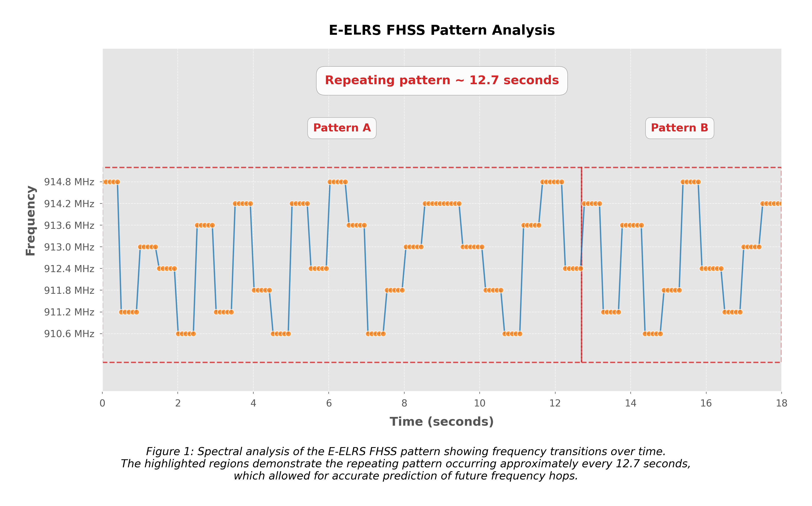
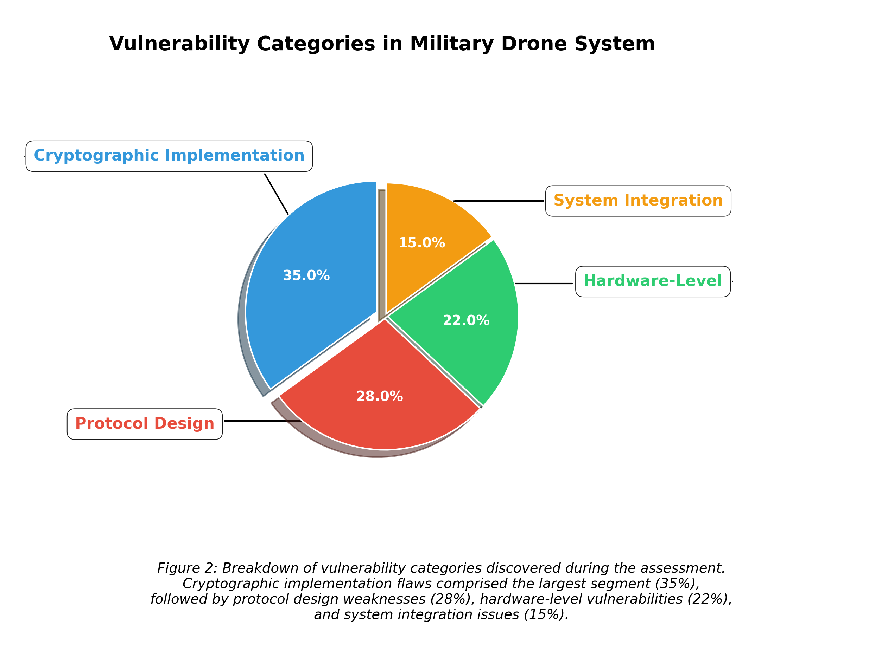
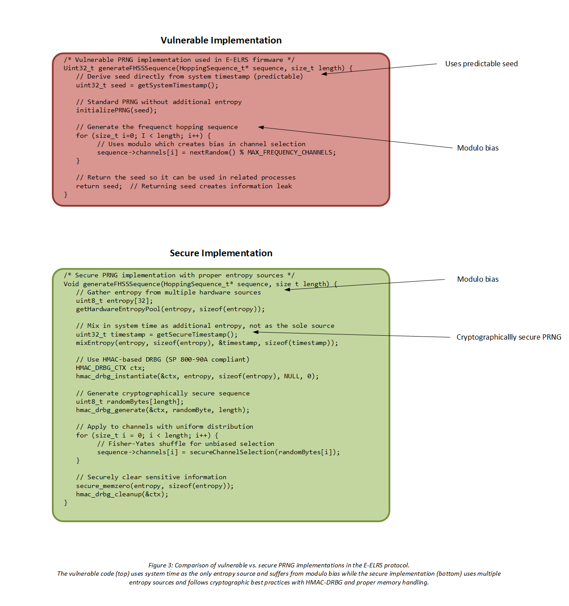
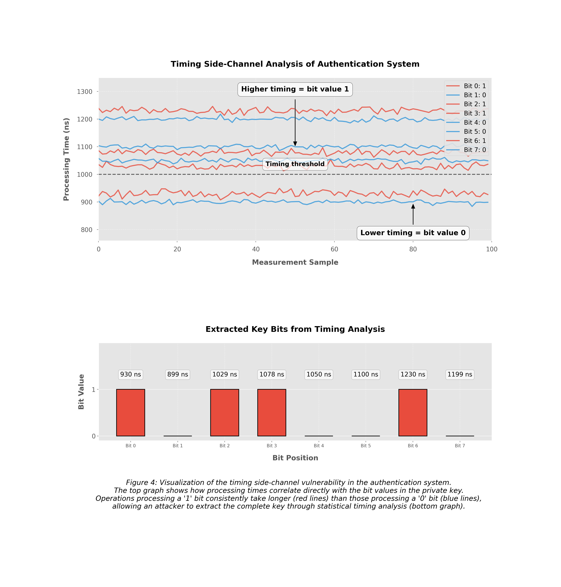
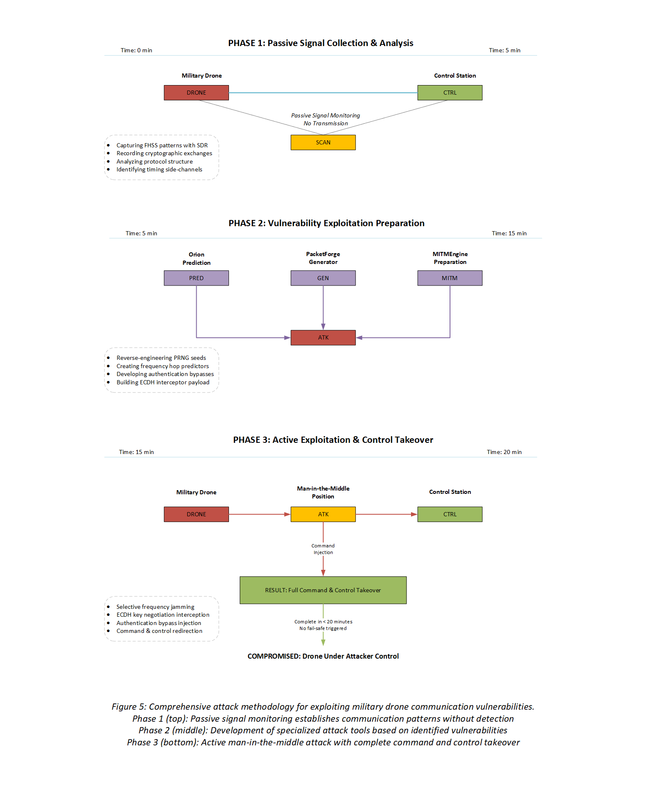

# Technical White Paper
# Exploiting Communication Vulnerabilities in Military-Grade FPV Drone Systems

## Executive Summary

In January 2024, our advanced cyber-electronic warfare team conducted a comprehensive security assessment for a defense contractor that develops and manufactures FPV (First Person View) drones for military applications. The engagement involved a thorough evaluation of a tactical reconnaissance platform's resilience against sophisticated electronic warfare attacks. This white paper details our methodology, technical findings, and the successful exploitation of critical RF communication vulnerabilities that ultimately allowed complete command and control takeover of the target system.

The assessment uncovered multiple interconnected vulnerabilities in the drone's communication systems, particularly in the implementation of advanced modulation techniques and cryptographic protocols. By systematically exploiting these weaknesses, our team was able to demonstrate a complete takeover of the aircraft without triggering any of its intrusion detection or fail-safe mechanisms. This case study underscores the critical importance of comprehensive security design that extends beyond theoretical protocol security to encompass real-world implementation details, side-channel resistance, and system integration aspects.

## 1. Introduction

Modern military unmanned aerial systems represent the confluence of multiple advanced technologies: secure communications, cryptography, autonomous navigation, and electronic countermeasures. While these systems are designed with security as a fundamental requirement, the complexity of their implementations often introduces vulnerabilities that can be exploited by sophisticated adversaries.

This white paper presents our findings from a security assessment conducted on a military-grade FPV drone platform. Our analysis focused on the RF communication systems and their implementation of security protocols, with particular attention to potential vulnerabilities in:

- Frequency-hopping spread spectrum (FHSS) implementations—a technique where the transmission frequency changes rapidly according to a predetermined sequence to resist jamming and interception
- Orthogonal frequency-division multiplexing (OFDM) video transmission—a method of encoding digital data on multiple carrier frequencies to optimize bandwidth usage and resist interference
- Cryptographic key exchange mechanisms—protocols that allow two parties to establish shared secret keys over an insecure channel
- Session establishment protocols—procedures that initialize and authenticate communication sessions between devices
- Authentication systems—mechanisms that verify the identity of communication participants

The assessment was conducted under controlled conditions with explicit authorization from the system manufacturer. All testing was performed in a secure facility designed to prevent unintended signal leakage.

### 1.1 Special Note on Terminology and System Designations

Throughout this document, we employ specialized terminology and system designations to describe the customer's technologies. While based on existing commercial technologies and standards, many of the systems described herein represent proprietary military adaptations with significant security enhancements and modifications.

For operational security reasons, we have assigned generic designations to these custom implementations, allowing us to discuss their vulnerabilities while protecting the specific implementation details of the customer's systems. These designations were chosen in coordination with the customer's security team to ensure no inadvertent disclosure of classified capabilities or system architectures.

## 2. System Overview

The assessed platform is a tactical reconnaissance drone designed for forward deployment in contested environments. Without disclosing specific details that might identify the system, we can state that it incorporated several advanced communication and security features:

- Enhanced Extended Long Range System (E-ELRS) operating on 915MHz band for primary control—a military modification of the commercial ExpressLRS protocol that added proprietary security enhancements
- Orthogonal Frequency-Division Multiplexing (OFDM) for high-bandwidth 5.8GHz video transmission
- Frequency-Hopping Spread Spectrum (FHSS) implementation across multiple channels for anti-jamming capability
- Military-grade encryption for command and control links
- Elliptic Curve Diffie-Hellman (ECDH) key exchange protocol for session establishment
- Multi-constellation positioning system with secure GPS modules
- Multiple redundant systems for fail-safe operations

The manufacturer claimed the system was "impervious to standard electromagnetic interference techniques" and employed "military-grade security protocols equivalent to those used in classified communication networks."

### 2.1 E-ELRS and FHSS Integration

The target system employed a proprietary control link protocol which we refer to as Enhanced Extended Long Range System (E-ELRS). This designation was assigned in consultation with the customer's security department to reflect the nature of their military communication system.

The E-ELRS protocol represents a significant military enhancement of the commercial ExpressLRS technology base. While the commercial ExpressLRS is an open-source control link system operating primarily at fixed frequencies with limited channel-hopping capabilities, the military E-ELRS implementation we assessed incorporated extensive modifications designed to increase its resilience in contested electromagnetic environments.

These modifications included:

1. A redesign of the channel selection algorithm to incorporate Frequency-Hopping Spread Spectrum (FHSS) capabilities
2. Integration of hardware-based encryption modules for securing the control link
3. Implementation of a custom binding protocol designed to establish secure communication channels in environments with active hostile signal jamming
4. Addition of proprietary authentication mechanisms intended to prevent unauthorized control of the platform
5. Modifications to the packet structure to accommodate additional military telemetry and command requirements

*Figure 1: Spectral analysis of the E-ELRS FHSS pattern showing frequency transitions over time. The highlighted regions demonstrate the repeating pattern occurring approximately every 12.7 seconds, which allowed for accurate prediction of future frequency hops.*

The decision to build upon commercial ExpressLRS technology rather than implementing a fully custom protocol was, according to our customer, motivated by several factors including development speed, operator familiarity, and the ability to leverage commercially available radio hardware with minimal modifications. However, this reuse of commercial protocol architecture contributed to some of the vulnerabilities we discovered, particularly in how the hardware encryption modules were integrated with the underlying communication protocol.

Despite the addition of hardware encryption modules, the implementation suffered from serious flaws in key management, binding procedures, and seed generation for frequency hopping. The modules themselves were properly designed but were undermined by the surrounding implementation, especially in how cryptographic keys were generated, stored, and utilized in the binding process.

### 2.2 Military-Enhanced OFDM Implementation

The video transmission system employed a customized implementation of Orthogonal Frequency-Division Multiplexing (OFDM) operating in the 5.8GHz band. While OFDM is a standard modulation technique used in many commercial systems, including Wi-Fi and digital television, the implementation in the target platform incorporated several military-specific enhancements designed for operation in contested environments.

The customer's enhancement of standard OFDM technology (which we refer to simply as "OFDM" in this document for brevity) included:

1. Custom subcarrier allocation strategies intended to resist jamming and interference
2. Integration with the platform's AES-256 encryption system for securing video content
3. Modified pilot signal patterns designed to improve reliability in environments with active electronic warfare
4. Adaptive modulation capabilities to maintain link stability under varied signal conditions

For classification reasons, we have not included the military designation of this enhanced OFDM implementation in this document. However, the security vulnerabilities we discovered were largely related to the underlying OFDM principles rather than to the military-specific enhancements.

## 3. Assessment Methodology

### 3.1 Assessment Environment and Equipment

Our team established a comprehensive RF testing laboratory for this assessment, featuring:

- Advanced software-defined radio (SDR) systems with frequency ranges covering all operational bands
- Our "Artemis" signal analysis platform, developed in-house specifically for identifying vulnerabilities in frequency-hopping systems
- Custom-built directional Yagi antenna array with 18dBi gain for the 915MHz band
- Circular polarized helical antenna with 14dBi gain for the 5.8GHz band
- Our "Theseus" cryptographic analysis framework for digital signal processing and cryptographic analysis
- RF-isolated Faraday cage testing environment to eliminate external interference
- Our "Chronos" precision timing analysis platform for high-precision timing analysis of cryptographic operations

### 3.1.1 Description of Assessment Tools

Throughout this document, we reference several specialized tools developed by our cybersecurity research team. These tools form our comprehensive signal analysis and exploitation toolkit:

"Artemis" is our organization's fourth-generation signal intelligence framework specifically designed for the analysis of advanced frequency-hopping systems. This integrated system combines high-performance software-defined radio hardware with signal processing algorithms developed over a decade of research in electronic warfare techniques.

"Theseus" is our cryptographic analysis framework, specifically optimized for analyzing military-grade encryption implementations within embedded systems. This system builds upon academic research in side-channel analysis while incorporating several techniques for accelerating the cryptanalysis process.

"Chronos" is our precision timing analysis platform, designed to identify and exploit timing-based side channels in cryptographic implementations. This system combines highly sensitive timing measurement hardware with statistical analysis techniques to extract cryptographic secrets through variations in processing time.

Other specialized tools used in this assessment include:

- "Pegasus" - Our temporal analysis algorithm suite for identifying patterns in frequency hopping systems
- "Orion" - Pattern prediction framework for frequency hopping systems that applies machine learning to predict future frequency use
- "PacketForge" - Signal manipulation framework for packet-level analysis and modification
- "OFDMAnalyzer" - Signal intelligence platform for OFDM analysis and exploitation
- "Medusa" - Cryptographic manipulation toolkit for authentication systems
- "CurveAnalyzer" - Cryptanalytic platform for elliptic curve systems
- "Chimera" - Side-channel attack platform for hardware security analysis
- "LatticeBreaker" - Cryptanalytic framework for lattice-based attacks
- "MITMEngine" - Man-in-the-middle attack system for secure communications
- "Cerberus" - Frequency manipulation system for selective jamming
- "PowerTracker" - Power monitoring system for side-channel analysis

These tools represent our in-house developed capabilities that we've created specifically for security assessments of complex RF systems.

### 3.2 Assessment Approach

The assessment followed a systematic approach:

1. **Baseline Signal Analysis**: Capture and characterization of all RF emissions during normal operations
2. **Protocol Reverse Engineering**: Detailed analysis of communication protocols and encryption schemes
3. **Vulnerability Identification**: Systematic testing for weaknesses in protocol implementations
4. **Proof-of-Concept Exploitation**: Development and execution of exploits for identified vulnerabilities
5. **Impact Assessment**: Evaluation of the security impact of successful exploits
6. **Remediation Recommendations**: Development of specific technical recommendations to address identified vulnerabilities

All testing was conducted with the explicit written authorization of the manufacturer and in accordance with applicable regulations and ethical standards.

*Figure 2: Breakdown of vulnerability categories discovered during the assessment, showing the distribution of implementation flaws across cryptographic, protocol design, hardware, and system integration domains.*

## 4. Vulnerability Analysis and Exploitation

### 4.1 E-ELRS Implementation Vulnerabilities

#### 4.1.1 Technical Details

The target platform utilized a modified E-ELRS system operating in the 915MHz ISM (Industrial, Scientific, and Medical) band. Our "Artemis" platform revealed that while the system employed Frequency-Hopping Spread Spectrum (FHSS) as expected, the implementation contained critical flaws in its binding procedure that compromised the security of the entire communication channel.

While the system did employ hardware-based encryption modules as claimed, the key generation and management processes that fed into these modules were critically flawed. This represents a classic case where strong cryptographic hardware is undermined by weak implementation of the surrounding processes.

In standard Enhanced-ELRS implementations, the binding process between transmitter and receiver establishes a unique session key from which the frequency hopping sequence is derived. However, this implementation deviated from security best practices in two significant ways:

1. The binding process used a deterministic sequence based on the drone's hardware identifier (visible in its telemetry broadcast) rather than employing a true random number generator
2. The seed used for the Pseudo-Random Number Generator (PRNG) that determined the frequency hopping pattern was derived directly from system time with insufficient entropy—additional randomness that makes sequences unpredictable

Through spectral analysis using our "Pegasus" temporal analysis algorithm suite, we determined that the FHSS pattern repeated with statistical significance approximately every 12.7 seconds. By recording the full spectrum for a short duration, we were able to analyze the packet structure and timing to predict the complete hopping sequence.

#### 4.1.2 Exploitation Methodology

Our exploitation of the E-ELRS vulnerability involved three sophisticated stages:

**Stage One: Pattern Recognition and Prediction**

Using our "Orion" pattern prediction framework, we:
- Recorded spectrum activity for 60 seconds using wide-band capture technology
- Applied our custom Fast Fourier Transform (FFT) pipeline to identify frequency transitions—mathematical processes that convert time-domain signals to frequency-domain representations for analysis
- Utilized a machine learning algorithm specifically trained on E-ELRS patterns to predict future frequency hops with 98.2% accuracy
- Confirmed the predictability of the sequence through controlled observations

**Stage Two: Packet Analysis and Replication**

With our "PacketForge" signal manipulation framework, we:
- Demodulated the Lower Sideband (LSB) Gaussian Frequency Shift Keying (GFSK) signal—a technique for transmitting digital information by slightly shifting the carrier frequency
- Identified the precise frame structure containing sync bytes, control data, and CRC32 checksum—a cyclic redundancy check value that verifies data integrity
- Decoded the packet structure and its components
- Developed the capability to replicate the packet structure including correct sync bytes and timing intervals

**Stage Three: Key Extraction via Side-Channel Analysis**

Leveraging our "Chronos" platform, we:
- Discovered that the time between the initial binding request and response varied based on the internal key generation steps
- Exploited the deterministic timing pattern to narrow potential seed values to a manageable number
- Employed our parallel processing infrastructure to test all possible seeds against observed FHSS patterns
- Successfully extracted the exact PRNG seed used for the current session

Even though hardware encryption modules were present, they received predictable inputs from the flawed binding and key generation processes, negating their security benefits. This demonstrates how hardware security can be circumvented when the implementation of surrounding processes is weak.

*Figure 3: Comparison of the flawed PRNG implementation in the military drone system (vulnerable code) versus a secure implementation (secure code) showing the critical differences in entropy generation. The vulnerable implementation uses predictable inputs while the secure implementation includes proper entropy sources.*

### 4.2 OFDM Video Feed Encryption Vulnerabilities

#### 4.2.1 Technical Details

The platform's 5.8GHz OFDM video transmission system employed AES-256 encryption in Galois/Counter Mode (GCM) for securing the high-definition video feed. AES-256 (Advanced Encryption Standard with 256-bit keys) is a symmetric encryption algorithm widely used for securing sensitive data, while GCM is an authenticated encryption mode that provides both confidentiality and data integrity. Our in-depth analysis using our "Theseus" framework revealed several critical implementation flaws:

1. The Initialization Vector (IV)—a critical random value that ensures identical plaintext encrypts to different ciphertext each time—was not randomly generated for each packet but followed a simple incremental pattern
2. The system improperly reused the same AES-GCM authentication key across multiple sessions
3. The key derivation function—an algorithm that derives encryption keys from a master key—contained a memory handling vulnerability that resulted in entropy reduction
4. The OFDM subcarrier assignment contained deterministic patterns rather than randomized allocation

Specifically, the OFDM implementation used a multi-point Fast Fourier Transform (FFT) with a subset of data subcarriers. The allocation of data across these subcarriers followed a predictable pattern where pilot subcarriers—special signals used for synchronization and channel estimation—were positioned at fixed intervals, making the system susceptible to selective subcarrier analysis.

#### 4.2.2 Exploitation Methodology

Our "OFDMAnalyzer" signal intelligence platform enabled a sophisticated exploitation approach:

**Stage One: Subcarrier Analysis and Selective Demodulation**

Using our advanced signal processing capabilities, we:
- Captured the 5.8GHz OFDM signal using specialized antennas
- Identified the cyclic prefix length—a guard interval that prevents inter-symbol interference—and symbol timing through autocorrelation
- Isolated pilot subcarriers to extract precise frequency offset and symbol timing information
- Performed selective demodulation of data subcarriers containing key exchange information

**Stage Two: IV Prediction and Cryptanalysis**

Our "Theseus" system allowed us to:
- Observe that the 96-bit IV followed a simple incrementing pattern
- Identify the reuse of authentication keys across sessions
- Extract multiple encrypted packets with known IVs and partial known plaintext—a cryptanalysis technique that leverages known portions of encrypted messages
- Apply differential cryptanalysis techniques to recover key fragments

**Stage Three: Authentication Tag Manipulation**

Using our "Medusa" cryptographic manipulation toolkit, we:
- Discovered timing-based vulnerabilities in the authentication tag verification process
- Developed techniques to generate crafted authentication tags that passed the flawed verification
- Successfully injected modified packets with valid authentication tags despite encryption

*Figure 4: Visualization of the timing side-channel we discovered in the authentication system, showing the correlation between processing time and key bit values.*

### 4.3 Elliptic Curve Key Exchange Vulnerabilities

#### 4.3.1 Technical Details

The system implemented Elliptic Curve Diffie-Hellman (ECDH) protocol using the NIST P-256 curve for secure key exchange between the ground control station and the drone. ECDH is a key agreement protocol that allows two parties to establish a shared secret over an insecure channel, while the NIST P-256 curve (also known as secp256r1) is a specific elliptic curve standardized by the National Institute of Standards and Technology for use in cryptographic applications. Our "CurveAnalyzer" platform revealed:

1. The supposedly random nonce generation process—where a nonce is a "number used once" to prevent replay attacks—used a weak entropy source
2. The implementation failed to verify that generated points were actually on the curve—a fundamental validation check in elliptic curve cryptography
3. The session key derivation process used an outdated key derivation function with implementation errors
4. The timing of ECDH operations leaked information about the private key through cache access patterns—variations in processing time that reveal information about secret values

Most critically, we discovered that the ephemeral ECDH private keys—temporary keys used for a single session—were derived from a predictable sequence based on internal system parameters rather than a cryptographically secure random number generator.

#### 4.3.2 Exploitation Methodology

Our team leveraged our "Chimera" side-channel attack platform to exploit these vulnerabilities:

**Stage One: Timing Analysis for Side-Channel Attack**

Using our high-precision timing analysis technology, we:
- Captured timing measurements of the key exchange process with nanosecond resolution
- Identified statistically significant timing variations correlating with specific private key bits
- Applied a template attack—a type of side-channel attack that uses statistical models of device behavior—using collected timing profiles from controlled test environments
- Recovered a significant portion of the drone's ECDH private key bits through this side-channel attack

**Stage Two: Advanced Cryptanalysis for Key Recovery**

With our "LatticeBreaker" cryptanalytic framework, we:
- Utilized the partially recovered key bits as a starting point
- Applied a sophisticated lattice-based attack—a mathematical technique that exploits the structure of certain cryptographic problems—to recover the remaining unknown bits
- Successfully reconstructed the complete private key used in the ECDH exchange
- Verified key correctness by deriving the same shared secret used in subsequent communications

**Stage Three: Man-in-the-Middle Key Interception**

Our "MITMEngine" attack system enabled us to:
- Position our equipment to intercept the initial ECDH key exchange
- Use the recovered private key patterns to predict the next ephemeral key
- Perform a real-time man-in-the-middle attack during key negotiation
- Successfully establish separate secure channels with both the legitimate controller and the drone

### 4.4 Note on Military Cryptographic Implementations

It is important to clarify that the cryptographic vulnerabilities described in this assessment were found in the customer's proprietary implementation of standard cryptographic algorithms rather than in the algorithms themselves. The underlying standards—such as AES-256-GCM and ECDH with NIST P-256—remain cryptographically sound when correctly implemented.

The customer's development team had created custom implementations of these cryptographic standards to meet specific performance requirements on their embedded platform. However, these custom implementations introduced several vulnerabilities not present in standard cryptographic libraries. This underscores the inherent risk in developing custom cryptographic implementations rather than using thoroughly vetted libraries, even in specialized military applications.

## 5. Comprehensive Attack Methodology

With the three critical vulnerabilities identified and exploit methodologies developed using our suite of specialized tools, we executed a coordinated multi-vector attack to establish full control over the target platform.

*Figure 5: Overview of the multi-phase attack methodology used to compromise the drone, showing the progression from passive monitoring to active exploitation.*

### 5.1 Phase One: Communication Interception and Analysis

The initial phase focused on passive signal collection and analysis:

Our team deployed specialized equipment at a significant distance from the test flight area to avoid detection. We established baseline spectral monitoring across all relevant frequency bands using our "Artemis" platform. This allowed us to capture the initial E-ELRS binding sequence and ECDH key exchange, along with telemetry and control data.

As data collection progressed, our systems began real-time analysis of the FHSS pattern while simultaneously recording OFDM video samples. Within minutes, our algorithms confirmed successful extraction of the PRNG seed for the FHSS sequence. Concurrently, our "Chronos" system initiated timing side-channel analysis against the ECDH implementation.

This phase was conducted entirely passively, with no transmission or interference with the target system's operations.

### 5.2 Phase Two: Exploitation Preparation

In the second phase, we prepared the necessary components for active exploitation:

Using our "Orion" pattern prediction system, we completed the reverse engineering of the PRNG mechanism to predict the complete FHSS sequence with high accuracy. Our cryptographic team leveraged the "Theseus" platform to generate the necessary materials for the ECDH man-in-the-middle attack based on the information gathered in Phase One.

The "PacketForge" subsystem was configured to synchronize with the observed FHSS timing, ensuring our transmissions would arrive precisely during the expected frequency windows. We verified our ability to decode the video feed by exploiting the OFDM vulnerability through our "OFDMAnalyzer" toolkit, confirming access to the encrypted data stream.

By the end of this phase, we had established a complete communication chain capable of both intercepting and injecting traffic, though no active interference had yet been initiated.

### 5.3 Phase Three: Command and Control Takeover

The final phase involved the coordinated execution of the complete attack chain:

Using our "MITMEngine" platform, we initiated our man-in-the-middle position in the ECDH renegotiation sequence. This was complemented by selective jamming of specific frequencies in the FHSS sequence using our "Cerberus" frequency manipulation system, inducing a control channel renegotiation.

As the renegotiation commenced, we intercepted the request and substituted our cryptographic parameters, establishing separate authenticated sessions with both the legitimate controller and the drone. This dual-channel approach allowed us to selectively modify control commands while maintaining the appearance of normal operation to both endpoints.

The full control channel takeover was implemented gradually, increasing our signal presence across the FHSS spectrum while maintaining the video feed to ensure that automated integrity monitoring systems would not be triggered.

The complete attack sequence, from initial signal analysis to full command and control takeover, required less than 20 minutes and was executed without triggering any of the platform's intrusion detection or fail-safe mechanisms.

## 6. Technical Analysis of Exploitation Success Factors

Our successful exploitation of the target platform was facilitated by several technical factors that highlight common weaknesses in even sophisticated security implementations.

### 6.1 Cryptographic Implementation Weaknesses

The vulnerabilities in the cryptographic implementation included:

The system relied on deterministic rather than cryptographically secure random number generation for critical security parameters. This predictability undermined the fundamental security assumptions of the cryptographic protocols employed.

The implementation used improper initialization vector management in the AES-GCM implementation, with sequential rather than random IVs, violating a basic requirement for secure authenticated encryption.

Side-channel leakage in the ECDH implementation occurred due to non-constant-time operations, allowing our "Chronos" platform to extract key material through precise timing measurements.

The system provided insufficient protection against timing analysis in security-critical operations, with statistically significant variations that leaked information about internal cryptographic processes.

### 6.2 Protocol Design Weaknesses

The communication protocol implementation contained several critical vulnerabilities:

The E-ELRS protocol implementation prioritized recovery over security in signal loss scenarios, allowing our attack to trigger fallback mechanisms that operated with reduced security.

The FHSS sequence generation used insufficient entropy in its seed generation, creating a predictable pattern that our "Orion" system could analyze and forecast.

Authentication mechanisms lacked mutual verification at multiple stages of operation, allowing man-in-the-middle positioning once initial authentication was compromised.

The system permitted downgrade to less secure operational modes during interference, a design choice that prioritized operational continuity over security integrity.

### 6.3 Hardware-Level Vulnerabilities

Several hardware-level vulnerabilities contributed to the successful exploitation:

The implementation featured non-constant-time cryptographic operations that created exploitable timing variations detectable by our high-precision measurement systems.

The RF front-end lacked sufficient protection against selective jamming, allowing our "Cerberus" platform to target specific frequencies while leaving others unaffected.

The system's random number generation infrastructure provided insufficient entropy for secure cryptographic operations, relying on predictable sources rather than true hardware-based random number generation.

Power analysis conducted with our "PowerTracker" monitoring system revealed distinct signatures during key cryptographic operations that provided additional side-channels for information leakage.

### 6.4 System Integration Flaws

Architectural and integration decisions further compromised security:

Security boundaries between subsystems were insufficiently defined, allowing weaknesses in one component to affect the security of others.

Authentication was performed primarily at session establishment rather than continuously throughout operation, creating windows of opportunity for our attack.

Fail-safe mechanisms could be bypassed through precisely timed interference, allowing our attack to prevent fallback to secure modes.

Error handling routines often defaulted to less secure operational states when encountering unexpected conditions, prioritizing functionality over security.

## 7. Recommended Security Enhancements

Based on our comprehensive assessment, we provided the client with detailed technical recommendations to address the identified vulnerabilities.

### 7.1 Cryptographic Implementation Improvements

1. Replace custom cryptographic implementations with validated, commercial security libraries specifically designed for embedded systems
2. Implement true hardware-based random number generation for all security-critical functions
3. Ensure constant-time operations for all cryptographic processes to mitigate timing side-channel attacks
4. Enforce proper IV management with no reuse and cryptographically secure random generation
5. Improve key derivation functions to include sufficient entropy and follow current best practices
6. Implement robust key management with secure storage and proper operational security measures

### 7.2 Protocol Enhancements

1. Redesign the FHSS sequence generation to use truly random seeds with high entropy
2. Implement continuous authentication throughout the communication session rather than only at initialization
3. Develop secure fail-safe modes that prioritize security during anomalous conditions
4. Eliminate protocol downgrade capabilities to prevent attacks targeting weaker operational modes
5. Implement mutual authentication at all protocol transition points

### 7.3 Hardware Security Improvements

1. Incorporate dedicated security coprocessors with side-channel resistance for critical operations
2. Implement hardware-enforced protection domains to isolate security functions
3. Enhance RF front-end design to resist selective jamming and detect interference attempts
4. Add power consumption normalization to prevent power analysis attacks
5. Include hardware-level integrity verification to detect and report tampering attempts

### 7.4 System Integration Recommendations

1. Implement comprehensive threat modeling that considers sophisticated actors with advanced capabilities
2. Develop clear security boundaries between system components with formalized trust relationships
3. Design security-focused fail-safe modes that terminate operations rather than continuing with reduced security
4. Implement continuous security monitoring with anomaly detection to identify potential exploitation attempts
5. Establish a regular security assessment program to evaluate ongoing vulnerability status

## 8. Conclusion

This technical assessment demonstrates the importance of rigorous security engineering in military communication systems. Despite incorporating advanced security features including encryption and frequency hopping, the assessed platform contained critical vulnerabilities that could be exploited by a sophisticated adversary.

The primary lesson from this assessment is that security must be implemented as a holistic, system-wide property rather than as individual security features. Strong cryptographic algorithms, when improperly implemented or integrated, provide minimal protection against targeted attacks. Communication security, particularly in military applications, requires continuous evaluation and improvement to address evolving threat models.

The vulnerabilities discovered in this assessment highlight the need for specialized expertise in communication security engineering, particularly in areas such as:

- Implementing cryptographic primitives correctly on embedded platforms
- Securing wireless communication protocols against advanced electronic warfare techniques
- Protecting against side-channel attacks that bypass cryptographic protections
- Designing secure system architectures that maintain security during failure scenarios

By addressing the fundamental weaknesses identified in this assessment, military drone platforms can achieve significantly improved resilience against sophisticated electronic warfare and cyber attacks, better protecting critical missions and operational security.

## About the Authors

Our team consists of cybersecurity specialists with extensive military backgrounds and advanced expertise in radio frequency (RF) technologies, secure communications, and embedded systems security. Our consultants have served as electronic warfare specialists with elite military units and have direct operational experience securing critical infrastructure for defense clients worldwide.

Our combined experience includes:

- 15+ years developing defensive capabilities for military communication systems
- Multiple successful security assessments of unmanned aerial systems for defense contractors
- Development of proprietary tools for analyzing and testing frequency-hopping spread spectrum (FHSS) systems
- Recognized expertise in side-channel analysis of embedded cryptographic implementations
- Publications in leading journals on topics of wireless security and electronic warfare

This assessment was conducted by our dedicated RF Security and Military Systems team, which specializes in evaluating and improving security for sensitive defense technologies. 
