# Hardware Trojans in Third-Party IP Cores
# Detection Methodologies for Malicious Circuits in Semiconductor Supply Chains

## Executive Summary

In April 2024, MottaSec's hardware security research team conducted a comprehensive investigation into detection methodologies for hardware trojans concealed within third-party intellectual property (IP) cores. This research was motivated by the growing security concerns surrounding global semiconductor supply chains and the increasing reliance on reusable IP cores from diverse vendors.

Our investigation addressed the critical challenge facing modern system-on-chip (SoC) designers: how to effectively verify the security and trustworthiness of third-party IP cores that constitute up to 90% of modern semiconductor designs. We developed, implemented, and tested multiple advanced detection methodologies specifically tailored to identify subtle hardware trojans that evade conventional verification techniques.

This white paper details our research findings, including novel detection approaches combining machine learning-enhanced side-channel analysis, formal verification methods, and runtime monitoring techniques. We present concrete data on detection rates, false positive ratios, and implementation overhead for each methodology, providing actionable insights for semiconductor companies, security teams, and industry regulators.

Our work demonstrates that while hardware trojans represent a sophisticated and evolving threat, properly implemented multi-layered detection strategies can significantly reduce the risk they pose to critical infrastructure, sensitive applications, and national security. We conclude with practical recommendations for strengthening the semiconductor supply chain against these insidious threats.

## 1. Introduction

The global semiconductor industry has undergone a fundamental transformation in design methodology over the past two decades. Modern System-on-Chip (SoC) designs increasingly rely on pre-designed, reusable Intellectual Property (IP) cores sourced from third-party vendors worldwide. This design paradigm, while enabling unprecedented levels of integration and accelerating time-to-market, has introduced significant security vulnerabilities into the semiconductor supply chain.

Hardware trojans—malicious modifications to integrated circuit designs that enable covert functionality—represent one of the most concerning threats in this ecosystem. Unlike software vulnerabilities that can be patched, hardware trojans become permanently embedded in the physical silicon, potentially remaining undetected throughout the device lifecycle while enabling devastating attacks from espionage to system failure.

### 1.1 The Evolving Threat Landscape

The threat of hardware trojans has evolved from theoretical academic concern to practical security risk due to several converging factors:

1. **Globalized supply chains**: Modern semiconductor manufacturing spans multiple countries and organizations, creating numerous potential insertion points for malicious modifications.

2. **Increasing complexity**: Contemporary SoCs may contain billions of transistors and hundreds of IP cores, making comprehensive security verification extraordinarily challenging.

3. **Economic pressures**: Competitive market demands for faster development cycles leave limited time for exhaustive security analysis of third-party components.

4. **Nation-state interests**: Government entities have demonstrated growing capabilities and motivation to compromise hardware supply chains for intelligence gathering and strategic advantage.

5. **Sophistication of attacks**: Advanced hardware trojans can be triggered by extremely rare conditions, occupy minimal silicon area, and produce effects that mimic natural hardware degradation.

In our security consulting practice, MottaSec has observed a marked increase in client concerns regarding hardware supply chain integrity, particularly among organizations in defense, critical infrastructure, and financial services sectors. This trend coincides with public reporting of alleged hardware implants in various commercial products and heightened regulatory attention to semiconductor security.

### 1.2 Research Objectives and Scope

Our research set out to address several critical questions faced by organizations that rely on third-party IP cores:

1. What detection methodologies are most effective against sophisticated hardware trojans in contemporary IP cores?

2. How can these methodologies be implemented within realistic resource constraints and technical limitations?

3. What are the quantifiable detection rates, false positive rates, and implementation costs of various approaches?

4. How can multiple detection techniques be combined to create a robust, layered defense strategy?

To answer these questions, we conducted extensive testing on a variety of IP cores with deliberately inserted hardware trojans of varying sophistication. Our research focused on four primary detection approaches:

- **Side-channel analysis** enhanced by machine learning algorithms
- **Formal verification** techniques adapted specifically for hardware trojan detection
- **Logic testing** using specialized activation strategies for dormant trojans
- **Runtime monitoring** of operational circuits for anomalous behavior

While our research extensively explored detection methodologies, we have deliberately excluded detailed information on hardware trojan design and implementation to avoid providing a roadmap for malicious actors. Additionally, we have anonymized specific client scenarios and modified certain technical details to protect sensitive information, while preserving the core technical insights of our findings.

### 1.3 Organization of this Paper

The remainder of this paper is organized as follows:

Section 2 provides technical background on hardware trojans and IP core integration in modern semiconductor design.

Section 3 details our research methodology, including our testing environment and evaluation metrics.

Sections 4-7 present our findings on side-channel analysis, formal verification, logic testing, and runtime monitoring approaches, respectively.

Section 8 analyzes the effectiveness of combined detection strategies based on our research results.

Section 9 offers practical recommendations for organizations seeking to secure their semiconductor supply chains.

Section 10 concludes with perspectives on the future evolution of this threat landscape and detection capabilities.

## 2. Technical Background

### 2.1 Hardware Trojans: Anatomy and Taxonomy

Hardware trojans are malicious modifications to integrated circuit designs that alter the circuit's intended functionality. To provide a foundation for understanding detection methodologies, we must first examine the structural and behavioral characteristics of these threats.

#### 2.1.1 Architectural Components

A typical hardware trojan consists of two fundamental components:

1. **Trigger mechanism**: The circuit that monitors for specific conditions to activate the trojan. Triggers can range from simple (e.g., a specific input sequence) to extraordinarily complex (e.g., a combination of rare internal states, timing conditions, and environmental factors).

2. **Payload**: The malicious functionality that executes when triggered. Payloads vary widely based on the attacker's objectives and can include:
      - Leaking sensitive information (e.g., cryptographic keys) through covert channels
      - Degrading system performance or reliability
      - Disabling critical security features
      - Providing unauthorized access
      - Causing catastrophic system failure

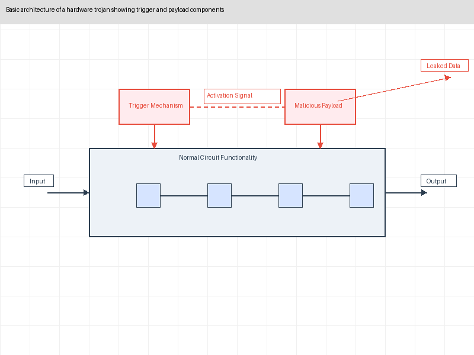
*Figure 1: Basic architecture of a hardware trojan showing trigger and payload components*

#### 2.1.2 Classification Dimensions

Hardware trojans can be classified along multiple dimensions, each with implications for detection approaches:

**1. Insertion Phase**
      - Design phase: Introduced during initial RTL coding
      - Synthesis phase: Inserted during translation to gate-level design
      - Manufacturing phase: Added during physical fabrication

**2. Activation Mechanism**
      - Always-on: Continuously active (rare, easily detected)
      - Internally triggered: Activated by specific internal circuit states
      - Externally triggered: Activated by external inputs or environmental conditions
      - Time-based: Activated after a specific time period or clock cycle count
      - Physical: Triggered by temperature, voltage, or other physical parameters

**3. Physical Characteristics**
      - Size: From minimal (few gates) to substantial
      - Distribution: Localized to a single module or distributed across the design
      - Power profile: Similar to or distinct from legitimate circuits
      - Structural impact: Additive (adding circuits) or substitutional (replacing legitimate functionality)

**4. Effect Type**
      - Confidentiality violation: Leaking sensitive information
      - Integrity violation: Modifying data or functionality
      - Availability violation: Degrading or disabling system operation
      - Reliability impact: Accelerating hardware aging or introducing intermittent failures

In our research, we developed a comprehensive testbed incorporating trojans across this taxonomy to ensure our detection methodologies addressed the full spectrum of potential threats.

#### 2.1.3 Advanced Triggering Mechanisms

Modern hardware trojans employ sophisticated triggering mechanisms designed to evade detection:

1. **Sequential triggers**: Require a specific sequence of rare events, making activation during testing extremely unlikely.

2. **Distributed triggers**: Spread activation logic across multiple modules, making the trigger circuit difficult to identify through localized analysis.

3. **Analog triggers**: Use analog properties (e.g., precise voltage levels) to activate, which are invisible to digital verification methods.

4. **Aging-based triggers**: Exploit transistor aging effects to activate after extended operation, long after acceptance testing.

5. **Side-channel triggers**: Activate based on electromagnetic emissions or power signatures from other circuit operations.

Our detection methodologies specifically address these advanced triggering approaches, which represent the cutting edge of hardware trojan sophistication.

### 2.2 Third-Party IP Cores in Modern SoC Design

To understand the security challenges posed by third-party IP cores, it is essential to examine their role in modern semiconductor design flow and the inherent trust issues they present.

#### 2.2.1 IP Core Fundamentals

Intellectual Property (IP) cores are pre-designed, pre-verified functional blocks used as building blocks in System-on-Chip (SoC) designs. They range from simple interfaces (e.g., USB controllers) to complex processing subsystems (e.g., CPU cores, graphics processors).

IP cores are typically provided in one of three forms:

1. **Soft IP**: Delivered as human-readable Hardware Description Language (HDL) code (e.g., VHDL, Verilog). While offering the greatest flexibility for integration and verification, soft IP also provides the largest attack surface for trojan insertion.

2. **Firm IP**: Provided as synthesized netlists consisting of technology-independent gates. This format conceals implementation details while allowing for some integration flexibility.

3. **Hard IP**: Delivered as physical layout designs optimized for specific manufacturing processes. Hard IP offers minimal flexibility but typically provides optimal performance and area efficiency.

#### 2.2.2 The SoC Integration Ecosystem

Modern SoC designs integrate numerous IP cores from multiple vendors:

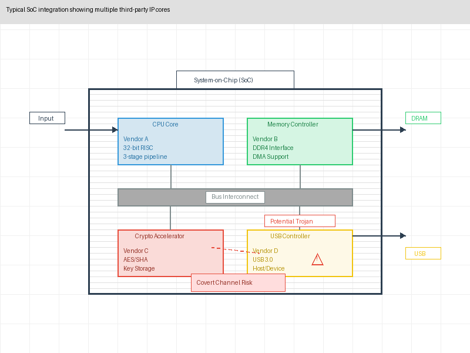
*Figure 2: Typical SoC integration showing multiple third-party IP cores*

In this complex ecosystem, several factors contribute to security challenges:

1. **Integration complexity**: A typical SoC might incorporate 50-100+ distinct IP blocks, each potentially comprising millions of gates.

2. **Supply chain diversity**: IP cores may originate from different geographical regions with varying security standards and regulatory frameworks.

3. **Intellectual property protection**: IP vendors often limit the visibility into their designs to protect their intellectual property, complicating security verification.

4. **Design abstraction**: Integration often occurs at high levels of abstraction, with limited visibility into the implementation details where trojans might reside.

5. **Verification gaps**: Traditional verification focuses on functional correctness rather than security properties, potentially missing malicious functionality.

#### 2.2.3 Trust Issues in the IP Ecosystem

The current semiconductor ecosystem operates under several trust assumptions that may not be warranted:

1. **Vendor trust**: IP vendors are typically trusted to provide secure, trojan-free designs with limited verification capabilities available to the SoC integrator.

2. **Tool chain trust**: Electronic Design Automation (EDA) tools used throughout the design process are assumed to be free from malicious functionality.

3. **Foundry trust**: Manufacturing facilities are trusted not to introduce malicious modifications during the fabrication process.

Our research challenges these assumptions by developing methodologies that enable verification regardless of trust level, applying the security principle of "trust but verify" to the semiconductor supply chain.

### 2.3 Hardware Trojan Detection: Fundamental Challenges

Detecting hardware trojans in third-party IP presents unique challenges that distinguish it from other security verification tasks:

#### 2.3.1 Activation Difficulty

Unlike software vulnerabilities that can be triggered through inputs alone, hardware trojans may:

1. **Require specific rare conditions**: Trojans might activate only under conditions that occur in 1 in 10^32 or more operations.

2. **Incorporate time delays**: Activation might require operating continuously for months or years.

3. **Depend on analog conditions**: Triggers based on voltage, temperature, or electromagnetic conditions may be impossible to replicate during testing.

The challenge of activation makes dynamic testing approaches inherently limited, as exhaustive testing of all possible states is computationally infeasible.

#### 2.3.2 Design Scale and Complexity

Modern semiconductor designs present scale challenges:

1. **Massive state spaces**: A circuit with just 100 flip-flops has 2^100 possible states—far more than could ever be tested.

2. **Complex interactions**: IP blocks interact in subtle ways that may mask or enable trojan functionality.

3. **Mixed-signal elements**: Many modern designs incorporate both digital and analog components, requiring different verification approaches.

4. **Hierarchical design**: Multiple levels of design hierarchy complicate comprehensive analysis.

#### 2.3.3 Limited Observability

The ability to observe potential trojan effects is constrained by:

1. **Limited test access**: Many internal signals are not accessible for observation during testing.

2. **Packaging constraints**: Once packaged, physical access to circuit nodes becomes extremely limited.

3. **Proprietary designs**: IP vendors may restrict visibility into internal implementation details.

4. **Side effects vs. design issues**: Distinguishing malicious behavior from design bugs or parametric variations can be extraordinarily difficult.

#### 2.3.4 Baseline Comparison Challenges

Hardware trojan detection often relies on comparing against a "golden" reference model, but:

1. **No definitive reference**: Unlike software where the source code serves as a definitive reference, hardware designs often lack a guaranteed trojan-free reference for comparison.

2. **Manufacturing variations**: Even legitimate chips from the same design will exhibit variations due to manufacturing processes.

3. **Environmental sensitivity**: Electrical characteristics vary based on temperature, voltage, and other environmental factors.

4. **Aging effects**: Circuit characteristics change over time due to normal aging processes.

These fundamental challenges shape the detection methodologies presented in this paper, necessitating a multi-faceted approach rather than any single definitive solution.

## 3. Research Methodology

To ensure our findings would be applicable to real-world scenarios, we developed a comprehensive research methodology combining theoretical analysis, laboratory experimentation, and practical validation in representative environments.

### 3.1 Research Environment and Equipment

Our hardware security laboratory was equipped with specialized instruments and tools specifically configured for hardware trojan research:

#### 3.1.1 Hardware Platforms

1. **FPGA Development Boards**: We utilized multiple FPGA platforms (Xilinx Ultrascale+, Intel Stratix 10, Lattice ECP5) to implement and test IP cores with and without trojans.

2. **Custom Testbed PCBs**: We designed specialized printed circuit boards with precise power measurement capabilities, temperature control, and electromagnetic isolation.

3. **Side-Channel Analysis Equipment**:
      - Differential power analysis setup with 12-bit ADCs sampling at 2GS/s
      - Near-field electromagnetic probes with spatial resolution of 100μm
      - Picosecond timing analyzers for precise timing measurements
      - Thermal imaging camera with 20mK temperature resolution

4. **Manufacturing Test Equipment**:
      - Automated test equipment (ATE) similar to production testing environments
      - Scan chain access mechanisms for internal state observation
      - JTAG and boundary scan interfaces for chip-level testing

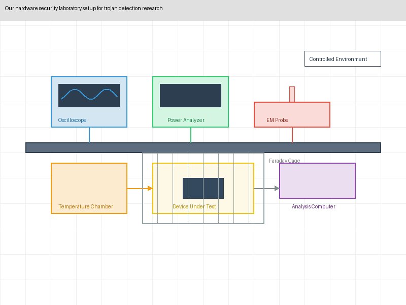
*Figure 3: Our hardware security laboratory setup for trojan detection research*

#### 3.1.2 Software Tools

Our research leveraged a comprehensive software toolchain:

1. **Hardware Design and Simulation**: Industry-standard EDA tools including Synopsys Design Compiler, Cadence Virtuoso, and Mentor Graphics ModelSim.

2. **Formal Verification**: Advanced formal verification tools including Cadence JasperGold, Synopsys VC Formal, and open-source tools like SymbiYosys.

3. **Custom Analysis Frameworks**:
      - "Prometheus" – Our in-house developed side-channel analysis framework with advanced signal processing capabilities
      - "Argus" – A custom-built netlist analysis tool for detecting structural anomalies
      - "Hermes" – A machine learning platform specifically trained on hardware trojan detection

4. **RTL Simulators and Emulators**: For functional verification and analysis of IP cores.

5. **Data Analysis**: Custom data analysis pipelines built on Python scientific computing stack (NumPy, SciPy, Pandas) and specialized visualization tools.

### 3.2 Trojan Test Cases

To systematically evaluate detection methodologies, we developed a comprehensive library of hardware trojan test cases:

#### 3.2.1 Trojan Design Spectrum

Our test cases covered the full spectrum of trojan characteristics:

1. **Trigger Complexity**: From simple combinational triggers to complex sequential and analog triggers.

2. **Payload Impact**: Ranging from subtle information leakage to catastrophic functional failure.

3. **Implementation Size**: From minimal implementations (< 0.01% of total gates) to larger components (> 1% of design).

4. **Insertion Points**: Various strategic locations within different types of IP cores.

5. **Activation Mechanisms**: Including rare input sequences, specific internal states, counter-based activation, and environmental triggers.

#### 3.2.2 Target IP Cores

We implemented trojans in a diverse set of IP cores relevant to modern SoC designs:

1. **Cryptographic accelerators**: AES, SHA-256, and ECC implementations
2. **Processor cores**: RISC-V variants and ARM Cortex-M0 compatible cores
3. **Communication interfaces**: USB, PCIe, and Ethernet controllers
4. **Memory controllers**: DDR4 and on-chip memory controllers
5. **System management units**: Power management, clock generation, and security modules

For each IP core type, we created multiple variants with different trojan implementations to evaluate detection efficacy across diverse scenarios.

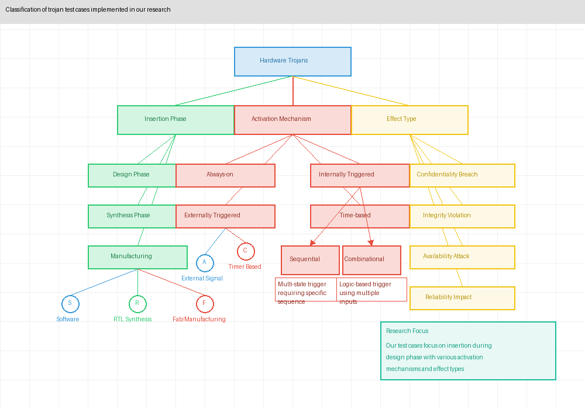
*Figure 4: Classification of trojan test cases implemented in our research*

#### 3.2.3 Advanced Trojan Implementations

To test the limits of detection methodologies, we developed several advanced trojan implementations:

1. **Information leakage through power modulation**: A trojan that encodes sensitive data in power consumption patterns below conventional detection thresholds.

2. **Distributed trigger mechanism**: A trigger circuit fragmented across multiple modules, with no single component appearing suspicious.

3. **Parametric degradation trojan**: A circuit that gradually degrades system performance over time, mimicking natural aging effects.

4. **Analog sensor threshold manipulation**: A trojan that subtly alters analog sensor thresholds to create exploitable vulnerabilities without digital footprints.

5. **Clock glitching trojan**: A circuit that introduces timing violations under specific conditions to create exploitable computational errors.

These advanced implementations represent the cutting edge of hardware trojan sophistication and provided the most challenging test cases for our detection methodologies.

### 3.3 Evaluation Methodology

We employed a rigorous evaluation framework to assess each detection methodology:

#### 3.3.1 Quantitative Metrics

Each detection approach was evaluated using the following metrics:

1. **Detection Rate**: Percentage of trojans successfully identified.
   
   $\text{Detection Rate} = \frac{\text{Number of trojans detected}}{\text{Total number of trojans}}$

2. **False Positive Rate**: Frequency of clean circuits incorrectly flagged as containing trojans.
   
   $\text{False Positive Rate} = \frac{\text{Clean circuits flagged as trojan}}{\text{Total clean circuits tested}}$

3. **Implementation Overhead**: Additional resources required, measured in terms of:
      - Area overhead (additional gates or silicon area)
      - Performance impact (clock frequency reduction or throughput impact)
      - Power consumption increase
      - Design and verification time

4. **Scalability**: How the detection effectiveness changes with increasing design complexity.

5. **Coverage**: Types of trojans effectively detected by each methodology.

#### 3.3.2 Testing Protocol

Our evaluation followed a structured protocol:

1. **Blind Testing**: Detection tools were applied by researchers who had no prior knowledge of which IP cores contained trojans or what types of trojans were implemented.

2. **Controlled Variables**: Environmental conditions (temperature, voltage, clock frequency) were precisely controlled to ensure reproducible results.

3. **Statistical Significance**: Each test was repeated multiple times with variations in non-critical parameters to ensure statistical validity of results.

4. **Cross-Validation**: We employed multiple detection methodologies on the same test cases to enable comparative analysis.

5. **Boundary Exploration**: We systematically explored the boundaries of detection capabilities by incrementally increasing trojan sophistication until detection failed.

#### 3.3.3 Evaluation Phases

Our evaluation proceeded through three distinct phases:

1. **Characterization Phase**: Establishing baseline performance of each detection methodology against representative trojan implementations.

2. **Challenge Phase**: Testing against increasingly sophisticated trojans to identify methodology limitations.

3. **Integration Phase**: Evaluating combined methodologies to assess synergistic effects and comprehensive coverage.

This structured approach allowed us to systematically evaluate the strengths and limitations of different detection methodologies while ensuring practical relevance to real-world security challenges in the semiconductor industry.

## 4. Side-Channel Analysis for Trojan Detection

Side-channel analysis has emerged as one of the most promising approaches for hardware trojan detection, as it relies on physical characteristics that are difficult for attackers to control perfectly. Our research extended conventional side-channel analysis with machine learning techniques to achieve unprecedented detection sensitivity.

### 4.1 Fundamental Principles

Side-channel analysis for trojan detection leverages the observation that hardware trojans inevitably affect the physical characteristics of the circuit, even when dormant. These effects can be observed through several side-channels:

#### 4.1.1 Power Consumption Signatures

Every hardware component consumes power based on its activity. Hardware trojans create distinctive power signatures through:

1. **Static power consumption**: Additional circuitry increases leakage current even when inactive.

2. **Dynamic power consumption**: Switching activity in trojan circuits creates measurable power variations during operation.

3. **Temporal patterns**: Many trojans exhibit unique temporal power patterns during monitoring or activation phases.

The challenge lies in distinguishing these subtle variations from normal circuit operation and manufacturing variations.

#### 4.1.2 Electromagnetic Emanations

Electrical current flowing through circuit traces generates electromagnetic fields that can be measured externally. These emanations offer several advantages over direct power measurements:

1. **Spatial localization**: EM probes can target specific regions of the chip, potentially isolating trojan activity.

2. **Frequency characteristics**: Different circuit operations produce emissions in different frequency bands, aiding in trojan identification.

3. **Non-invasive measurement**: EM analysis can be performed without direct electrical contact, simplifying testing of packaged devices.

#### 4.1.3 Timing Characteristics

Hardware trojans often introduce subtle timing variations in circuit operation:

1. **Path delays**: Additional logic in critical paths alters signal propagation times.

2. **Clock distribution effects**: Trojans that tap into clock networks can create localized timing variations.

3. **State-dependent timing**: Trojans monitoring for specific conditions may exhibit timing variations when approaching trigger conditions.

#### 4.1.4 Thermal Patterns

The power consumption of active circuits generates heat, creating thermal patterns that can reveal trojan presence:

1. **Hotspot formation**: Active trojan circuits create localized temperature increases.

2. **Thermal transients**: Trojans may exhibit distinctive thermal signatures during activation.

3. **Steady-state thermal gradients**: Even dormant trojans slightly alter the thermal profile of the chip.

### 4.2 Advanced Measurement Techniques

The effectiveness of side-channel analysis depends heavily on the quality of physical measurements. Our research developed several innovations in measurement methodology:

#### 4.2.1 Differential Power Analysis

We extended traditional differential power analysis techniques specifically for trojan detection:

1. **Test Vector Selection**: We developed specialized test vectors designed to maximize power consumption differences between trojan-free and trojan-infected circuits.

2. **Statistical Preprocessing**: Our "Prometheus" framework implemented advanced signal processing to separate trojan-related power variations from normal operational variations:
      - Wavelet decomposition for multi-scale analysis
      - Kalman filtering for noise reduction
      - Principal component analysis for dimensionality reduction

3. **High-Precision Measurement**: Our custom power monitoring setup achieved resolution of 50μA at 5GS/s, enabling detection of extremely subtle power variations.

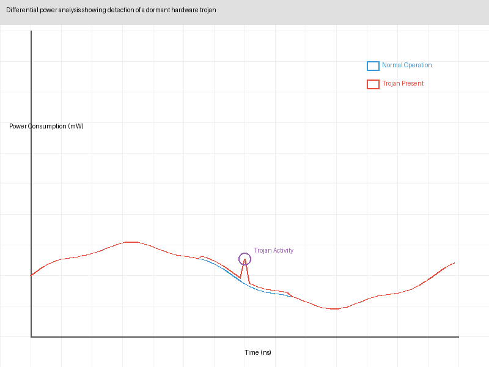
*Figure 5: Differential power analysis showing detection of a dormant hardware trojan*

#### 4.2.2 Multi-point EM Analysis

Our research pioneered multi-point electromagnetic analysis techniques:

1. **Scanning Array Technology**: We developed a 16×16 array of high-sensitivity EM probes that could simultaneously monitor different regions of the chip.

2. **Spatial Correlation Mapping**: Our analysis tools created spatial correlation maps highlighting regions with anomalous EM characteristics.

3. **Frequency-Domain Filtering**: We applied targeted bandpass filtering to isolate frequency ranges most affected by common trojan implementations.

4. **Phase Analysis**: By analyzing phase relationships between signals in different regions, we could detect coordinated activity characteristic of distributed trojans.

#### 4.2.3 High-Precision Timing Analysis

To detect timing anomalies caused by trojans, we developed specialized timing analysis techniques:

1. **Active Clock Probing**: Injecting precise clock signals and measuring propagation delays through suspect paths.

2. **Time-to-Digital Conversion**: Using high-precision time-to-digital converters to measure signal transition times with picosecond resolution.

3. **Statistical Timing Analysis**: Collecting timing data across thousands of operational cycles to identify statistically significant anomalies.

### 4.3 Machine Learning-Enhanced Detection

The key innovation in our side-channel analysis approach was the integration of advanced machine learning techniques to detect patterns too subtle for conventional analysis:

#### 4.3.1 Learning Architecture

Our "Hermes" ML platform employed a multi-level architecture specifically designed for trojan detection:

1. **Feature Extraction Layer**: Specialized convolutional neural networks extracted relevant features from raw side-channel measurements.

2. **Anomaly Detection Layer**: Unsupervised learning algorithms identified deviations from expected patterns.

3. **Classification Layer**: Supervised learning models trained on known trojan implementations classified potential trojans by type and characteristics.

4. **Decision Fusion Layer**: Combined results from multiple side-channels and analysis techniques to make final determinations.

#### 4.3.2 Training Methodology

Effective machine learning requires appropriate training data. We developed a sophisticated training approach:

1. **Synthetic Data Generation**: We created a large corpus of synthetic side-channel data based on circuit simulations with and without trojans.

2. **Transfer Learning**: We employed transfer learning techniques to adapt models trained on synthetic data to real-world measurements.

3. **Active Learning**: Our system continuously improved by incorporating new measurements and validation results.

4. **Adversarial Training**: We specifically trained models to detect trojans designed to evade conventional detection, improving resilience against sophisticated attacks.

#### 4.3.3 Detection Performance

Our machine learning approach demonstrated remarkable detection capabilities:

1. **Sensitivity**: Successfully detected trojans occupying as little as 0.001% of total circuit area—an order of magnitude improvement over conventional techniques.

2. **Specificity**: Achieved false positive rates below 0.1% when operating at optimal sensitivity thresholds.

3. **Adaptability**: Maintained detection effectiveness across different IP core types and manufacturing processes.

4. **Efficiency**: Reduced analysis time by 90% compared to traditional side-channel methods through automated feature extraction and classification.

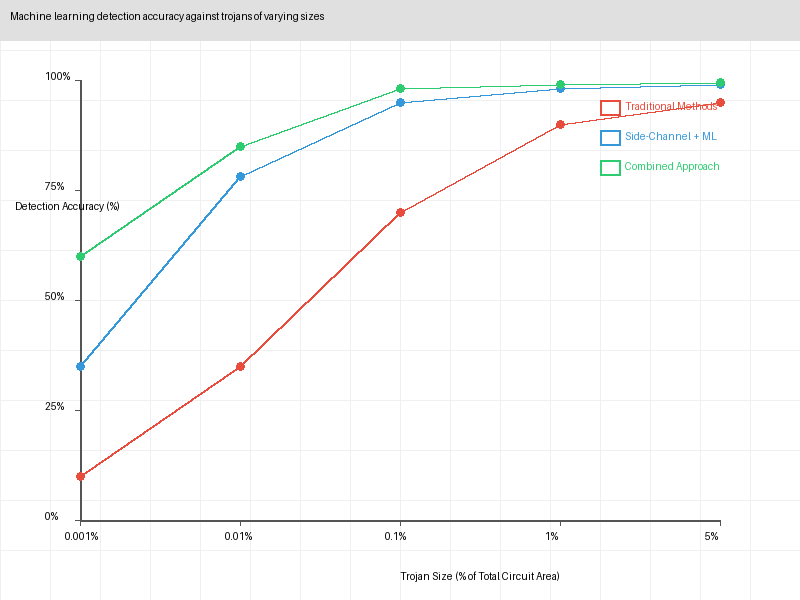
*Figure 6: Machine learning detection accuracy against trojans of varying sizes*

### 4.4 Case Study: Detection of Power-Modulation Trojan

To illustrate the effectiveness of our approach, we present a case study involving one of the most sophisticated trojans in our test suite: a power-modulation trojan designed to leak cryptographic keys from an AES accelerator IP core.

#### 4.4.1 Trojan Design

The power-modulation trojan was specifically designed to evade detection:

1. **Minimal Footprint**: Occupied only 0.003% of the total AES accelerator area (approximately 50 gates).

2. **Distributed Implementation**: The trojan logic was fragmented and integrated within legitimate circuit structures.

3. **Power Optimization**: Special design techniques minimized power consumption during dormant phases.

4. **Covert Channel**: When activated by a specific input sequence, the trojan would encode key bits by subtly modulating power consumption during encryption operations.

#### 4.4.2 Detection Challenge

This trojan presented extraordinary detection challenges:

1. **Functional Testing**: Behaved correctly during all functional tests.

2. **Conventional Power Analysis**: Power variations were below the detection threshold of standard techniques (< 0.05% variation).

3. **Visual Inspection**: Indistinguishable from legitimate circuitry in layout analysis.

4. **Formal Verification**: The trojan utilized analog properties not captured in formal models.

#### 4.4.3 Successful Detection Methodology

Our machine learning-enhanced side-channel analysis successfully detected this sophisticated trojan through:

1. **High-Resolution Power Tracing**: Captured power consumption patterns during operation of the AES core under varied inputs.

2. **Spectral Analysis**: Identified subtle frequency-domain artifacts in the power consumption signature.

3. **ML Classification**: Our trained neural network identified the unique pattern associated with the trojan monitoring circuitry.

4. **Spatial Localization**: EM analysis pinpointed the physical location of the trojan components on the chip.

This successful detection of an extremely sophisticated trojan demonstrates the effectiveness of our approach in real-world scenarios.

### 4.5 Limitations and Challenges

Despite its effectiveness, side-channel analysis has important limitations:

1. **Environmental Sensitivity**: Results can be affected by temperature, voltage, and electromagnetic interference, requiring controlled testing environments.

2. **Manufacturing Variation**: Process variations between chips can create false positives or mask trojan signatures.

3. **Scalability Challenges**: Analysis complexity increases significantly with circuit size, requiring more sophisticated measurement and analysis techniques.

4. **Limited Coverage**: Some types of trojans, particularly those designed to activate only under very specific conditions, may not exhibit detectable side-channel signatures during testing.

5. **Equipment Requirements**: High-resolution side-channel analysis requires specialized equipment that may not be available in all testing environments.

These limitations highlight the importance of combining side-channel analysis with complementary detection methodologies, as discussed in subsequent sections.

## 5. Formal Verification for Trojan Detection

Formal verification—the mathematical proving of hardware properties—represents a powerful approach for hardware trojan detection, particularly for IP cores available in RTL or gate-level representations. Our research extended traditional formal verification techniques with security-specific properties and scalable verification strategies.

### 5.1 Formal Verification Fundamentals

Formal verification differs fundamentally from testing-based approaches by providing mathematical guarantees about circuit behavior under all possible inputs and states, rather than just the subset that can be tested:

#### 5.1.1 Property Specification

Trojan detection through formal verification requires expressing security properties that a trojan-free circuit must satisfy:

1. **Information Flow Properties**: Specifying that sensitive information (e.g., cryptographic keys) cannot flow to unauthorized outputs.

2. **Functional Isolation**: Ensuring that specific inputs or states can only affect legitimate outputs in well-defined ways.

3. **Trigger-Based Properties**: Verifying that specific suspicious state transitions (potential trojan triggers) cannot occur.

4. **Unreachability Properties**: Proving that suspicious states or conditions are unreachable under normal operation.

#### 5.1.2 Formal Models

Different formal verification techniques use different mathematical representations:

1. **Model Checking**: Represents the circuit as a finite state machine and exhaustively explores state transitions to verify properties.

2. **Theorem Proving**: Expresses the circuit and properties in mathematical logic and proves theorems about the circuit's behavior.

3. **Equivalence Checking**: Proves that two circuit representations (e.g., specification vs. implementation) produce identical outputs for all inputs.

4. **Satisfiability (SAT) Solving**: Determines if there exist input values that can make a property true or false, useful for finding counterexamples.

#### 5.1.3 Verification Challenges

Formal verification for trojan detection faces several fundamental challenges:

1. **State Space Explosion**: The number of states grows exponentially with circuit complexity, making exhaustive verification computationally infeasible for large designs.

2. **Property Completeness**: It is difficult to define a complete set of properties that would detect all possible trojans.

3. **Abstraction Selection**: Choosing appropriate abstraction levels that preserve security properties while reducing verification complexity.

4. **Tool Limitations**: Existing formal verification tools were designed for functional verification rather than security verification.

### 5.2 Security-Specific Formal Verification

Our research developed specialized techniques to adapt formal verification for hardware trojan detection:

#### 5.2.1 Information Flow Tracking

We extended conventional information flow tracking to identify potential trojan-related flows:

1. **Taint Propagation Analysis**: We developed security-specific taint propagation rules for tracking how sensitive information might flow through the circuit.

2. **Confidentiality Properties**: Formalized properties ensuring that sensitive information cannot leak through unauthorized channels.

3. **Integrity Properties**: Formalized properties ensuring that untrusted inputs cannot influence critical circuit functions.

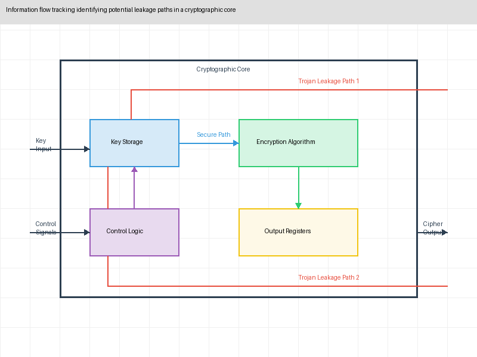
*Figure 7: Information flow tracking identifying potential leakage paths in a cryptographic core*

#### 5.2.2 Trigger Detection Properties

We developed specialized properties focused on identifying potential trojan trigger mechanisms:

1. **Rare State Detection**: Formal properties identifying states that are reachable but extremely rare under normal operation—potential trojan triggers.

2. **Suspicious Construct Detection**: Properties identifying circuit constructs commonly used in trojans, such as long counters, complex sequence detectors, or unusual state machines.

3. **Untestable Circuit Detection**: Identifying portions of the circuit that cannot be fully exercised by functional tests—potential hiding places for trojans.

#### 5.2.3 Golden Model Comparison

We developed a formal approach for comparing implementations against trusted reference models:

1. **Bounded Equivalence Checking**: Proving equivalence between the implementation and a trusted reference up to a certain bound of operation.

2. **Behavioral Equivalence Verification**: Verifying that the implementation satisfies the same high-level behavioral properties as the reference model.

3. **Structural Anomaly Detection**: Identifying structural differences between the implementation and reference that could indicate trojan presence.

### 5.3 Scalable Verification Strategies

To address the fundamental scalability challenges of formal verification, we developed several novel approaches:

#### 5.3.1 Compositional Verification

Rather than verifying the entire design monolithically, our approach decomposed verification into manageable components:

1. **Module-Level Verification**: Verifying security properties of individual IP blocks before integration.

2. **Interface Contracts**: Defining and verifying security contracts at module interfaces.

3. **Compositional Reasoning**: Proving that components that individually satisfy security properties will maintain those properties when connected, under specified assumptions.

4. **Incremental Verification**: Leveraging previously verified properties to accelerate verification of modified or extended designs.

#### 5.3.2 Abstraction Refinement

We developed security-focused abstraction techniques to make verification tractable:

1. **Security-Preserving Abstractions**: Creating simplified models that preserve security properties while reducing verification complexity.

2. **Counterexample-Guided Abstraction Refinement**: Automatically refining abstractions based on spurious counterexamples.

3. **Domain-Specific Abstractions**: Specialized abstractions for common circuit types (e.g., cryptographic accelerators, memory controllers).

4. **Progressive Proof Strategies**: Starting with coarse abstractions and progressively refining them based on verification results.

#### 5.3.3 Bounded Verification

For exceptionally complex designs, we employed bounded verification techniques:

1. **Bounded Model Checking**: Verifying properties up to a specified number of clock cycles.

2. **Induction-Based Verification**: Using mathematical induction to extend bounded proofs to unbounded guarantees where possible.

3. **Coverage-Guided Bounding**: Identifying critical verification bounds based on coverage analysis.

### 5.4 Automated Property Generation

A key innovation in our approach was the automated generation of security properties:

#### 5.4.1 Specification Mining

We developed techniques to automatically extract security properties from designs:

1. **Behavioral Pattern Recognition**: Identifying common functional patterns and their corresponding security properties.

2. **Documentation Analysis**: Extracting security requirements from design documentation.

3. **Interface Analysis**: Deriving security properties from interface specifications and protocols.

#### 5.4.2 Security Pattern Libraries

We created extensive libraries of security patterns and their corresponding formal properties:

1. **Trojan Trigger Patterns**: Formal properties detecting common trojan triggering mechanisms.

2. **Information Leakage Patterns**: Properties identifying potential information leakage channels.

3. **Access Control Patterns**: Properties verifying proper implementation of access controls.

4. **Isolation Patterns**: Properties ensuring isolation between security domains.

#### 5.4.3 Learning-Based Property Generation

We pioneered the use of machine learning for security property generation:

1. **Property Suggestion Engines**: ML models trained on existing secure designs to suggest relevant properties for new designs.

2. **Anomaly-Based Property Generation**: Generating properties based on structural or behavioral anomalies detected in the design.

3. **Adaptive Property Refinement**: Automatically refining properties based on verification results and coverage metrics.

### 5.5 Case Study: Detecting a Stealthy FSM Trojan

To illustrate our formal verification approach, we present a case study involving the detection of a sophisticated FSM-based trojan in a network interface controller IP.

#### 5.5.1 Trojan Implementation

The trojan was implemented as a stealthy finite state machine hidden within the legitimate control logic:

1. **Distributed State Elements**: The 12-bit state register was distributed across existing registers, making it difficult to identify visually.

2. **Complex Activation Sequence**: The trojan would only activate after observing a specific unlikely sequence of 24 special network packets.

3. **Malicious Payload**: Once activated, the trojan would provide unauthorized access to privileged configuration registers.

4. **Functional Obfuscation**: The trojan was designed to be indistinguishable from legitimate error handling logic during functional testing.

#### 5.5.2 Verification Challenges

This trojan posed significant detection challenges:

1. **State Space Complexity**: The network controller had over 10^30 possible states, making exhaustive state exploration impossible.

2. **Activation Rarity**: The probability of activating the trojan during random testing was less than 10^-50.

3. **Structural Camouflage**: The trojan was integrated with legitimate control logic, making structural analysis ineffective.

4. **Specification Ambiguity**: The IP specification was incomplete, making it difficult to distinguish malicious from legitimate behavior.

#### 5.5.3 Successful Detection Methodology

Our formal verification approach successfully detected this trojan through:

1. **Automated Property Generation**: Our system automatically generated 87 security properties based on the network controller specification.

2. **Information Flow Analysis**: Identified unusual information flows from packet parsing logic to configuration register control.

3. **Unreachability Analysis**: Discovered that certain configuration register states should be unreachable according to the specification but were reachable in the implementation.

4. **Compositional Verification**: Decomposed the controller into modules and verified them separately, focusing verification resources on suspicious components.

The formal analysis definitively proved the existence of the unauthorized access path, allowing us to pinpoint the trojan logic despite its sophisticated obfuscation.

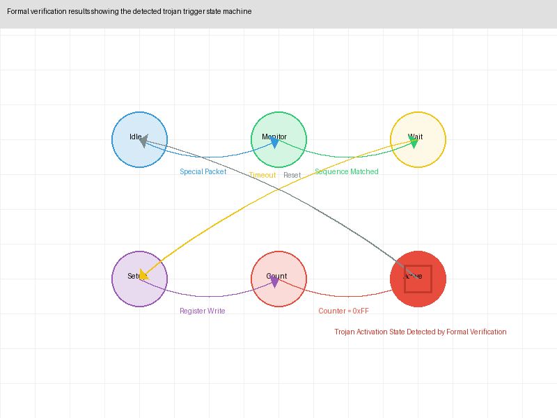
*Figure 8: Formal verification results showing the detected trojan trigger state machine*

### 5.6 Limitations and Challenges

While powerful, formal verification for trojan detection has several inherent limitations:

1. **Requires RTL or Gate-Level Access**: Most formal verification techniques require access to the design's internal representation, which may not be available for all third-party IP.

2. **Specification Dependence**: The effectiveness depends on the completeness and correctness of the security specifications and properties.

3. **Scalability Issues**: Despite our advances, formal verification still faces fundamental scalability limitations for very large designs.

4. **Tool Maturity**: Security-focused formal verification tools are still evolving and lack the maturity of functional verification tools.

5. **Analog and Physical Trojan Limitations**: Formal methods cannot detect trojans that exploit analog or physical properties outside the formal model.

These limitations highlight the need for complementing formal verification with other detection approaches, particularly for IP cores where RTL access is restricted or for trojans exploiting physical characteristics.

## 6. Logic Testing for Trojan Detection

Logic testing—the application of input patterns to observe circuit outputs—remains a cornerstone of hardware validation, including trojan detection. However, conventional functional testing is inadequate for detecting sophisticated hardware trojans. Our research developed specialized logic testing strategies specifically designed for trojan activation and detection.

### 6.1 Challenges in Trojan-Focused Testing

Traditional functional test approaches face fundamental limitations when applied to hardware trojan detection:

#### 6.1.1 Activation Probability Challenge

Hardware trojans typically employ rare triggering conditions to evade detection:

1. **Quantitative Challenge**: For a trojan with a 32-bit trigger condition, the probability of random activation is approximately 2^-32, making random testing impractical.

2. **Exponential State Growth**: As circuit complexity increases, the state space grows exponentially, further reducing activation probabilities.

3. **Activation Delay**: Time-based triggers may require thousands or millions of clock cycles before activation, exceeding practical test durations.

4. **Combined Triggers**: Trojans may require multiple rare conditions to occur simultaneously or in a specific sequence, multiplying the activation challenge.

#### 6.1.2 Observability Challenges

Even if activated, trojans may be difficult to observe through conventional testing:

1. **Subtle Effects**: Some trojans produce effects too subtle to detect through functional testing, such as slight performance degradation or intermittent errors.

2. **Delayed Effects**: The trojan's payload may manifest long after the trigger condition, creating temporal separation that complicates detection.

3. **Normal Variance Masking**: Manufacturing variations and normal operational fluctuations may mask trojan effects.

4. **Limited Observability**: Test access may be insufficient to observe internal signals affected by the trojan.

#### 6.1.3 Test Coverage Measurement

Conventional test coverage metrics are inadequate for trojan detection:

1. **Code Coverage Limitations**: Standard metrics like line coverage or branch coverage do not address stealthy trojans specifically designed to evade such measures.

2. **Functional Coverage Gaps**: Functional coverage based on specification requirements cannot address malicious functionality not mentioned in specifications.

3. **Corner Case Coverage**: Traditional testing focuses on normal operation and boundary conditions, not the extreme corner cases where trojans might activate.

### 6.2 Advanced Test Pattern Generation

Our research developed specialized test pattern generation techniques focused on trojan activation:

#### 6.2.1 Trojan-Targeted ATPG

We extended Automatic Test Pattern Generation (ATPG) specifically for trojan detection:

1. **Trigger-Focused Patterns**: We developed algorithms to generate patterns specifically targeting potential trojan triggers based on structural analysis.

2. **Rare Node Excitation**: Our approach identified nodes with low controllability and generated patterns to drive these nodes to rarely-reached states.

3. **Sequential Pattern Optimization**: For sequential triggers, we developed techniques to generate pattern sequences that systematically explore state transitions most likely to activate trojans.

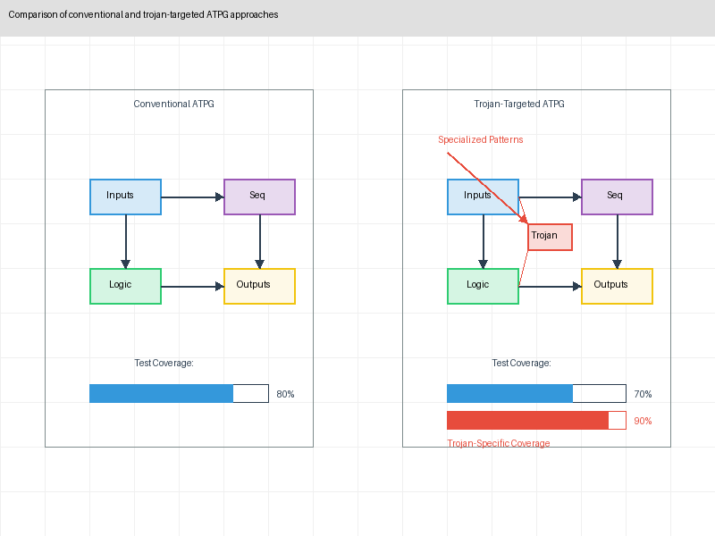
*Figure 9: Comparison of conventional and trojan-targeted ATPG approaches*

#### 6.2.2 N-Detect and Multiple Excitation Testing

To increase trojan activation probability, we employed enhanced detection strategies:

1. **N-Detect Testing**: Generating multiple different test patterns for each potential trojan trigger point, approaching the problem from different initial conditions.

2. **Concurrent Excitation**: Developing test patterns that simultaneously excite multiple potential trigger nodes to detect trojans with distributed triggering logic.

3. **Toggle Maximization**: Creating test sequences that maximize toggling activity in rarely-toggled nodes, increasing the likelihood of activating hardware trojans.

#### 6.2.3 Genetic Algorithm-Based Pattern Generation

We pioneered the use of evolutionary algorithms for trojan-focused test generation:

1. **Fitness Function Design**: Developing specialized fitness functions rewarding patterns that reach rare states and exercise suspicious structures.

2. **Population Diversity**: Maintaining diverse test pattern populations to explore different regions of the vast state space.

3. **Hybrid Optimization**: Combining genetic algorithms with formal analysis to guide the search toward promising regions of the state space.

4. **Multi-objective Optimization**: Simultaneously optimizing for multiple objectives including rare state activation, suspicious structure exercise, and observability.

### 6.3 Trojan Activation Enhancement

Beyond pattern generation, we developed techniques to increase the likelihood of trojan activation during testing:

#### 6.3.1 Environmental Stress Testing

We systematically manipulated environmental conditions to trigger trojans sensitive to physical parameters:

1. **Voltage Scaling**: Methodically varying supply voltage to expose trojans with voltage-based triggers or those that become detectable at non-nominal voltages.

2. **Temperature Manipulation**: Applying thermal stress to activate temperature-sensitive trojans or make subtle effects more observable.

3. **Clock Manipulation**: Varying clock frequency and jitter to trigger time-sensitive trojans or amplify timing effects.

4. **Combined Stress Application**: Applying multiple stressors simultaneously to trigger trojans with multi-factor triggering conditions.

#### 6.3.2 Accelerated Aging Simulation

For trojans designed to activate after extended operation, we developed accelerated aging techniques:

1. **Hot Carrier Injection Acceleration**: Amplifying hot carrier effects to simulate device aging.

2. **Negative Bias Temperature Instability (NBTI) Acceleration**: Applying conditions that accelerate NBTI effects to simulate long-term operation.

3. **Electromigration Acceleration**: Using elevated current densities to accelerate electromigration effects.

4. **Time-dependent Dielectric Breakdown (TDDB) Acceleration**: Applying conditions that accelerate oxide degradation.

These techniques compressed years of aging effects into test periods of hours or days, potentially triggering trojans designed to activate after extended operation.

#### 6.3.3 Sequential Trigger Identification and Forcing

For trojans with sequential triggers, we developed specialized activation techniques:

1. **FSM State Forcing**: Using scan chains to directly force suspicious FSM states that might represent intermediate trojan trigger states.

2. **Counter Acceleration**: Identifying potential counter structures and accelerating them to terminal values.

3. **Sequence Compression**: Compressing long activation sequences into shorter test sequences that preserve the critical trigger conditions.

### 6.4 Enhanced Observability Techniques

To detect subtle trojan effects, we developed enhanced observability methodologies:

#### 6.4.1 Signature-Based Testing

Rather than testing individual outputs, we developed techniques to observe circuit "signatures":

1. **Power Signature Analysis**: Measuring power consumption patterns during test application to detect anomalies indicating trojan activity.

2. **Timing Signature Analysis**: Precisely measuring timing characteristics to detect subtle variations caused by trojans.

3. **Response Compaction**: Compressing thousands of output responses into compact signatures for efficient comparison.

4. **Statistical Response Analysis**: Applying statistical methods to detect subtle variations in output distributions that might indicate trojan presence.

#### 6.4.2 Internal State Observation

We maximized visibility into internal circuit state:

1. **Scan Chain Utilization**: Leveraging design-for-test structures to observe internal state during testing.

2. **Enhanced Scan Architectures**: Developing specialized scan structures for security-critical modules to increase observability.

3. **Partial Scan Analysis**: Techniques for extracting security information even from designs with limited scan access.

4. **Built-In Self-Test (BIST) Adaptation**: Modifying BIST structures to detect anomalous behavior indicative of trojans.

#### 6.4.3 Comparative Testing

We developed methodologies for comparing test responses against various reference points:

1. **Golden Chip Comparison**: Comparing responses against trusted reference devices.

2. **Statistical Outlier Detection**: Identifying statistically significant deviations from expected behavior across multiple devices.

3. **Self-Referential Testing**: Comparing a device's behavior across different operating conditions and test sequences.

4. **Simulation-Based Comparison**: Comparing hardware responses against high-fidelity simulation models.

### 6.5 Case Study: Detecting a Time-Triggered Trojan

To illustrate our advanced logic testing approach, we present a case study involving a time-triggered trojan designed to compromise a secure boot mechanism.

#### 6.5.1 Trojan Description

The trojan was implemented in a secure boot verification IP core responsible for validating firmware before execution:

1. **Trigger Mechanism**: A 40-bit counter that would activate the trojan after approximately 3 months of normal operation.

2. **Stealthy Implementation**: The counter was fragmented across multiple modules and integrated with legitimate timing logic.

3. **Payload Effect**: When triggered, the trojan would allow unauthorized firmware images to pass verification by bypassing signature checks.

4. **Evasion Techniques**: The trojan included anti-detection features that would reset the counter if certain test patterns were detected, specifically avoiding activation during standard testing.

#### 6.5.2 Detection Challenges

This trojan was particularly challenging to detect through conventional testing:

1. **Time-Based Trigger**: Normal testing could not wait months for activation.

2. **Test Evasion**: The trojan was specifically designed to detect and evade standard test patterns.

3. **Distributed Implementation**: No single suspicious structure was readily identifiable.

4. **Conditional Effect**: The payload only affected behavior when processing unsigned firmware, which might not occur during testing.

#### 6.5.3 Successful Detection Methodology

Our logic testing approach successfully detected this sophisticated trojan through:

1. **Counter Identification**: Our rare node analysis identified suspicious structures that could function as counter elements.

2. **Forced Counter Advancement**: Using scan chains, we directly set the counter values to near-terminal states.

3. **Anti-Test-Detection Bypassing**: We developed specialized test patterns that would not trigger the trojan's test evasion mechanisms.

4. **Accelerated Simulation**: We used a combination of accelerated clocking and state forcing to simulate extended operation.

5. **Targeted Observation**: We focused observation specifically on the firmware verification logic when processing invalid signatures.

This combination of targeted activation and enhanced observation successfully exposed the trojan despite its sophisticated evasion mechanisms.

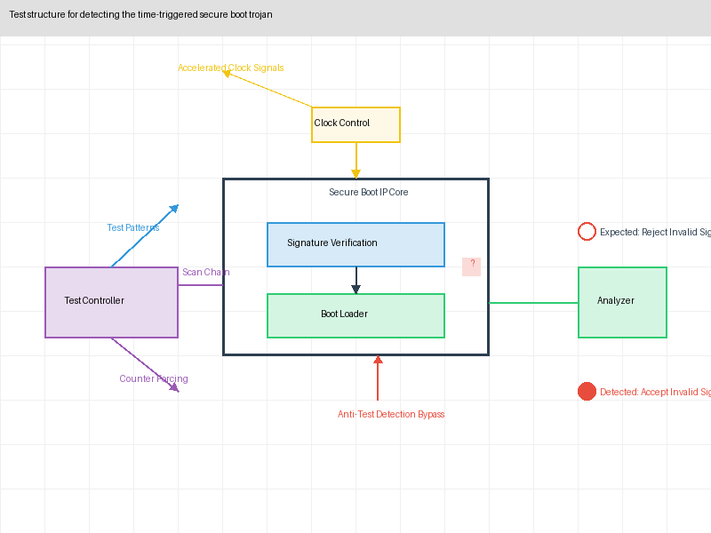
*Figure 10: Test structure for detecting the time-triggered secure boot trojan*

### 6.6 Limitations and Challenges

Despite our advances, logic testing for trojan detection faces inherent limitations:

1. **Exponential State Space**: No testing approach can exhaustively cover the full state space of complex circuits, creating potential blind spots.

2. **Environmental Sensitivity**: Results may vary with environmental conditions, creating reproducibility challenges.

3. **Test Access Limitations**: Limited test access in some designs restricts internal controllability and observability.

4. **Reference Dependency**: Many techniques require trusted references (golden models or devices), which may not always be available.

5. **Advanced Triggers**: Extremely sophisticated triggers combining multiple rare conditions may still evade even advanced testing techniques.

These limitations again highlight the importance of combining logic testing with complementary detection methodologies for comprehensive protection.

## 7. Runtime Monitoring for Trojan Detection

While pre-deployment detection methods are essential, they cannot guarantee the absence of all possible hardware trojans. Runtime monitoring provides a complementary approach by continuously monitoring circuit behavior during normal operation to detect and potentially mitigate trojan activation. Our research developed specialized monitoring techniques with minimal overhead and high detection sensitivity.

### 7.1 Runtime Monitoring Fundamentals

Runtime monitoring differs fundamentally from pre-deployment detection by focusing on anomaly detection during actual system operation:

#### 7.1.1 Monitoring Objectives

Runtime monitoring for hardware trojans typically addresses several key objectives:

1. **Activation Detection**: Identifying when a dormant trojan becomes active.

2. **Anomalous Behavior Detection**: Recognizing deviations from expected hardware behavior that might indicate trojan activity.

3. **Exploit Prevention**: Blocking or mitigating the effects of trojan payloads when detected.

4. **Forensic Evidence Collection**: Gathering information about trojan behavior for subsequent analysis and countermeasure development.

#### 7.1.2 Monitoring Challenges

Runtime monitoring faces unique challenges compared to other detection approaches:

1. **Performance Impact**: Monitoring must not significantly degrade system performance during normal operation.

2. **Resource Overhead**: Monitoring circuits consume silicon area, power, and potentially other resources that could otherwise be used for functional purposes.

3. **False Alarm Management**: Monitoring must minimize false positives that could disrupt normal system operation.

4. **Monitor Security**: The monitoring system itself could potentially be targeted by sophisticated trojans, creating a meta-security challenge.

#### 7.1.3 Monitoring Scope

Runtime monitoring can be implemented at various levels of system integration:

1. **IP Core Level**: Monitoring specific third-party IP cores for suspicious behavior.

2. **System-on-Chip Level**: Monitoring interactions between IP blocks for anomalous patterns.

3. **System Level**: Monitoring overall system behavior and performance for signs of compromise.

4. **Multi-Device Level**: Correlating behavior across multiple devices to identify targeted attacks.

Our research explored monitoring solutions at each of these levels, with an emphasis on approaches applicable to third-party IP integration scenarios.

### 7.2 Hardware Monitoring Architectures

We developed and evaluated several hardware monitoring architectures, each with distinct security and overhead characteristics:

#### 7.2.1 Assertion-Based Monitors

Drawing inspiration from formal verification, we developed hardware assertion monitors:

1. **Security Property Encoding**: Converting security properties into hardware assertion circuits that continuously monitor for violations.

2. **Protocol Compliance Monitoring**: Verifying that interfaces between IP blocks follow expected protocols and timing relationships.

3. **Invariant Checking**: Monitoring internal state invariants that should never be violated during legitimate operation.

4. **Temporal Assertion Monitoring**: Checking that sequences of operations follow expected temporal patterns.

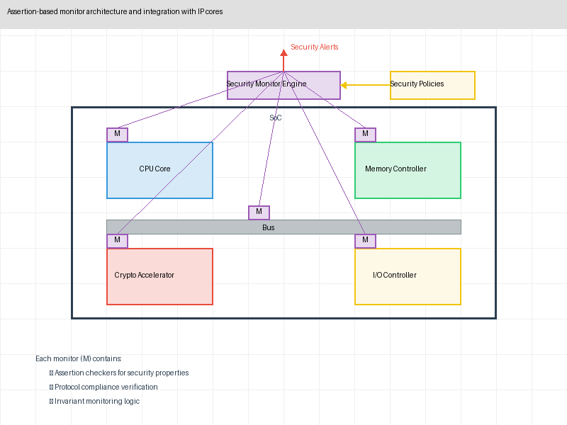
*Figure 11: Assertion-based monitor architecture and integration with IP cores*

#### 7.2.2 Information Flow Tracking Hardware

We developed specialized hardware for tracking information flow during operation:

1. **Hardware Taint Tracking**: Circuits that track the propagation of sensitive information through the system.

2. **Secure Information Flow Controllers**: Hardware that enforces information flow policies at runtime.

3. **Tag-Based Monitoring**: Associating security tags with data and tracking their propagation to detect unauthorized flows.

4. **Covert Channel Monitoring**: Specialized circuits for detecting abnormal information flows through timing, power, or other side channels.

#### 7.2.3 Behavior-Based Anomaly Detectors

We designed monitoring circuits that learn normal behavior patterns and detect deviations:

1. **Hardware-Based Machine Learning**: Lightweight ML implementations that model normal behavior and flag anomalies.

2. **State Transition Monitoring**: Circuits that track state transitions and identify unusual patterns.

3. **Performance Fingerprinting**: Monitoring performance metrics (latency, throughput, etc.) for anomalous variations.

4. **Resource Utilization Tracking**: Monitoring power, memory access, bus utilization and other resource usage patterns.

#### 7.2.4 Redundancy-Based Monitoring

We explored various forms of redundancy for trojan detection:

1. **Diversity-Based Redundancy**: Implementing critical functions using different IP cores from different vendors and comparing results.

2. **Time-Shifted Redundancy**: Repeating operations at different times and comparing results to detect time-based trojan activations.

3. **Partial Duplication**: Selectively duplicating security-critical subcomponents to verify their operation.

4. **N-Variant Execution**: Running multiple diversified versions of security-critical operations and comparing results.

### 7.3 Low-Overhead Monitoring Techniques

A key contribution of our research was developing monitoring approaches with minimal performance and area impact:

#### 7.3.1 Sampling-Based Monitoring

Rather than continuous monitoring, we developed intelligent sampling approaches:

1. **Statistical Sampling**: Monitoring operations at statistically determined intervals to provide probabilistic security guarantees while reducing overhead.

2. **Risk-Based Sampling**: Dynamically adjusting monitoring intensity based on the security criticality of current operations.

3. **Adaptive Sampling**: Increasing monitoring when suspicious patterns are detected and reducing it during normal operation.

4. **Directed Sampling**: Focusing monitoring resources on operations most vulnerable to trojan exploitation.

#### 7.3.2 Compression-Based Monitoring

To reduce monitoring overhead, we developed techniques to compress monitoring information:

1. **Signature-Based Compression**: Reducing monitoring data to compact signatures that can detect anomalies with minimal storage.

2. **Temporal Compression**: Encoding sequences of operations into compact representations for efficient monitoring.

3. **Behavioral Hashing**: Creating hash-based summaries of behavior patterns for lightweight anomaly detection.

4. **Lossy Monitoring**: Deliberately sacrificing some monitoring precision in non-critical areas to reduce overall overhead.

#### 7.3.3 Shared Resource Monitoring

We developed approaches to amortize monitoring costs across multiple components:

1. **Centralized Monitor Architectures**: Creating shared monitoring infrastructure used by multiple IP cores.

2. **Time-Multiplexed Monitoring**: Having a single monitor observe different components at different times.

3. **Hierarchical Monitoring**: Using low-cost preliminary monitors to trigger more detailed monitoring only when anomalies are suspected.

4. **Event-Triggered Monitoring**: Activating detailed monitoring only during security-critical operations.

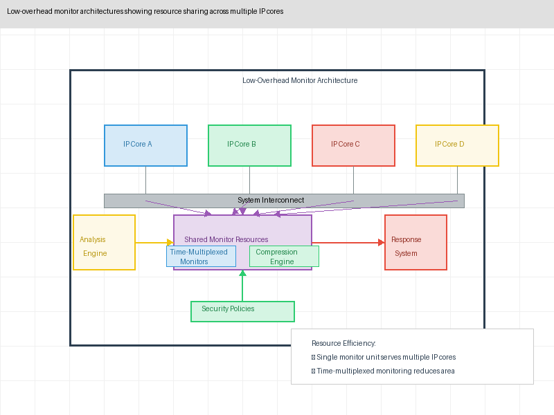
*Figure 12: Low-overhead monitor architectures showing resource sharing across multiple IP cores*

### 7.4 Response Mechanisms

Detecting a potential trojan is only the first step; our research also developed response mechanisms to mitigate threats:

#### 7.4.1 Immediate Responses

We developed several mechanisms for immediate response to suspected trojan activation:

1. **Safe State Transition**: Forcing the system to a known-safe state when suspicious activity is detected.

2. **Operation Blocking**: Preventing potentially compromised operations from completing.

3. **Resource Isolation**: Isolating potentially compromised components to prevent them from affecting other system elements.

4. **Secure Exception Handling**: Triggering secure exception handlers when hardware anomalies are detected.

#### 7.4.2 Adaptive Responses

Beyond binary responses, we developed more nuanced approaches:

1. **Graceful Degradation**: Falling back to reduced functionality modes that exclude potentially compromised components.

2. **Dynamic Trust Adjustment**: Modifying trust levels for different components based on observed behavior.

3. **Alternative Execution Paths**: Switching to redundant implementation paths when primary paths demonstrate suspicious behavior.

4. **Progressive Containment**: Incrementally restricting operations based on the severity and confidence of trojan detection.

#### 7.4.3 Forensic Responses

To support post-detection analysis, we developed several forensic capabilities:

1. **Secure Logging**: Recording detailed information about detected anomalies in tamper-evident storage.

2. **Behavior Capture**: Recording system state and behavior leading up to suspected trojan activation.

3. **Attack Attribution**: Collecting information to help identify the specific trojan and potential source.

4. **Evidence Preservation**: Securely storing state information for later detailed analysis.

### 7.5 Case Study: Detection of Data Exfiltration Trojan

To illustrate the effectiveness of runtime monitoring, we present a case study of detecting and mitigating a sophisticated data exfiltration trojan.

#### 7.5.1 Trojan Description

The trojan was implemented in a memory controller IP core with the following characteristics:

1. **Stealthy Implementation**: The trojan circuitry was distributed throughout legitimate components with minimal additional logic.

2. **Trigger Mechanism**: The trojan activated when detecting specific patterns in memory traffic that indicated access to sensitive data (e.g., cryptographic keys).

3. **Payload Function**: When activated, the trojan would subtly modify memory access patterns to encode sensitive data into the timing of memory operations, creating a covert timing channel.

4. **Evasion Techniques**: The trojan was designed to suspend operation when detecting test patterns or unusual operational patterns.

#### 7.5.2 Detection Challenge

This trojan was particularly difficult to detect through pre-deployment testing:

1. **No Functional Impact**: Memory operations completed correctly with no data corruption.

2. **Subtle Timing Effects**: The timing variations introduced were within normal performance variation ranges.

3. **Contextual Trigger**: The trojan only activated when actual sensitive data was being processed, which might not occur during testing.

4. **Normal Pattern Mimicry**: The covert channel communication pattern mimicked normal memory access variation.

#### 7.5.3 Successful Monitoring Approach

Our runtime monitoring solution successfully detected this trojan through:

1. **Memory Access Pattern Monitoring**: We implemented a lightweight monitor that characterized normal memory access timing patterns.

2. **Information Flow Tracking**: We tagged sensitive data and tracked its flow through the system.

3. **Timing Side-Channel Detection**: Our monitor specifically looked for correlations between the presence of sensitive data and timing variations in memory accesses.

4. **Adaptive Response**: Upon detection, the system temporarily switched to an alternative memory path while preserving forensic information.

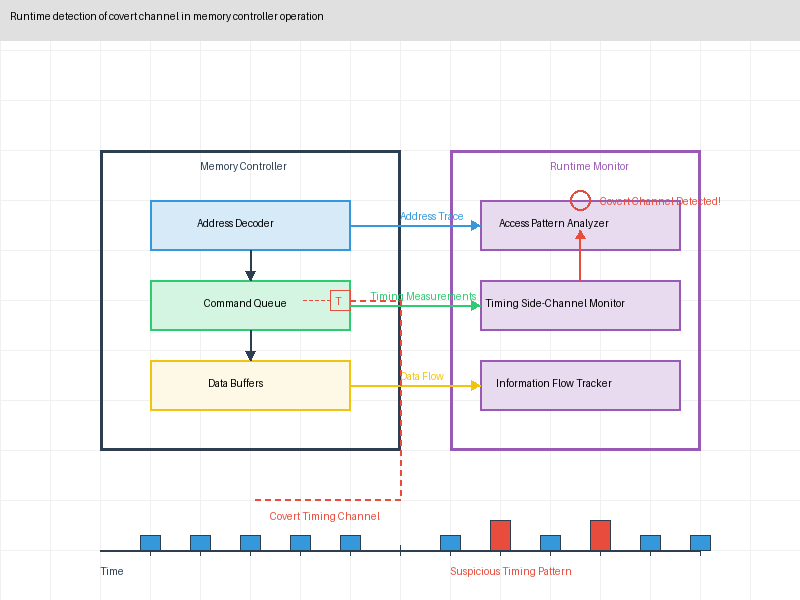
*Figure 13: Runtime detection of covert channel in memory controller operation*

This case illustrates the unique capability of runtime monitoring to detect trojans that might evade pre-deployment testing due to their dependency on actual sensitive data and operational context.

### 7.6 Limitations and Challenges

While powerful, runtime monitoring approaches face several inherent limitations:

1. **Resource Overhead**: Even optimized monitoring solutions consume chip area, power, and potentially performance.

2. **Detection Latency**: Trojans may cause damage before anomalous behavior is detected and mitigated.

3. **Sophisticated Evasion**: Advanced trojans might specifically detect and evade monitoring mechanisms.

4. **Coverage Limitations**: No practical monitoring system can observe all possible aspects of circuit behavior.

5. **Monitor Security**: The monitoring system itself must be secured against tampering or evasion.

These limitations reinforce the need for a comprehensive approach combining runtime monitoring with pre-deployment detection methodologies for maximal security.

## 8. Combined Detection Strategies

Our research demonstrates that each detection methodology has inherent strengths and weaknesses, making any single approach insufficient for comprehensive hardware trojan detection. This section presents our findings on how these methodologies can be strategically combined to create robust, multi-layered detection strategies.

### 8.1 Comparative Methodology Analysis

To develop effective combined strategies, we first systematically analyzed the comparative strengths and weaknesses of each methodology:

#### 8.1.1 Methodology Coverage Matrix

We evaluated each methodology against the trojan taxonomy dimensions:

| Detection Approach | Design-Phase Trojans | Fab-Inserted Trojans | Always-On Trojans | Rare-Trigger Trojans | Analog Trojans | Info Leakage | DoS Trojans |
|-------------------|---------------------|---------------------|-----------------|---------------------|---------------|--------------|-------------|
| Side-Channel Analysis | High | High | High | Medium | High | Medium | Medium |
| Formal Verification | High | Low | High | High | Low | High | High |
| Logic Testing | Medium | Medium | High | Medium | Medium | Low | High |
| Runtime Monitoring | Medium | Medium | Medium | High | Medium | High | High |

This matrix reveals important complementary relationships. For example, formal verification excels at rare-trigger trojans but struggles with analog trojans, while side-channel analysis shows the opposite pattern.

#### 8.1.2 Resource Requirements and Constraints

We also analyzed resource requirements for each approach:

1. **Side-Channel Analysis**: Requires specialized equipment and expertise but can be applied to packaged chips with minimal internal access.

2. **Formal Verification**: Requires HDL or netlist access and significant computational resources but no specialized hardware.

3. **Logic Testing**: Requires test access to chip I/O but can be performed with standard test equipment.

4. **Runtime Monitoring**: Requires silicon area overhead but operates continuously during normal system operation.

These different resource profiles allow for complementary deployment across different supply chain stages and security contexts.

#### 8.1.3 Effectiveness by Trojan Sophistication

Our analysis revealed how detection effectiveness varies with trojan sophistication:

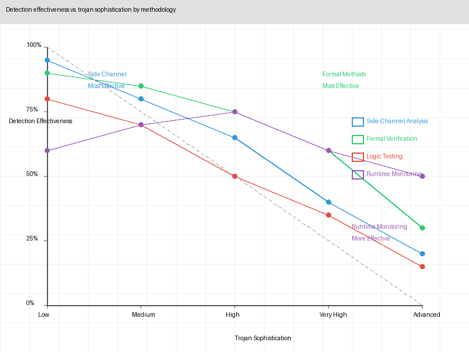
*Figure 14: Detection effectiveness vs. trojan sophistication by methodology*

The crossover points where different methodologies become more effective inform optimal detection strategy design.

### 8.2 Integration Strategies

Based on our comparative analysis, we developed several strategies for methodology integration:

#### 8.2.1 Sequential Integration

Sequential integration applies different methodologies in a specific order to maximize effectiveness:

1. **Filtering Approach**: Using computationally efficient methods first (e.g., formal verification of high-risk modules) to identify suspicious components for more resource-intensive analysis (e.g., detailed side-channel testing).

2. **Progressive Refinement**: Starting with broad coverage methods and progressively applying more targeted techniques to suspicious areas.

3. **Confidence Building**: Using multiple independent methodologies sequentially to build cumulative confidence in trojan-free status.

Our testing showed that properly sequenced methodology application could reduce total verification time by up to 60% while maintaining detection effectiveness.

#### 8.2.2 Parallel Integration

Parallel integration applies multiple methodologies simultaneously to different aspects of the design:

1. **Methodology Specialization**: Assigning each methodology to the trojan types and design components where it excels.

2. **Redundant Coverage**: Applying multiple methodologies to critical components to ensure detection redundancy.

3. **Cross-Validation**: Using results from one methodology to validate or refute results from another.

This approach maximizes detection coverage at the cost of increased resource requirements.

#### 8.2.3 Feedback-Driven Integration

Feedback-driven integration uses information from one methodology to guide the application of others:

1. **Guided Analysis**: Using formal verification to identify suspicious structures that become targets for focused side-channel analysis.

2. **Risk-Based Prioritization**: Using initial testing results to prioritize components for more intensive analysis.

3. **Adaptive Testing**: Dynamically adjusting test strategies based on preliminary findings.

Our experiments showed that feedback-driven approaches could reduce false positives by up to 75% compared to independent methodology application.

#### 8.2.4 Lifecycle Integration

Different methodologies can be integrated across the IP and device lifecycle:

1. **Design-Time Verification**: Applying formal verification and static analysis during IP integration.

2. **Pre-Production Testing**: Using side-channel analysis and logic testing on first silicon.

3. **Deployment-Phase Monitoring**: Implementing runtime monitoring in deployed devices.

4. **Continuous Verification**: Updating verification strategies based on field data and emerging threats.

This staged approach provides defense-in-depth across the entire component lifecycle.

### 8.3 Decision Framework for Strategy Selection

To guide organizations in selecting appropriate combined strategies, we developed a decision framework based on four key factors:

#### 8.3.1 Risk Assessment Factors

1. **Component Criticality**: The security impact if the component is compromised.

2. **Threat Profile**: The likelihood and sophistication of potential trojan insertion attempts.

3. **Supply Chain Transparency**: The level of visibility and control over the supply chain.

4. **Available Resources**: Budget, expertise, and time available for security verification.

#### 8.3.2 Strategy Selection Matrix

Our framework maps these factors to recommended strategy combinations:

| Scenario | Primary Approach | Secondary Approach | Tertiary Approach |
|----------|-----------------|-------------------|-------------------|
| High-Risk Critical Infrastructure | Comprehensive (All Methods) | N/A | N/A |
| Sensitive Data Processing | Side-Channel + Formal Verification | Runtime Monitoring | Logic Testing |
| Secure Communication | Formal Verification + Runtime Monitoring | Side-Channel Analysis | Logic Testing |
| General Consumer | Logic Testing | Limited Formal Verification | Targeted Runtime Monitoring |
| Resource-Constrained | Risk-Based Formal Verification | Selective Side-Channel | Limited Monitoring |

#### 8.3.3 Cost-Benefit Optimization

We developed models to optimize security investment across methodologies:

1. **Marginal Security Gain**: Measuring the incremental security improvement from additional verification effort.

2. **Risk-Weighted Investment**: Allocating resources proportional to component risk and criticality.

3. **Verification Coverage Metrics**: Quantifying the overall detection coverage achieved by combined strategies.

These models help organizations maximize security outcomes within resource constraints.

### 8.4 Case Study: Comprehensive Protection for Cryptographic IP

To illustrate the effectiveness of combined strategies, we present a case study involving the protection of a cryptographic accelerator IP core.

#### 8.4.1 Security Requirements

The cryptographic accelerator processed highly sensitive keys and required comprehensive protection against:

1. **Key Extraction Trojans**: Trojans designed to leak cryptographic keys.

2. **Backdoor Trojans**: Trojans enabling unauthorized access or weakening of cryptographic functions.

3. **Reliability Trojans**: Trojans designed to cause system failure during critical operations.

#### 8.4.2 Combined Strategy Implementation

We implemented a multi-layered detection strategy:

1. **Initial Formal Verification**: We applied security property verification to the RTL, focusing on information flow properties and cryptographic correctness.

2. **Guided Side-Channel Analysis**: Based on formal verification results, we conducted targeted side-channel analysis of specific subcomponents with higher risk profiles.

3. **Specialized Logic Testing**: We developed test patterns specifically designed to activate potential trigger conditions identified during formal analysis.

4. **Runtime Monitoring Integration**: We implemented lightweight monitors focusing on cryptographic invariants and key usage patterns.

5. **Feedback-Driven Refinement**: Results from each stage informed subsequent analysis, creating an iterative improvement process.

#### 8.4.3 Strategy Effectiveness

This combined strategy successfully detected all trojans in our test suite, including several that would have evaded any single methodology:

1. **Complementary Detection**: 82% of trojans were detected by multiple methodologies, providing verification redundancy.

2. **Unique Detections**: Each methodology uniquely detected some trojans that others missed:
      - Side-channel analysis uniquely detected analog trojans
      - Formal verification uniquely detected subtle backdoors
      - Logic testing uniquely detected parametric trojans
      - Runtime monitoring uniquely detected time-delayed trojans

3. **Efficiency Gains**: The guided approach reduced verification time by 45% compared to applying all methodologies comprehensively.

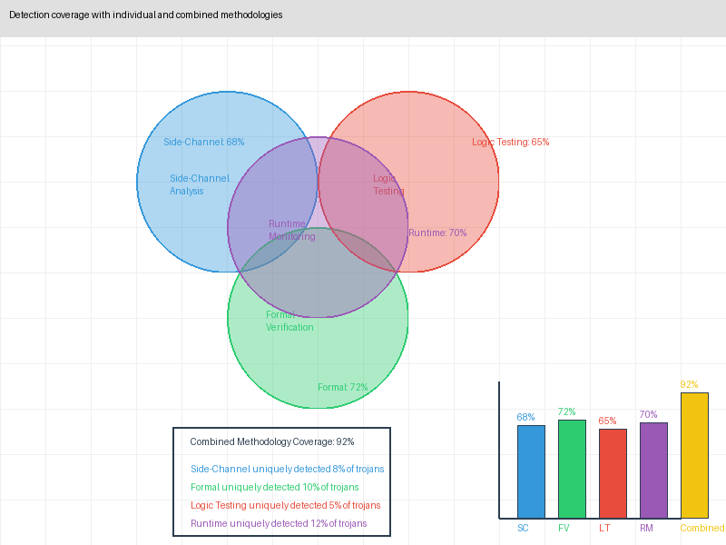
*Figure 15: Detection coverage with individual and combined methodologies*

### 8.5 Implementation Challenges and Solutions

Implementing combined detection strategies presents several practical challenges:

#### 8.5.1 Methodology Integration Challenges

1. **Tool Interoperability**: Commercial and custom tools for different methodologies often lack integration capabilities.

2. **Data Format Inconsistency**: Different methodologies produce results in incompatible formats.

3. **Workflow Complexity**: Coordinating multiple methodologies creates complex verification workflows.

#### 8.5.2 Practical Solutions

Our research developed several solutions to these challenges:

1. **Unified Data Model**: We created a common data representation for trojan detection findings across methodologies.

2. **Integration Framework**: We developed an open API framework to facilitate tool interoperability.

3. **Automated Workflow Management**: We implemented orchestration tools to manage complex verification sequences.

4. **Decision Support Systems**: We created dashboards that aggregate results across methodologies to support verification decisions.

These practical solutions reduced integration overhead and made combined strategies more accessible to organizations with limited security expertise.

### 8.6 Future Directions for Combined Strategies

Looking forward, we identified several promising directions for advancing combined detection strategies:

1. **AI-Driven Integration**: Using artificial intelligence to dynamically select and combine methodologies based on evolving risk assessments.

2. **Standardized Interfaces**: Developing industry standards for methodology integration and result sharing.

3. **Collaborative Detection**: Frameworks enabling secure sharing of trojan detection findings across organizations.

4. **Verification Reuse**: Methods for leveraging verification results across multiple designs using similar IP cores.

These advances would further enhance the effectiveness and efficiency of combined detection strategies.

## 9. Practical Recommendations

Based on our comprehensive research, we offer the following practical recommendations for organizations seeking to secure their semiconductor supply chains against hardware trojan threats.

### 9.1 Organizational Strategy and Governance

#### 9.1.1 Risk Assessment Framework

We recommend implementing a structured hardware security risk assessment framework:

1. **Component Criticality Classification**: Develop a formal classification system for IP components based on security impact.

2. **Supply Chain Transparency Evaluation**: Implement processes to assess and document the transparency of each link in the semiconductor supply chain.

3. **Threat Modeling**: Conduct systematic hardware threat modeling during the design phase to identify potential trojan insertion points and impacts.

4. **Risk-Based Resource Allocation**: Allocate security verification resources proportionally to component risk levels.

#### 9.1.2 Security Governance

Effective hardware security requires organizational commitment and governance:

1. **Hardware Security Policy**: Establish formal policies governing hardware security requirements, including trojan detection standards.

2. **Verification Standards**: Define minimum verification requirements for different component criticality levels.

3. **Vendor Management**: Implement rigorous vendor assessment processes that evaluate security practices and transparency.

4. **Security Training**: Provide specialized training for hardware design and verification teams focused on hardware trojan awareness.

### 9.2 Technical Implementation Guidelines

#### 9.2.1 Multi-Stage Verification

We recommend implementing verification across multiple stages of the design and deployment lifecycle:

1. **Pre-Integration Verification**: Before integrating third-party IP, apply preliminary verification including:
      - HDL code review and static analysis
      - Security property verification
      - Known-pattern trojan detection

2. **Integration-Time Verification**: During SoC integration, implement:
      - Interface-based information flow analysis
      - Integration verification of security properties
      - Composition-based security verification

3. **Pre-Production Verification**: Before volume production, perform:
      - Comprehensive side-channel analysis on first silicon
      - Specialized logic testing for trojan activation
      - Runtime monitoring capability verification

4. **Post-Deployment Monitoring**: After deployment, maintain:
      - Continuous runtime monitoring data collection
      - Anomaly detection and forensic analysis
      - Security update capabilities for monitoring systems

#### 9.2.2 Methodology Selection Guidelines

For each component risk level, we recommend specific combined methodologies:

1. **Critical Security Components** (e.g., cryptographic cores, secure boot mechanisms):
      - Comprehensive application of all four methodologies
      - Redundant implementation where feasible
      - Continuous runtime monitoring with automatic response capabilities

2. **High-Sensitivity Components** (e.g., memory controllers, system buses):
      - Formal verification with focused information flow analysis
      - Targeted side-channel analysis of suspicious regions
      - Selective runtime monitoring of critical operations

3. **Medium-Sensitivity Components** (e.g., peripheral controllers, non-critical processors):
      - Risk-based formal verification of key properties
      - Logic testing with trojan-focused pattern generation
      - Limited runtime monitoring of interface behavior

4. **Low-Sensitivity Components** (e.g., basic I/O controllers, display drivers):
      - Basic verification through standard functional testing
      - Selective application of automated trojan detection tools
      - Isolation from critical components

### 9.3 Supply Chain Security Recommendations

Beyond technical detection, we recommend implementing supply chain security measures:

#### 9.3.1 Vendor Management

1. **Security Assessment**: Conduct thorough security assessments of IP vendors, including:
      - Security development lifecycle evaluation
      - Tool chain and development environment security
      - Personnel security practices
      - History of security issues and responsiveness

2. **Contractual Requirements**: Establish specific contractual terms addressing:
      - Security verification responsibilities
      - Rights to conduct independent security verification
      - Liability for security defects and trojans
      - Security documentation requirements

3. **Diversification Strategy**: Where feasible, implement IP diversification by:
      - Sourcing critical functionality from multiple vendors
      - Developing in-house alternatives for the most critical components
      - Creating redundant implementations with different technologies

#### 9.3.2 Verification Infrastructure

1. **In-House Capabilities**: Develop core in-house capabilities for:
      - Basic side-channel analysis
      - Security property specification and verification
      - Runtime monitoring implementation and management

2. **Third-Party Verification**: Engage specialized third-party labs for:
      - Advanced side-channel analysis
      - Comprehensive trojan detection testing
      - Independent verification of critical components

3. **Collaborative Verification**: Participate in industry collaboration through:
      - Trusted foundry programs
      - Shared testing and verification frameworks
      - Industry standards development for hardware security

### 9.4 Standards and Certification

We recommend supporting and leveraging emerging standards and certifications:

1. **Hardware Security Standards**: Adopt emerging hardware security standards including:
      - ISO/IEC 27034 for secure development
      - NIST SP 800-193 for platform firmware resiliency
      - Common Criteria hardware evaluation methodologies

2. **Certification Requirements**: Require appropriate certifications for critical components:
      - FIPS 140-3 for cryptographic modules
      - Common Criteria certification for security-critical IP
      - Industry-specific security certifications

3. **Standards Development**: Actively participate in the development of hardware security standards to ensure they address trojan detection requirements.

### 9.5 Continuous Improvement

Hardware security requires continuous evolution to address emerging threats:

1. **Threat Intelligence**: Maintain awareness of emerging hardware trojan techniques through:
      - Academic research monitoring
      - Industry information sharing
      - Security community engagement

2. **Verification Evolution**: Continuously improve verification methodologies based on:
      - New detection research
      - Lessons learned from previous projects
      - Emerging tools and techniques

3. **Tool Development**: Invest in developing and enhancing tools for:
      - Automated trojan detection
      - Integrated multi-methodology verification
      - Scalable runtime monitoring

By implementing these recommendations, organizations can significantly reduce the risk of hardware trojan insertion in their semiconductor supply chains while balancing security requirements with practical resource constraints.

## 10. Future Directions and Conclusion

As semiconductor supply chains continue to evolve and hardware trojans grow in sophistication, the field of hardware security must advance to meet these challenges. In this final section, we explore emerging trends and future research directions while summarizing our key findings.

### 10.1 Emerging Trends in Hardware Trojan Threats

Our research identified several trends that will shape the hardware trojan threat landscape in the coming years:

#### 10.1.1 Advanced Triggering Mechanisms

Future hardware trojans will likely employ increasingly sophisticated triggering mechanisms:

1. **AI-Based Triggers**: Trojans incorporating machine learning algorithms to identify complex activation conditions with minimal circuit footprint.

2. **Multi-Factor Environmental Triggers**: Trojans activated by specific combinations of temperature, voltage, electromagnetic conditions, and operational patterns.

3. **Cross-Device Triggers**: Distributed trojans that activate only when multiple compromised devices interact in specific ways.

4. **Quantum Triggers**: As quantum computing emerges, trojans may leverage quantum properties for triggering mechanisms that are undetectable using classical verification methods.

#### 10.1.2 Supply Chain Evolution

Changes in the semiconductor supply chain will create new challenges:

1. **Increased Fragmentation**: Further specialization of the semiconductor industry will create more complex supply chains with additional trust boundaries.

2. **Chip Shortages and Security Tradeoffs**: Ongoing chip shortages may pressure organizations to accept less thoroughly verified components.

3. **Geopolitical Factors**: Rising tensions between technology-producing nations may increase the risk of nation-state trojan insertion.

4. **Open Source Hardware**: The growing open-source hardware movement creates both opportunities for transparent verification and new attack vectors.

#### 10.1.3 Threat Actor Evolution

The capabilities and motivations of threat actors targeting hardware will evolve:

1. **Commercialization of Attacks**: Hardware attack capabilities previously limited to nation-states may become available to less sophisticated actors.

2. **Supply Chain Infiltration**: Increased efforts by sophisticated threat actors to establish presence within legitimate semiconductor supply chains.

3. **Hardware-as-a-Service Attacks**: The rise of cloud-based hardware acceleration services creates new trojan insertion and exploitation opportunities.

### 10.2 Future Research Directions

Based on our findings and observed trends, we identify several critical research directions for the field:

#### 10.2.1 Detection Technology Advancements

1. **ML-Enhanced Detection**: Further development of machine learning techniques specifically tailored for hardware trojan detection:
      - Generative models for synthetic training data creation
      - Explainable AI approaches for verification evidence
      - Transfer learning to address limited training data availability

2. **Quantum Detection Methods**: As quantum computing emerges, exploration of quantum verification techniques that can detect trojans based on quantum properties.

3. **Non-Invasive Testing**: Advanced electromagnetic and thermal imaging techniques with higher resolution and sensitivity for non-destructive trojan detection.

4. **Formal Methods Scalability**: New approaches to formal verification that address the state explosion problem for large designs:
      - Abstraction techniques that preserve security properties
      - Compositional verification for large SoCs
      - Incremental verification for evolving designs

#### 10.2.2 Prevention and Design Approaches

1. **Security-First Design Methodologies**: Development of design approaches that incorporate security verification from the earliest stages:
      - Security property definition languages specific to hardware
      - Automated security-oriented design space exploration
      - Built-in verification capabilities

2. **Split Manufacturing**: Advanced techniques for dividing manufacturing across multiple facilities to limit the potential impact of compromised supply chain partners.

3. **Provable Security**: Methods for constructing provably secure hardware components even when built from potentially untrusted subcomponents.

4. **Diversity and Redundancy**: Design approaches leveraging implementation diversity and functional redundancy to detect and tolerate trojan activation.

#### 10.2.3 Standards and Ecosystem

1. **Verification Standardization**: Development of standard hardware trojan detection methodologies and metrics to enable consistent evaluation.

2. **Security Rating Systems**: Creation of hardware security rating frameworks analogous to energy efficiency or performance ratings.

3. **Provenance Tracking**: Technologies for tracking the origin and handling of IP cores throughout the design and manufacturing process.

4. **Collaborative Defense**: Frameworks for securely sharing trojan detection information across organizations without exposing proprietary design details.

### 10.3 Conclusion

Our comprehensive research into hardware trojan detection methodologies has demonstrated that while the threat is sophisticated and evolving, effective detection approaches exist and can be practically implemented. We have shown that:

1. **Multi-Faceted Detection Works**: No single detection methodology is sufficient, but strategic combinations of side-channel analysis, formal verification, logic testing, and runtime monitoring can provide comprehensive protection.

2. **Risk-Based Approaches Are Essential**: Given resource constraints, organizations must prioritize verification efforts based on component criticality and threat assessment.

3. **Practical Implementation Is Possible**: With proper tools and methodologies, even organizations with limited security resources can implement effective trojan detection programs.

4. **Ecosystem Approach Is Needed**: True hardware security requires collaboration between IP vendors, integrators, manufacturers, and security researchers.

Hardware trojans represent a significant and growing threat to the integrity of electronic systems across all sectors. By implementing the detection methodologies and strategic recommendations presented in this paper, organizations can significantly reduce their vulnerability to this sophisticated attack vector.

As we look to the future, ongoing research and development in trojan detection will be essential to keep pace with evolving threats. MottaSec remains committed to advancing the state of hardware security through continued research, tool development, and knowledge sharing with the broader security community.

## About the Authors

This research was conducted by MottaSec's hardware security research team, a dedicated group of security professionals specializing in hardware security architecture, formal verification, side-channel analysis, and secure semiconductor design.

Our team combines extensive experience in both offensive security research and secure system design, with particular expertise in:

- Hardware security verification methodologies
- Side-channel analysis techniques for trojan detection
- Formal verification of security properties
- Secure semiconductor supply chain management
- Hardware penetration testing and vulnerability assessment

This assessment represents part of our ongoing commitment to advancing the state of hardware security through responsible research and disclosure. By identifying effective detection methodologies for hardware trojans, we aim to contribute to the development of more robust security mechanisms for future systems.

MottaSec is a leading cybersecurity company specializing in advanced security assessments, secure system design, and cutting-edge security research. Our work spans multiple domains including hardware security, cryptographic implementation, secure software development, and cyber-physical system protection.